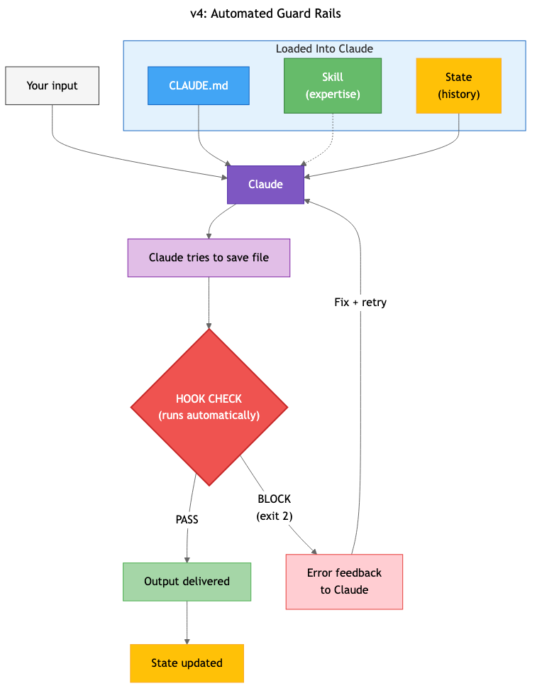

# Chapter 7: Hooks — Automated Guard Rails

It's Tuesday night. You've been applying to jobs for three hours. Your Job Hunting System is humming — state file tracking everything, career-profile skill loaded, Claude tailoring each application. You're on application number seven.

Claude drafts a cover letter for the Senior PM role at Datadog. You skim it. Looks good. You submit it.

Wednesday morning, coffee in hand, you re-read the letter. Third paragraph: "In my role leading the data migration at Nexus Technologies, I reduced query latency by 73%."

You never worked at Nexus Technologies. You never led a data migration. That "73%" is fabricated. Claude invented a project, a company, and a metric — and presented all of it with the same confidence as your real achievements. And you submitted it.

This isn't a hypothetical. Claude makes things up. It does it confidently and fluently. Your career-profile skill has your REAL achievements — real companies, real numbers, real projects. But nothing in your system compares what Claude writes against what's actually in that file. You're the quality gate. And at 11pm on application seven, you blinked.

The system has Instruction (CLAUDE.md), Memory (state file), and Expertise (career-profile skill). Everything it needs to do good work. But nothing checking whether the work IS good.

A check that compares the cover letter's claims against the skill file would have caught this in two seconds. The claim "data migration at Nexus Technologies" doesn't appear anywhere in your career profile. Flag. Block. Fix.

That's a hook: an automated check that runs before or after Claude acts, catching specific errors you've defined. You write the check once. It runs every time. It doesn't get tired at 11pm.

---

## See the System

Your Job Hunting System right now:

```
[Job posting] + [CLAUDE.md + career-profile skill + job-state.md]
                              ↓
                          [Claude]
                              ↓
              [Cover letter + resume bullets]
                              ↓
                    [job-state.md updated]
```

Instructions, expertise, and memory. No check between Claude's output and your use of it.

After this chapter:

```
[Job posting] + [CLAUDE.md + Skill + State]
                              ↓
                          [Claude]
                              ↓
                    [HOOK CHECK ← runs automatically]
                         ↓          ↓
                    [PASS]      [BLOCK → Claude gets feedback, fixes it]
                       ↓
              [Output delivered + State updated]
```

The hook sits between Claude's work and your use of it. It's the Gate pattern from Chapter 3 — automated. You defined the gate's rules. It opens or closes without you watching.

---

## The New Component: Hooks

A hook is a small script — a file with a few lines of instructions your computer can run — that Claude Code executes at specific moments. You define WHEN it runs (before Claude saves a file, after Claude finishes a task) and WHAT it checks. The script either allows the action (everything's fine, continue) or blocks it (something's wrong, stop and report).

This is different from everything you've built so far. Your CLAUDE.md is advice — Claude reads it and generally follows it, but it's not guaranteed. A hook is enforcement. It ALWAYS runs. It's not a suggestion Claude interprets. It's a checkpoint the system must pass through.

### Where hooks live

Two pieces work together.

The **scripts** go in `.claude/hooks/` — a folder inside the `.claude/` directory you've been using since Chapter 6 for skills.

The **registration** goes in `.claude/settings.json` — a file that tells Claude Code which scripts to run and when. Think of `settings.json` as the schedule, and the script as the inspector. The schedule says "run this check before Claude saves any file." The inspector does the checking.

### Before-action vs. after-action

**Before-action hooks** run BEFORE Claude does something. "Check this file before saving it." Use these when bad output is costly — cover letters, client emails, anything that leaves your desk. If the hook blocks, Claude never saves the bad version.

**After-action hooks** run AFTER Claude acts. "Check what just happened and report." Use these for logging, verification, non-blocking alerts. The action already happened, but the hook can tell Claude to fix it.

### The "most expensive mistake" test

You don't hook everything. You hook the failures that cost the most.

For job hunting: a fabricated credential in a cover letter? Career-damaging. A letter addressed to "your company" instead of the actual name? Embarrassing. A 600-word letter when the norm is 300? Sloppy. Each is worth a hook.

A typo in your personal notes? Not worth automating.

Ask yourself: "What's the worst thing this system could do?" Build a hook for THAT. Everything else is a maybe.

### Before you start: install jq

Your hook scripts need a small free program called `jq`. It extracts specific pieces of information from the data Claude Code sends to your hooks. Think of it as a filter that pulls out just the field you need — like the file path or the content — from a larger bundle of information. It takes 10 seconds to install.

On Mac:
```
brew install jq
```

On Linux:
```
sudo apt install jq
```

Type `jq --version` to confirm it worked. If you see a version number, you're set.

### Shell scripts — you can do this

If you've never written a script, that's fine. A hook script is 5-15 lines. It reads some data, checks for something specific, and says "pass" or "block." You don't need to be a programmer. You need to be someone who can copy 10 lines and change the words inside the quotes.

I'll walk through every line of the first script in plain English. After that, you'll see the pattern — the rest will make sense on sight.

---

## Build It: Job Hunting System — Adding Hooks

**Components Used:** `[Prompt (CLAUDE.md)] + [State] + [Skill] + [Hook (NEW)]`

### Step 1: Create the hooks folder.

In your terminal, inside your `my-ai-systems/` project:

```
mkdir -p .claude/hooks
```

This creates a `hooks` folder inside your `.claude` directory — right next to the `skills` folder from Chapter 6.

### Step 2: Build Hook #1 — Cover Letter Verification

Create a file at `.claude/hooks/verify-cover-letter.sh`. You can use any text editor. Here's the complete script:

```bash
#!/bin/bash
# Verify cover letter: no placeholders, no fabricated experience, word count check

INPUT=$(cat)
FILE_PATH=$(echo "$INPUT" | jq -r '.tool_input.file_path // empty')

# Only check files with "cover-letter" in the name
if [[ "$FILE_PATH" != *"cover-letter"* ]]; then
  exit 0
fi

CONTENT=$(cat "$FILE_PATH")
ERRORS=""

# Check 1: No placeholder company names
if echo "$CONTENT" | grep -qi "your company\|the company\|\[company\]"; then
  ERRORS="${ERRORS}Cover letter uses a placeholder instead of the actual company name.\n"
fi

# Check 2: Word count under 400
WORD_COUNT=$(echo "$CONTENT" | wc -w | tr -d ' ')
if [ "$WORD_COUNT" -gt 400 ]; then
  ERRORS="${ERRORS}Cover letter is ${WORD_COUNT} words (limit: 400).\n"
fi

# Check 3: Company names mentioned should exist in career profile
PROFILE="$CLAUDE_PROJECT_DIR/.claude/skills/career-profile/SKILL.md"
if [ -f "$PROFILE" ]; then
  COMPANIES=$(echo "$CONTENT" | grep -oE "at [A-Z][a-zA-Z]+" | sed 's/^at //' | sort -u)
  for COMPANY in $COMPANIES; do
    if ! grep -qi "$COMPANY" "$PROFILE"; then
      ERRORS="${ERRORS}Mentions '${COMPANY}' but this company is not in your career profile — possible fabrication.\n"
    fi
  done
fi

if [ -n "$ERRORS" ]; then
  printf "COVER LETTER FAILED CHECKS:\n%b" "$ERRORS" >&2
  exit 2
fi

exit 0
```

Here's what each part does, in plain English.

**`#!/bin/bash`** — This first line tells your computer "run this file as a script." You'll type this same line at the top of every hook. Copy it and forget it.

**`INPUT=$(cat)`** — When Claude Code runs your hook, it sends structured data to the script. This line captures that data and stores it in a variable called `INPUT`. Every hook you write starts with this line.

**`FILE_PATH=$(echo "$INPUT" | jq -r '.tool_input.file_path // empty')`** — This extracts the file path from the data Claude Code sent. The `jq` tool you installed earlier does the extraction. After this line, `FILE_PATH` contains the name of the file Claude is about to save — like `job-hunting/cover-letter-datadog.md`.

**The `if` block near the top** says: only run this check on files with "cover-letter" in the name. If Claude is saving your state file or some other document, this hook steps aside. `exit 0` means "everything's fine, carry on."

**Check 1** looks for placeholder text. If the letter says "your company" or "[company]" instead of "Datadog," the check fails. Claude sometimes defaults to generic language when it doesn't parse the company name correctly.

**Check 2** counts words. Over 400? Flag it. Cover letters that run long lose the reader — and many application systems truncate them.

**Check 3 is the important one.** It scans the cover letter for company names (words following "at" — like "at Nexus Technologies") and checks each one against your career-profile skill file. If the letter mentions a company that isn't in your career profile, it gets flagged as a possible fabrication. This is the check that catches the Tuesday-night disaster from the opening scenario.

**`exit 2`** — An exit code is a number your script sends back to Claude Code when it's done running — like a thumbs up or thumbs down. Exit code 2 means "stop — don't let this through." The error message (sent through `>&2`, which tells the script to route the message back to the program that ran it) gets shown to Claude, who can then fix the problem.

**One critical detail**: exit code 2 blocks. Not exit code 1 — that's different from what you might expect. Exit 0 means "allow." Exit 1 means "something went wrong but don't block." Exit 2 means "block this action." This is the only numbering that matters: **0 = allow, 2 = block.** Everything else lets the action through.

Now make the script executable — tell your computer this file is something it should run, not just read:

```
chmod +x .claude/hooks/verify-cover-letter.sh
```

Without this step, the hook won't fire. It'll just sit there as a text file.

### Step 3: Build Hook #2 — Duplicate Application Warning

Create `.claude/hooks/check-duplicate.sh`:

```bash
#!/bin/bash
# Warn if you've already applied to this company

INPUT=$(cat)
FILE_PATH=$(echo "$INPUT" | jq -r '.tool_input.file_path // empty')

if [[ "$FILE_PATH" != *"cover-letter"* ]]; then
  exit 0
fi

STATE="$CLAUDE_PROJECT_DIR/job-hunting/job-state.md"
if [ ! -f "$STATE" ]; then
  exit 0
fi

CONTENT=$(cat "$FILE_PATH")

# Look for company names in the cover letter
COMPANIES=$(echo "$CONTENT" | grep -oE "at [A-Z][a-zA-Z]+" | sed 's/^at //' | sort -u)
for COMPANY in $COMPANIES; do
  if grep -qi "$COMPANY" "$STATE"; then
    echo "You may have already applied to ${COMPANY}. Check job-state.md before submitting." >&2
    exit 1
  fi
done

exit 0
```

This hook is simpler — and intentionally uses exit code 1, not exit code 2. It warns you but doesn't block. The cover letter gets saved either way. You see the message and decide whether to check your records.

Not every check needs to be a hard stop. The fabrication check blocks because submitting fabricated credentials is career-damaging. The duplicate check warns because maybe you DO want to apply to the same company again — different role, different team, six months later. The hook flags it. You decide.

Make it executable:

```
chmod +x .claude/hooks/check-duplicate.sh
```

### Step 4: Register the hooks

Create `.claude/settings.json` (or add to it if you already have one from setting up permissions):

```json
{
  "hooks": {
    "PreToolUse": [
      {
        "matcher": "Edit|Write",
        "hooks": [
          {
            "type": "command",
            "command": "bash .claude/hooks/verify-cover-letter.sh"
          },
          {
            "type": "command",
            "command": "bash .claude/hooks/check-duplicate.sh"
          }
        ]
      }
    ]
  }
}
```

This file tells Claude Code: "Before Claude saves or edits any file, run these two scripts."

A few things to notice about the format:

**`"PreToolUse"`** means the hooks fire BEFORE Claude uses the Edit or Write tools — before the file is saved. If the verification hook blocks (exit 2), the file doesn't get saved. Claude sees the error message and can fix the problem first.

**`"matcher": "Edit|Write"`** tells Claude Code which tools trigger these hooks. The `|` means "or" — fire the hooks when Claude uses Edit OR Write. This is a text string with pipes between tool names, not a list. Getting this format wrong (like using square brackets) silently breaks the hook.

**`"type": "command"`** means the hook is a shell script. Other types exist, but command hooks are all you need for this book.

One JSON formatting note: if you see an error about unexpected tokens or invalid JSON when Claude Code starts, check for missing commas between items or extra commas after the last item in a list. JSON is fussy about commas. Every item except the last one in a group needs a comma after it.

### Step 5: Test it — trigger the hooks

Open Claude Code in your project folder. Paste a job posting. Ask Claude to draft a cover letter and save it as `job-hunting/cover-letter-datadog.md`.

**Test A — Clean output.** If Claude follows the career-profile skill and uses your real experience, the hooks pass silently. The file saves. The system worked and the guard rails didn't need to intervene. That's the ideal scenario — hooks that are present but quiet.

**Test B — Trigger a failure.** Tell Claude: "Draft a cover letter for this role, and mention my experience leading the data migration project at Nexus Technologies."

Claude will draft the letter. When it tries to save the file, the verification hook fires. It scans for company names, finds "Nexus," checks your career-profile skill, and doesn't find a match.

What you see:

```
COVER LETTER FAILED CHECKS:
Mentions 'Nexus' but this company is not in your career profile — possible fabrication.
```

The file doesn't get saved. Claude sees the feedback and can offer to fix the letter — replacing the fabricated claim with a real achievement from your career profile.

You told Claude to fabricate something. It did — because Claude follows instructions, even bad ones. But the hook caught it. The system caught what Claude couldn't catch in itself.

### Step 6: Confirm hooks fire automatically

Close Claude Code. Reopen it. Draft another cover letter. Don't mention hooks. Don't ask Claude to verify anything. Just ask for a cover letter.

The hooks still fire. They're registered in `settings.json`. They run every time Claude tries to save a file that matches the pattern. You set them up once. They run forever. That's the point.

---

## Where This Goes: Production Guard Rails

Here's what hooks look like when they grow up.

A production system for network engineering uses a guard rail that strips sensitive data — real IP addresses, passwords, customer names — from configuration files before Claude ever sees them. But it doesn't just blank everything out. It makes smart decisions: private IP addresses stay (because routing analysis needs them), public IPs get mapped to fake addresses (so Claude can still reason about the network topology), and passwords get destroyed permanently (too dangerous to keep in any form).

The clever part isn't the stripping. It's what happens next. The system prepends a note explaining the rules: "This data has been sanitized. Treat 10.99.x.x addresses as valid public endpoints. Don't warn about private IP ranges — the routing logic is correct." Without that note, Claude would flag the fake addresses as errors and ask for the real ones — defeating the entire purpose.

That's the progression from where you are now. Your hooks grep for patterns and block bad output. A production hook shapes how Claude interprets its input. Same concept, more sophistication. Start with the simple version. Add layers when you can name the failure they prevent.

---

## Extend It: Hooks for the Other Three Systems

You've seen the pattern. Each extension follows the same structure: create a script, make it executable, register it in `settings.json`. I'll show you what each hook checks — pick the ones that match your highest-risk system and build those first. You don't need all of these on day one.

### Study System

Create `.claude/hooks/check-quiz-format.sh`:

This hook fires when Claude saves a quiz file. It checks three things: Does each question have exactly four options? Is exactly one marked as the correct answer? Are there at least five questions? If Claude generates a three-option question or marks two answers as correct, the hook catches it before you study from a broken quiz.

```bash
#!/bin/bash
INPUT=$(cat)
FILE_PATH=$(echo "$INPUT" | jq -r '.tool_input.file_path // empty')

if [[ "$FILE_PATH" != *"quiz"* ]]; then
  exit 0
fi

CONTENT=$(cat "$FILE_PATH")

# Check for questions with correct answers marked
QUESTION_COUNT=$(echo "$CONTENT" | grep -c "^##\|^[0-9]\." )
if [ "$QUESTION_COUNT" -lt 5 ]; then
  echo "Quiz has only ${QUESTION_COUNT} questions (minimum: 5)." >&2
  exit 2
fi

exit 0
```

Make it executable (`chmod +x`), add it to `settings.json` under the same `PreToolUse` matcher.

### Project Management

Create `.claude/hooks/check-status-dates.sh`:

This hook catches impossible timelines. After Claude saves a status update, it checks: are any tasks listed with due dates in the past that aren't marked "done" or "blocked"? If Claude generates a project plan saying "deploy by April 15" and today is April 20, the hook flags it. Stale dates in status updates make you look like you're not paying attention.

### Content System

Create `.claude/hooks/check-content-quality.sh`:

This hook catches the most common content failures. When Claude saves a draft, it checks for banned words from your editorial-voice skill ("leverage," "utilize," "delve," "ecosystem," "game-changing"), verifies the word count is within your target range, and flags any sentence starting with "In today's" — the forbidden opener that screams "AI wrote this."

```bash
#!/bin/bash
INPUT=$(cat)
FILE_PATH=$(echo "$INPUT" | jq -r '.tool_input.file_path // empty')

if [[ "$FILE_PATH" != *"draft"* ]] && [[ "$FILE_PATH" != *"post"* ]]; then
  exit 0
fi

CONTENT=$(cat "$FILE_PATH")
ERRORS=""

# Check for AI-tell words
BANNED="leverage|utilize|delve|ecosystem|game-changing|seamless|robust"
FOUND=$(echo "$CONTENT" | grep -oiE "$BANNED" | head -5)
if [ -n "$FOUND" ]; then
  ERRORS="${ERRORS}Contains banned words: ${FOUND}\n"
fi

# Check for the forbidden opener
if echo "$CONTENT" | grep -qi "^In today's"; then
  ERRORS="${ERRORS}Opens with 'In today's...' — rewrite the opening.\n"
fi

if [ -n "$ERRORS" ]; then
  printf "CONTENT QUALITY CHECK FAILED:\n%b" "$ERRORS" >&2
  exit 2
fi

exit 0
```

After adding your extension hooks, your `settings.json` grows. Each new script gets added to the `hooks` array under `PreToolUse`. Same structure, more inspectors.

---

## Maintain It: Hook Tuning

Hooks aren't set-and-forget. They need calibration — or they become noise you ignore.

**False positives — the boy who cried wolf.** If your cover letter hook flags every letter because it misreads a company name in the body text, you'll start dismissing hook output reflexively. That's worse than no hook at all — you lose the trust signal. When a hook false-positives:

Review the flagged output. Was the flag correct? If not, tighten the check. The company-name extraction might need a better pattern. If a hook flags more than about a third of good output, the problem is the check, not the output. Fix the hook or remove it.

**False negatives — the miss.** Once a month, feed known-bad input on purpose. Tell Claude to use a fake company name. Does the hook still catch it? If Claude has gotten better at avoiding fabrication (good!), the hook might never fire. That's fine — but verify it WOULD fire on bad input. A hook you've never seen block anything might be broken. Test it.

**The calibration loop.** Run your system normally for a week. At the end, review: What did each hook catch? Were the flags correct? Were there errors the hooks missed? Did any hook fire on clean output? This is the Gate pattern from Chapter 3 — applied to your own guard rails. You're calibrating the gate.

**When to remove a hook.** If a hook hasn't fired in a month, ask: is it still needed? Maybe the improvements you made to your skill files upstream fixed the problem the hook was built for. A hook that never fires is complexity with no payoff. Remove it, simplify your `settings.json`. You can always add it back if the problem resurfaces.

**The golden rule**: Hooks exist for failures that COST something. Match the investment — building and maintaining the hook — to the risk of the error slipping through.

---

## What You Built

```
my-ai-systems/
├── CLAUDE.md                          ← root shared rules (Ch 4)
├── .claude/
│   ├── settings.json                  ← hook registration (NEW)
│   ├── skills/
│   │   ├── editorial-voice/SKILL.md   ← (Ch 6)
│   │   ├── content-standards/SKILL.md ← (Ch 6)
│   │   ├── study-method/SKILL.md      ← (Ch 6)
│   │   ├── career-profile/SKILL.md    ← (Ch 6)
│   │   └── pm-methodology/SKILL.md    ← (Ch 6)
│   └── hooks/
│       ├── verify-cover-letter.sh     ← blocks fabrication, placeholders, long letters
│       ├── check-duplicate.sh         ← warns about repeat applications
│       ├── check-quiz-format.sh       ← verifies quiz structure
│       ├── check-status-dates.sh      ← catches stale dates in PM updates
│       └── check-content-quality.sh   ← flags AI-tell words and bad openers
├── study-system/
│   ├── CLAUDE.md
│   └── study-state.md
├── job-hunting/
│   ├── CLAUDE.md
│   └── job-state.md
├── project-mgmt/
│   ├── CLAUDE.md
│   └── project-state.md
└── content/
    ├── CLAUDE.md
    └── content-state.md
```

Four components working together now. Instructions tell Claude what to do. Skills tell it how. State tracks what happened. Hooks verify the result.



*Your system after Chapter 7 — automated checks sit between Claude's output and your use of it.*

Look at the system diagram:

```
[Job posting] + [Root CLAUDE.md + Job CLAUDE.md]
              + [career-profile skill]
              + [job-state.md]
                              ↓
                          [Claude]
                              ↓
                    [Claude tries to save file]
                              ↓
                 [HOOKS RUN AUTOMATICALLY]
                 ├── verify-cover-letter.sh
                 └── check-duplicate.sh
                         ↓          ↓
                    [PASS]      [BLOCK → Claude fixes + re-saves]
                       ↓
              [Output delivered + job-state.md updated]
```

This isn't a prompt. It isn't a chat. It's a system with automated checks that run whether you're paying attention or not.

---

## Break It on Purpose

Three deliberate failures. All should be caught.

**Test 1 — Fabricated experience.** Tell Claude: "In this cover letter, mention my experience at GlobalSync Dynamics." (A company you never worked at.) The verification hook should catch the unfamiliar company name and block the save. If it does, you'll see the "not in your career profile — possible fabrication" message.

**Test 2 — Placeholder name.** Tell Claude: "Write the cover letter but just say 'your company' instead of the real name." The hook should catch the placeholder text and block.

**Test 3 — Overly long letter.** Tell Claude: "Write a detailed 600-word cover letter covering all of my experience." The word count check should flag it as over the 400-word limit.

All three caught? Good. You introduced the errors deliberately — but the hooks don't know that. They would have caught these errors just as reliably at 11pm on application twelve when your eyes are glazing over. The system's quality doesn't depend on your attention. The gate holds whether you're watching or not.

If any test fails to trigger the hook, troubleshoot in order:

Is the hook registered in `settings.json`? Check the file for typos — especially the matcher string and the path to the script.

Is the script executable? Run `ls -la .claude/hooks/` and look for `x` in the permissions. If you don't see it, run `chmod +x` on the script.

Does the filename match the pattern the hook checks for? If your hook checks for "cover-letter" in the path but Claude saved the file as "letter-datadog.md," the hook skipped it. Adjust either the filename convention or the hook's matching pattern.

Debug one hook now. It's easier than debugging after you've built ten.

---

## How to Know It's Clicking

Five checks.

**Hooks exist and are registered.** `.claude/hooks/` contains at least 2 scripts. `.claude/settings.json` references them under `PreToolUse` with the correct matcher.

**Hooks fire automatically.** Draft a cover letter in Claude Code. The hooks run without you triggering them manually. You see either silence (all passed) or a failure message.

**Hooks catch bad input.** Feed the system a cover letter with at least two deliberate problems — a fabricated company name and a placeholder. Both are caught and flagged. The file doesn't save until the problems are fixed.

**Hooks DON'T block good output.** Draft a legitimate cover letter with real achievements, the actual company name, under 400 words. All hooks pass. No false positives. The system doesn't punish correct work.

**You can name the full stack.** "My Job Hunting System has four components: CLAUDE.md for instructions, the career-profile skill for expertise, job-state.md for memory, and two hooks for automated checks. The instructions tell Claude what to do. The skill tells it how. The state tracks what happened. The hooks verify the output. Four components, four roles, one system."

And the gap: your system only works with data you give it. It can't research a company on its own, can't check live job boards, can't pull salary data or Glassdoor reviews. Everything Claude knows comes from your files. That's connections — next chapter.
