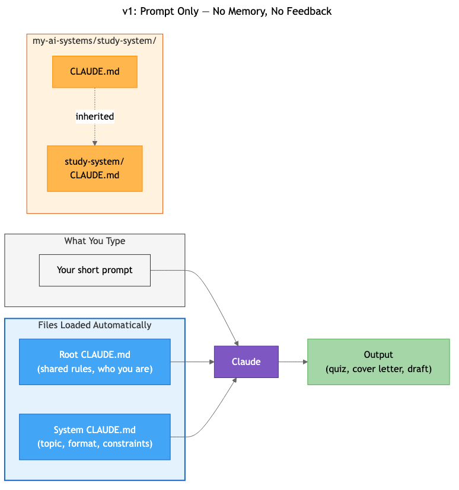
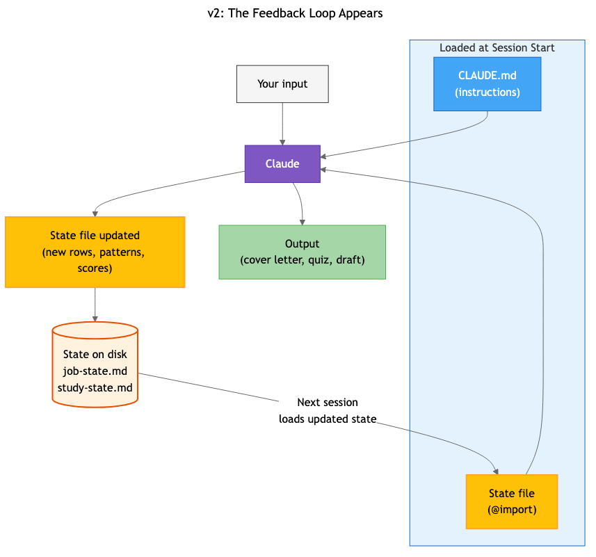
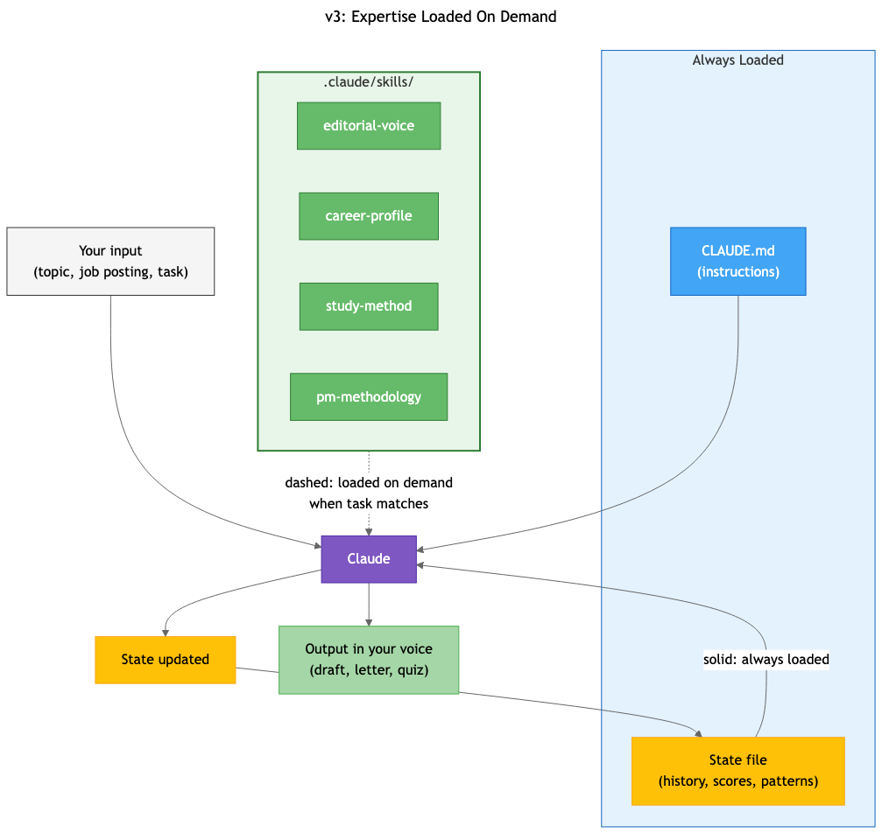
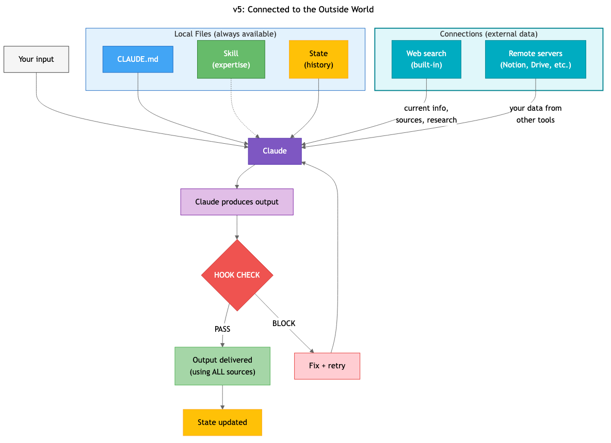

# From Prompts to Pipelines

## A Systems-Based Approach to Prompt Engineering and Agentic Workflows

### Act 2: The Build

*Twelve chapters. ~40,000 words. The reader builds four real systems — Study, Job Hunting, Project Management, Content — each growing from a structured prompt to a full 6-component pipeline. Then sees a production system at scale, learns cost management, debugging, composition, and designs a new system from scratch.*

---

## Part II: First Builds — Instruction + Memory

---

# Chapter 4: Structured Prompts — Your Systems Start Here

You have a napkin sketch of the system you want to build. You know the four concepts, the three patterns, and the six-step design process. You've felt each concept work and watched each one fail under manual execution.

Time to stop sketching and start building.

This chapter is where the book shifts. Act 1 gave you the thinking. Act 2 gives you the tools. And the first tool isn't what you'd expect — it's not a prompt you type. It's a file you write once that tells the AI who you are, what you're building, and how to work. A file that loads automatically every time you start a session, so you never re-explain yourself again.

---

## Opening the Kitchen

You're about to open a terminal. If you've never done that before, this section takes about five minutes. If you have, skip to the next section.

A terminal is a text-based window where you type commands and see results. That's it. The reason this book uses a terminal instead of a graphical interface is the same reason cooking shows use kitchens instead of vending machines — you need to see what you're making. In a graphical tool, your instruction files are hidden behind menus. Your state files are "settings" somewhere. Your hooks are invisible. In the terminal, everything is a file in a folder you can see, open, and understand.

Here's what to install:

**A terminal.** If you're on a Mac, you already have one — it's called Terminal, in Applications/Utilities. But I recommend Warp. It's free, open-source, and designed for working with AI tools. Download it at warp.dev. On Windows, use Windows Terminal or Warp. On Linux, you already know what a terminal is.

**An AI CLI tool.** This book shows Claude Code, but the patterns work in OpenAI's Codex, Kimi CLI, or any AI tool that runs in the terminal. Install Claude Code by typing:

```
npm install -g @anthropic-ai/claude-code
```

If that doesn't work, you need Node.js first — download it at nodejs.org, install it, try again.

**If you prefer a graphical interface** — everything in this book works in Claude's desktop app (Cowork), VS Code with the Claude extension, or Cursor. The files you create are identical. Only the interface differs. I'll show the terminal because it makes the system visible. Use whatever you're comfortable with.

Now create a folder for your systems:

```
mkdir my-ai-systems
cd my-ai-systems
```

Before you create any system, you're going to create the most important file in any AI project — and it goes right here, in the root folder.

**A quick note on how context works.** Claude Code reads CLAUDE.md files by walking up the directory tree from wherever you're working. If you're in `my-ai-systems/study-system/`, it loads the CLAUDE.md in `study-system/` AND the CLAUDE.md in the parent `my-ai-systems/` folder. They stack — root first, then the subfolder. This means you can put shared rules in the root (your name, your general preferences, "never fabricate data") and system-specific context in each subfolder (your study topic, your career history, your project team). General → specific. Every AI tool with project instructions works this way — it's not a Claude Code quirk, it's how scoped context should work.

This matters because you're about to build four systems. They'll share some context (who you are, how you like to work) and differ on the rest (what each system does). One root file. Four system-specific files. The AI sees all of them.

---

## The File That Changes Everything

Every modern AI CLI tool — Claude Code, Codex, Kimi, Cursor — has the same foundational concept: a project instructions file. A plain text file that sits in your project folder and gets loaded automatically at the start of every session. You write it once. The AI reads it every time. You never re-explain yourself.

In Claude Code, this file is called `CLAUDE.md`. In Codex and Kimi, it's called `AGENTS.md`. In Cursor, it's `.cursorrules`. Different names, same idea. This book calls it what Claude Code calls it — CLAUDE.md — but the concept transfers to any tool.

Here's why this matters. Think back to Chapter 2. Every session, you typed your topic, your level, your weak areas, your constraints. Manual memory. By Session 4, maintaining that context was becoming a chore. By Session 20, you'd have quit.

CLAUDE.md solves the static part of that problem. Your topic doesn't change between sessions. Your level changes slowly. Your constraints — "focus on understanding, not memorization" — are the same every time. All of that goes in CLAUDE.md, and you never type it again.

This is the first system component you're building. Not a prompt you paste into a chat and lose. A persistent file that defines how the AI works in this project, automatically, every session.

---

## Build It: The Root + Study System v1

**Components Used:** `[Prompt (CLAUDE.md)]`
**New this chapter:** The project instructions file — both root and system-specific

**Step 1: Create the root CLAUDE.md.**

This file lives in your `my-ai-systems/` folder — not inside any system. It contains what's true about YOU, regardless of which system you're working in.

Create `my-ai-systems/CLAUDE.md`:

```markdown
# My AI Systems

## Who I Am
[YOUR NAME]. [ONE SENTENCE ABOUT WHAT YOU DO].

## Shared Rules
- Use plain language — define technical terms when you use them
- Never fabricate data, credentials, or experience
- If you're unsure about something, say so — don't guess confidently
- Keep output concise — I'll ask for more detail if I need it

## Systems in This Project
- study-system/ — learning and quiz system
- job-hunting/ — career and application system
- project-mgmt/ — task and status tracking
- content/ — writing and publishing
```

That's your root context. Every system inherits this. You never type "don't fabricate data" in four different places — it lives once, at the root, and applies everywhere.

**Step 2: Create the study-system folder and its CLAUDE.md.**

```
mkdir study-system
cd study-system
```

Now create `study-system/CLAUDE.md`. This file has the system-specific context — your topic, level, quiz format. When Claude Code runs here, it reads BOTH files: the root (who you are, shared rules) and this one (what the Study System does). Open it in any text editor — VS Code, TextEdit, Notepad, whatever you have. Or if you're in Warp or another terminal, create it right there.

Here's what goes in it. Replace the brackets with your real information:

```markdown
# Study System

## Who I Am
I'm studying [YOUR TOPIC — e.g., AWS Solutions Architect certification,
conversational Spanish, music theory, personal investing].

My current level: I understand [WHAT YOU KNOW] but struggle with
[WHAT TRIPS YOU UP].

My goal: [WHAT YOU NEED TO KNOW AND BY WHEN].

## How to Quiz Me
When I ask for a quiz or study session:

**Format**: 10 questions, 4 multiple-choice options each. Mark the
correct answer. For each answer, write a 2-sentence explanation —
why the right answer is right, and why the most tempting wrong
answer is wrong.

**Difficulty**: At least 6 of 10 questions should target the areas
I said I struggle with. The other 4 should review areas I'm
stronger in to verify retention.

**Style**: Focus on conceptual understanding, not memorizing specific
numbers, dates, or syntax. If two answers could seem correct,
acknowledge the ambiguity. Use plain language — define technical
terms in parentheses on first use.

## What NOT to Do
- Don't add study tips or exam strategies unless I ask
- Don't recommend courses, books, or resources unless I ask
- Don't include questions that require memorizing a specific
  number or date to answer
- Don't hedge — if you're unsure about an answer, flag it
  rather than guessing confidently
```

Save it. That's it. That's your first system component.

**Step 2: Launch the AI and see what happens.**

In your terminal, from the `study-system/` folder:

```
claude
```

Claude Code starts, sees your folder, and — this is the important part — automatically reads CLAUDE.md. You don't paste anything. You don't reference the file. It just loads. Every session, every time, without you doing anything.

Now type:

```
Quiz me. I've been studying [paste a brief summary of what you
worked on recently, or describe your understanding so far].
```

That's a short prompt. But watch what the AI does with it. It already knows your topic, your level, your weak areas, your quiz format, your constraints — because it read CLAUDE.md before you typed a word. The output should be:

- 10 questions weighted toward your weak areas (not random coverage)
- 4 options per question, correct answer marked
- 2-sentence explanations addressing why wrong answers are tempting
- Conceptual questions, not memorization (your constraint working)
- No unsolicited study tips (your "What NOT to Do" working)

Compare this to Session 1 in Chapter 1, where you typed everything into a single prompt. Same AI. But now the context is persistent — you wrote it once, and it applies every time you open this folder.

**Step 3: Close and reopen.**

Close Claude Code. Open it again in the same folder.

```
claude
```

Type: "Quiz me on what we covered last time."

The AI reads CLAUDE.md again — your topic, level, constraints are all there. But here's what it CAN'T do: it doesn't know what "last time" was. It doesn't know your score. It doesn't know which questions you got wrong.

CLAUDE.md handles static context — who you are, how you want to work. It doesn't handle dynamic data — what happened in each session. That's what state files do. That's Chapter 5.

But notice how much better this already is. You didn't re-explain your topic. You didn't re-type your format preferences. You didn't remind the AI about your constraints. The CLAUDE.md file handled all of that automatically. The manual overhead from Chapter 2's sessions just dropped dramatically.

---

## Extend It: Three More Systems

The project instructions pattern works for any system. Same concept, different folder, different CLAUDE.md.

### Job Hunting System

```
mkdir ../../job-hunting
cd ../../job-hunting
```

Create `CLAUDE.md`:

```markdown
# Job Hunting System

## Who I Am
I'm a [YOUR ROLE — e.g., product manager with 7 years in B2B SaaS].
My strongest achievements:
- [ACHIEVEMENT 1 — quantified]
- [ACHIEVEMENT 2 — quantified]
- [ACHIEVEMENT 3 — quantified]

I'm targeting [ROLE TYPE — e.g., Senior PM at growth-stage startups].

## When I Paste a Job Posting
Produce:
1. 5 tailored resume bullet points (action verb + quantified result)
2. A cover letter (under 400 words) that names the company, references
   something specific about them, and connects my experience to their needs
3. 3 likely interview questions with talking points from my experience

## What NOT to Do
- Never invent experience, projects, or metrics I didn't provide
- Don't use "passionate about" or "excited to join" — find specific reasons
- Don't write generic cover letters that could apply to any company
- If the role requires skills I haven't listed, flag it — don't fabricate
```

Run Claude Code in this folder, paste a real job posting, and watch. The AI already knows your career, your achievements, your constraints. You typed a job URL. It produced tailored output. But close the session — it won't remember which jobs you've applied to, which resume version you sent where, or what got callbacks.

### Project Management System

Create `project-mgmt/CLAUDE.md`:

```markdown
# Project Management System

## Who I Am
I'm [YOUR ROLE] managing [PROJECT NAME].
Team: [WHO'S INVOLVED].
Deadline: [DATE].

## When I Give a Status Update
Produce:
1. Task breakdown: each task with owner, dependency, estimated
   duration, and status
2. Critical path: which tasks must finish before others can start
3. Risk flags: anything that could delay the deadline, with a
   one-sentence mitigation

## What NOT to Do
- Don't assume resources or team members I haven't mentioned
- Don't create optimistic timelines — if dependencies make a
  deadline impossible, say so
- Flag anything that depends on people or systems outside our control
```

### Content System

Create `content/CLAUDE.md`:

```markdown
# Content System

## Who I Am
I write [WHAT — blog posts, newsletters] for [AUDIENCE].
My tone is [DESCRIBE — e.g., conversational but informed, like
explaining something to a smart friend over coffee].

## When I Give a Topic
Produce an 800-word blog post with:
- A hook in the first sentence (not "In today's world...")
- A clear argument that builds (not a listicle)
- One specific example or story
- A close that gives the reader something to do or think about

## What NOT to Do
- Never use: "leverage," "utilize," "delve," "ecosystem,"
  "game-changing," "in today's rapidly evolving landscape"
- Don't hedge with "it might" or "could potentially"
- No numbered lists as the main structure
- Don't write in your voice — write in mine (see my tone above)
```

---

## What You Built

One root file. Four system files. Five CLAUDE.md files total — and the AI reads the right combination automatically based on where you're working.

```
my-ai-systems/
├── CLAUDE.md              ← YOUR shared rules (applies everywhere)
├── study-system/
│   └── CLAUDE.md          ← study-specific (topic, level, quiz format)
├── job-hunting/
│   └── CLAUDE.md          ← job-specific (career, achievements, constraints)
├── project-mgmt/
│   └── CLAUDE.md          ← pm-specific (project, team, deadline)
└── content/
    └── CLAUDE.md          ← content-specific (audience, tone, banned words)
```

When you work in `study-system/`, the AI loads root CLAUDE.md (who you are, shared rules) PLUS `study-system/CLAUDE.md` (your topic, quiz format). When you switch to `job-hunting/`, it loads root PLUS `job-hunting/CLAUDE.md`. Same shared foundation, different system context. You wrote your name and shared rules once. They apply everywhere.

This is how scoped context works — general rules at the root, specific rules in the subfolder. It's the same pattern in every tool: Claude Code reads CLAUDE.md files up the directory tree, Codex does the same with AGENTS.md, Cursor with .cursorrules. Learn it once, use it anywhere.



*Your system after Chapter 4 — structured prompts load automatically, but there's no feedback arrow yet.*

Here's what your system looks like:

```
[Your short prompt] + [Root CLAUDE.md + System CLAUDE.md auto-loaded] → [AI] → [Output]
```

Better than Act 1 — the static context is handled at two levels. But there's still no feedback arrow. No memory of what happened last session. No state. The AI knows who you are and how each system should work, but not what you've done.

Chapter 5 adds the feedback loop.

---

## How to Know It's Clicking

Five checks:

**Folder check.** You have four folders in `my-ai-systems/`, each with a CLAUDE.md file. They're real files you can open, read, and edit.

**Auto-load check.** Open Claude Code in your Study System folder. Type a short prompt — "quiz me on [topic]." Verify: the AI follows your format (10 questions, 4 options, explanations) and constraints (no memorization questions, no unsolicited tips) WITHOUT you specifying them in the prompt. CLAUDE.md is doing its job.

**Portability check.** If you use a different AI tool, create the equivalent file (AGENTS.md for Codex/Kimi, .cursorrules for Cursor) with the same content. Same result, different filename.

**Break it on purpose.** Open Claude Code in a DIFFERENT folder — one without a CLAUDE.md. Ask for a study quiz. Watch the output: generic topic coverage, random format, no constraints. That's what "no project instructions" looks like. Now go back to your study-system folder and run the same prompt. The difference is the CLAUDE.md.

**Name the gap.** CLAUDE.md handles static context — who you are, how you work. What it can't handle: what happened last session, your quiz scores, your weak areas over time. You can explain why to someone: "The instructions file is like a job description. The state file — which we'll build next — is like the work log."


---

# Chapter 5: State Files — Teaching Your Systems to Remember

You applied to six jobs last week. You open Claude Code in your `job-hunting/` folder. You paste a new job posting. Claude drafts a solid cover letter — but it doesn't know you already applied to this company's competitor last Tuesday with a different angle. It doesn't know which resume version got you a callback. It doesn't know you've been emphasizing "data infrastructure" in your last three letters because that's what's working.

It starts from zero. Every. Single. Time.

You could paste all of that context into your prompt. But after 20 applications, that paste is three pages long. After 50, it's unmanageable. And you're the one maintaining it — by hand, in a text file, copying and pasting every session.

Your CLAUDE.md told Claude WHO you are. But it can't tell Claude what HAPPENED. Instructions are static. Your job search is dynamic — it changes every day.

---

## See the System

Here's what your Job Hunting System looks like right now:

```
[Job posting] + [CLAUDE.md auto-loaded] → [Claude] → [Cover letter + resume bullets]
```

Good output. No feedback arrow. Each session is independent. The system has Instruction but no Memory.

Here's what it looks like after this chapter:

```
[Job posting] + [CLAUDE.md + State auto-loaded] → [Claude] → [Output + State updated]
                                                                       ↓
                                                             [State file on disk]
```

The feedback arrow appears. The system remembers.

---

## The New Component: State Files

A state file is a plain text document that lives in your system's folder. It tracks what happened — not what you want (that's CLAUDE.md), but what IS. Applications submitted, dates, statuses, outcomes, patterns.

Claude reads it at the start of every session. Writes to it at the end. You don't paste it. You don't copy it. It loads automatically — because you'll add one line to your CLAUDE.md telling Claude where it is.

**Three patterns you'll use in every system going forward:**

**Status tables** work like a spreadsheet in markdown. Each row is an item — an application, a task, a topic, a draft. Columns track the details.

| Company | Role | Date Applied | Status | Notes |
|---------|------|-------------|--------|-------|
| Stripe | Sr PM | 2025-04-12 | Phone screen | Emphasized data infra |

**Session logs** are timestamped entries of what happened. Useful when the work is sequential — study sessions, drafts, project meetings.

**Derived fields** are calculated from your data. "Callback rate by resume version." "Average quiz score by topic." "Completion percentage." Claude updates these when it writes to state. These are where patterns emerge.

Without state, the system treats every session as day one. With state, session 10 is informed by sessions 1 through 9. That's the difference between 10 isolated cover letters and a campaign that learns.

---

## Build It: Job Hunting System v2

**Components Used:** `[Prompt (CLAUDE.md)] + [State (NEW)]`
**New this chapter:** The state file — a markdown document Claude reads and writes each session

### Step 1: Create the state file.

In your `job-hunting/` folder, create a new file called `job-state.md`:

```markdown
# Job Hunting State

## Applications

| # | Company | Role | Date Applied | Resume Version | Cover Letter Approach | Status | Callback? | Notes |
|---|---------|------|-------------|----------------|----------------------|--------|-----------|-------|
| | | | | | | | | |

## Resume Versions

| Version | Emphasis | Where Sent | Callback Rate |
|---------|----------|-----------|---------------|
| v1-general | Broad experience | — | — |

## Patterns & Insights

(After 5+ applications, Claude will note what's working and what isn't.)

## Interview Log

| Company | Date | Questions Asked | What Went Well | What I'd Change |
|---------|------|----------------|----------------|-----------------|

## Next Actions

- [ ] (Claude updates this at session end)
```

This looks like an empty spreadsheet. That's intentional. The table headers are there but the rows are empty. The system fills them in. You don't maintain this by hand — that's the whole point.

### Step 2: Wire it into your CLAUDE.md.

Open `job-hunting/CLAUDE.md` and add a new section at the bottom:

```markdown
## State File

Current state: @job-state.md

Before you do anything, check what's in the state file — applications
I've submitted, patterns you've noticed, resume versions that are
getting callbacks.

At the end of every session, update job-state.md:
- Add any new applications to the Applications table
- Update statuses if I tell you about callbacks, interviews, or rejections
- Recalculate Callback Rate in the Resume Versions table
- Update Patterns & Insights if you notice something
- Update Next Actions based on what we did today

Never delete rows from the Applications table. If something is old,
mark the status as "Archived" — don't remove it.
```

This is the critical wiring. The `@job-state.md` line tells Claude Code to load that file's contents into its context automatically when you start a session. Without the `@`, the file exists but Claude never sees it. You'll test this in the "Break It" section — remove the `@`, and watch Claude forget everything.

Your CLAUDE.md just became a conductor. In Chapter 4, it told Claude WHO you are and HOW to work. Now it tells Claude WHICH FILES to read and WHAT TO DO with them. CLAUDE.md orchestrates the state file.

### Step 3: Run Session 1 — first application.

Open Claude Code in your `job-hunting/` folder:

```
claude
```

Paste a real job posting (or a realistic one). Tell Claude to draft a tailored cover letter and resume bullets.

Here's what happens:

- Claude reads CLAUDE.md (your career info, format preferences, constraints)
- Claude reads `job-state.md` through the `@` import (empty — first session)
- Claude drafts the cover letter and resume bullets — same quality as Chapter 4
- Claude writes to `job-state.md`: adds the application to the table, notes the resume version used, records the cover letter approach, sets status to "Applied"

Open `job-state.md`. It now has one row in the Applications table. The system wrote it. You didn't.

### Step 4: Run Session 2 — different job, different session.

Close Claude Code. Open it again. Paste a different job posting.

Here's what happens:

- Claude reads CLAUDE.md + `job-state.md` (now has one row from last time)
- Claude sees Application #1. It knows you emphasized data infrastructure last time.
- For this new posting — say it's a different kind of role — Claude adjusts. If the role calls for a different strength, Claude uses a different resume version or creates a new one. The cover letter takes a different angle — not because you told it to, but because the state file shows what was already used.
- Claude writes to state: adds Application #2, notes the different approach, updates the Resume Versions table.

You didn't tell Claude about Application #1. You didn't paste your notes. It read the state file. Session 2 is informed by Session 1 automatically.

### Step 5: Run Session 3 — the pattern emerges.

Tell Claude that Application #1 got a callback but Application #2 hasn't heard back.

What happens:

- Claude updates statuses in the state file
- Claude recalculates callback rate: the data-infrastructure resume → 100% (1/1), the general resume → 0% (0/1)
- Claude notes in Patterns & Insights: "Data infrastructure emphasis getting callbacks. General approach not converting."
- For the next application, Claude recommends the data-infrastructure angle unprompted — the state informed the strategy

After three sessions, the system has an opinion. Not because you programmed an opinion — because the data in the state file reveals a pattern, and Claude surfaces it. That's the feedback loop. That's what Memory does.

---

## Extend It: Three More Systems Get State

Each system gets a state file and a CLAUDE.md update. Same pattern, different data.

### Study System v2

Create `study-system/study-state.md`:

```markdown
# Study State

## Topics

| Topic | Date Covered | Quiz Score | Mastery Level | Notes |
|-------|-------------|------------|---------------|-------|
| | | | | |

## Session Log

| Date | Topics Covered | Score | Key Takeaways |
|------|---------------|-------|---------------|

## Weak Areas

(Topics scored < 70% more than once. Claude updates this automatically.)

## Next Session Focus

- [ ] (Claude updates based on weak areas)
```

Add to `study-system/CLAUDE.md`:

```markdown
## State File

Current state: @study-state.md

Check my quiz scores, weak areas, and what was covered last time.
At the end of every session, update study-state.md with new scores,
recalculate weak areas, and set the next session focus.
```

What three sessions look like: Session 1 covers broad topics, baseline scores recorded. Session 2 focuses on weak areas from Session 1 instead of random coverage. Session 3 shows progress — weak areas shrinking, mastery building. You stop re-explaining your level. The state file IS your level.

### Project Management v2

Create `project-mgmt/project-state.md`:

```markdown
# Project State

## Tasks

| Task | Owner | Status | Dependency | Due Date | Notes |
|------|-------|--------|------------|----------|-------|
| | | | | | |

Status options: not started / in progress / done / blocked

## Decisions Log

| Date | Decision | Rationale | Who Decided |
|------|----------|-----------|-------------|

## Completed This Week

(Claude moves finished tasks here with completion date.)

## Blocked Items

| Task | Blocked By | What Unblocks It |
|------|-----------|-----------------|
```

Add the same State File section to `project-mgmt/CLAUDE.md` with `@project-state.md`.

Three sessions: Session 1 creates the initial task breakdown. Session 2 — you update Claude on what's done, what's blocked. Claude updates the state, recalculates the timeline, flags risks. Session 3 — Monday morning, Claude reads state and generates a status report without you summarizing the week. It already knows.

### Content System v2

Create `content/content-state.md`:

```markdown
# Content State

## Pieces

| Title | Topic | Date Drafted | Status | Performance Notes |
|-------|-------|-------------|--------|-------------------|
| | | | | |

Status options: draft / published / shelved

## Topics Covered

(Prevents repetition. Claude checks this before suggesting new topics.)

## Editorial Calendar

| Date | Planned Topic | Format | Status |
|------|--------------|--------|--------|

## What's Working

(Notes on audience response. Update manually when you have data.)
```

Add the State File section to `content/CLAUDE.md` with `@content-state.md`.

Three sessions: Session 1 drafts a piece, logs it. Session 2 — Claude knows what was already written, picks a different angle. Session 3 — Claude notices you've covered a topic from three angles and suggests moving to something fresh. No more accidental repetition.

---

## Maintain It: State Hygiene

State files aren't build-and-forget. They need upkeep — or they rot.

**When to archive.** If your Applications table has 50 rows and 40 are "Rejected" or "Ghosted," those 40 are noise. Move them to an `## Archive` section at the bottom of the file. Keep active state lean: items with status "Applied," "Phone Screen," "Interview," or "Offer."

**The 50-row guideline.** Your state file loads into Claude's context every session through the `@` import. Claude's working memory has limits. A 20-row table is fine. A 50-row table is getting heavy. Past 100 rows, Claude may start overlooking entries near the bottom. Treat your state file like a clean desk, not a filing cabinet.

**The monthly check.** Set a calendar reminder. Thirty minutes. Open each state file. What's stale? What's missing? What pattern should be captured that isn't? Unglamorous work. Prevents drift.

**How to know state is healthy.** Open your state file and read it like Claude will. Does it tell a clear, current story? Or does it read like a cluttered database? If you can't parse it quickly, neither can Claude.

---

## What You Built

```
my-ai-systems/
├── CLAUDE.md                  ← root shared rules (Ch 4)
├── study-system/
│   ├── CLAUDE.md              ← updated: now references state
│   └── study-state.md         ← NEW: quiz scores, weak areas, session log
├── job-hunting/
│   ├── CLAUDE.md              ← updated: now references state
│   └── job-state.md           ← NEW: applications, resume versions, patterns
├── project-mgmt/
│   ├── CLAUDE.md              ← updated: now references state
│   └── project-state.md       ← NEW: tasks, decisions, blocked items
└── content/
    ├── CLAUDE.md              ← updated: now references state
    └── content-state.md       ← NEW: pieces, topics, calendar
```

Nine files. Five CLAUDE.md files from Chapter 4, now updated with state references. Four state files that Claude reads and writes every session.



*Your system after Chapter 5 — the feedback arrow appears. The system remembers.*

The system diagram for all four:

```
[Your input] + [CLAUDE.md + State auto-loaded] → [Claude] → [Output + State updated]
                                                                      ↓
                                                            [State file on disk]
```

The feedback arrow is real now. The system's output includes updating its own memory. Session 10 is informed by sessions 1 through 9.

---

## Break It on Purpose

### Test 1: Remove the wiring.

Open `job-hunting/CLAUDE.md`. Find the line that says `Current state: @job-state.md` and delete it (or comment it out — add `<!--` before and `-->` after).

Start a new session. Paste a job posting. Claude drafts a cover letter — but it's generic. No reference to prior applications. No pattern-based recommendations. No "last time you emphasized data infrastructure and got a callback." The system is back to Chapter 4.

Restore the `@` line. Start another session. The system remembers again. The `@` import is the wiring — without it, the state file is invisible.

### Test 2: Feed a duplicate.

Paste the same job posting from Application #1. If state is working, Claude should flag it: "You already applied to this company for this role on [date] — status: [status]. Do you want to apply again, or update the existing application?"

If it doesn't flag the duplicate, your CLAUDE.md instructions for reading state need to be more explicit. Add: "Before drafting a cover letter, check the Applications table for this company. If I've already applied, tell me."

### Test 3: Check the Edit behavior.

Look at your state file after a few sessions. Did Claude update specific rows (changing a status from "Applied" to "Phone screen")? Or did it rewrite the entire file? Both work — but targeted row updates mean the system is using state efficiently. If Claude is rewriting the whole file every time, your rows might not be unique enough. Add dates or application numbers to make each row distinct.

---

## How to Know It's Clicking

Five checks:

**State file exists and is populated.** Open `job-state.md`. It has real data from at least 2 sessions — rows in the Applications table, dates, statuses. The system wrote this data, not you.

**Session 3 references Session 1.** In your third session, Claude mentions something from the first session — an application, a pattern, a recommendation — without you re-explaining it.

**Derived insights appear.** After 3+ entries, the Patterns & Insights section has something Claude wrote. A callback rate, a trend, a recommendation based on data. The system is synthesizing, not just recording.

**Duplicate detection works.** Paste a previously-used job posting. Claude flags it or references the prior application. The state file prevents redundant work.

**You can name the gap.** You can explain to someone: "The CLAUDE.md tells the system how I work. The state file tracks what happened. Together, the system has both instructions and memory. What's still missing: it doesn't have expertise loaded — it doesn't know my voice, my methodology, my standards beyond what I put in the instructions. That's skills, next chapter."


---

## Part III: Knowledge & Guard Rails

---

# Chapter 6: Skills — Loading Expertise On Demand

You've drafted three blog posts with your Content System. The state file works — Claude knows what you've already covered, avoids repetition, picks complementary topics. But read those three drafts side by side.

They sound like AI.

Not terrible AI. They follow your CLAUDE.md constraints. No "leverage" or "delve." The word count is right. The structure is fine. But the voice is... flat. Generic. If someone who reads your real writing saw these, they'd say "this doesn't sound like you."

Your CLAUDE.md says "my tone is conversational, like explaining to a smart friend over coffee." That's a rule. But it's not expertise. Claude follows the rule — avoids formal language, keeps sentences short — but it can't reproduce YOUR specific voice because it's never seen your voice. It's guessing at "conversational" based on a one-sentence description.

You could paste samples of your writing into the prompt every session. But that's manual. It clogs the conversation with 2,000 words of examples before you even ask for anything. And you'd paste the same examples every single time.

The state file tells Claude what happened. But it doesn't tell Claude how to do the work well — your voice, your methodology, your standards. You need a file that carries your expertise and loads automatically when the system does content work. Not instructions ("be conversational"). Evidence ("here's what conversational looks like when I write it").

---

## See the System

Your Content System right now:

```
[Topic] + [CLAUDE.md + content-state.md] → [Claude] → [Draft + State write]
```

Instructions and memory. But no expertise loaded. Claude knows WHAT to write (from the prompt), knows WHAT you've already written (from state), but doesn't know HOW you write.

After this chapter:

```
[Topic] + [CLAUDE.md + Skill loaded + State read] → [Claude] → [Draft + State write]
```

The skill sits alongside the CLAUDE.md — but notice WHERE it loads. Here's the actual sequence when you start a session:

```
1. You type: claude (or open your AI tool in the content/ folder)
2. Claude Code reads CLAUDE.md → knows your rules, your constraints
3. Claude Code scans .claude/skills/ → reads skill names + descriptions
4. You type your prompt: "Write a blog post about remote work burnout"
5. Claude matches your request to a skill description → loads editorial-voice
6. Claude reads content-state.md (via @import) → knows what you've written before
7. Claude drafts — with your voice loaded from the start, not guessing
```

The skill doesn't load at startup like CLAUDE.md does. It loads on demand — when Claude decides (or you tell it) the skill matches the current task. That's the difference between instructions (always on) and expertise (loaded when relevant). You don't load your career-profile skill when generating a quiz. You don't load your study-method skill when writing a blog post. Skills are selective.

CLAUDE.md says "write an 800-word blog post, no jargon." The skill says "here's what my writing actually sounds like — here are three paragraphs I wrote, here are the patterns that make my content mine."

---

## The New Component: Skills

Your CLAUDE.md says: "Write in a conversational tone."
A skill file shows: three paragraphs of YOUR conversational tone — real sentences you wrote, with annotations about what makes them yours.

Your CLAUDE.md says: "Keep cover letters under 400 words."
A skill file shows: a cover letter that got a callback, annotated with why it worked.

CLAUDE.md = what to do. Skill = how to do it well.

Here's the thing. Claude Code has a built-in feature for this — the `.claude/skills/` directory. You create a folder structure inside `.claude/skills/` at the root of your project. Each skill is a folder containing a file called `SKILL.md`. That file is a knowledge document — a domain of expertise. Claude loads them based on what you're working on.

The file format is simple. At the top of `SKILL.md`, you put a small header block between `---` lines — just a name and description. Below that, the skill content in markdown. Same format you've been writing all along.

```
---
name: editorial-voice
description: My writing voice, style patterns, and editorial standards. Use when drafting any content.
---

(skill content goes here)
```

The folder name becomes a command you can type. If your skill lives in `.claude/skills/editorial-voice/SKILL.md`, you can type `/editorial-voice` in Claude Code to load it. That's the reliable path — you ask for it, it loads.

Claude can also load skills on its own. It reads the description line from every skill at startup and decides when one matches what you're doing. But here's what you should know: automatic loading works about half the time. Sometimes Claude picks it up, sometimes it doesn't. For anything important, type the command. `/editorial-voice`. Done.

**How skills differ from state:**
- State changes every session — new applications, new scores, new drafts
- Skills change rarely. They're stable expertise that evolves slowly
- State tracks what happened. Skills define how to do things well
- Both live as files. Both can load automatically. Different purpose

**This isn't a Claude Code feature.** It's a pattern that shows up everywhere. Cursor has `.cursor/rules/` — same idea, different folder name. Codex and Kimi CLI use `AGENTS.md` files that can reference external knowledge docs. Windsurf has its own rules system. The concept is: separate your instructions (what to do) from your expertise (how to do it well), and load the expertise when relevant. If you switch tools next year, your skill files transfer. Rename the folder, keep the content.

And the core design principle, the rule that makes everything in this chapter work: **show, don't describe.** Three examples of your real writing teach Claude more about your voice than 500 words of rules describing your voice. Put the examples in the skill. Cut the rules.

---

## Build It: Content System v3

**Components Used:** `[Prompt (CLAUDE.md)] + [State] + [Skill (NEW)]`
**New this chapter:** The skill — a reusable knowledge document Claude loads before doing work

### Step 1: Create the skills directory.

Open your terminal and run:

```
mkdir -p my-ai-systems/.claude/skills
```

A note on what just happened. `.claude/` is a hidden folder — it starts with a dot, so it won't show up in a regular file listing. Run `ls -a` to see it. This folder is the engine room of your AI system. Skills live here. Later, hooks will live here too.

The skills directory goes at the ROOT of `my-ai-systems/`, not inside each system folder. That's deliberate. Skills are shared expertise — your editorial voice skill loads when doing content work, but the same career-profile skill could load when writing a cover letter OR when writing a blog post about your professional experience. Skills belong to the whole system, not to one corner of it.

### Step 2: Build the editorial voice skill.

Create the folder and file:

```
mkdir -p my-ai-systems/.claude/skills/editorial-voice
```

Now create `my-ai-systems/.claude/skills/editorial-voice/SKILL.md`:

```markdown
---
name: editorial-voice
description: My writing voice, patterns, and style. Use when drafting any written content — blog posts, newsletters, social media.
---

# Editorial Voice

## My Writing — Real Examples

### Example 1: Blog opening
"[Paste a paragraph from something you actually wrote and published
or shared. A blog intro, a newsletter opening, even a long social
post. The more representative of your voice, the better.]"

### Example 2: Explaining something technical
"[Paste a paragraph where you explained something complex to your
audience. This teaches Claude how you handle complexity — do you
use analogies? Short sentences? Walk through step by step?]"

### Example 3: Strong close
"[Paste how you end pieces. The closing voice is often where AI
drifts most. Your real examples anchor it.]"

## Voice Patterns

Words I use: [list 5-10 words or phrases that are distinctly yours]
Words I never use: [list words that aren't you — AI-isms, jargon,
  phrases you'd never say out loud]

Sentence rhythm: [short? Long and layered? A mix? Point to
  your examples above — "see Example 1 for how I alternate
  short and long."]

How I open pieces: [with a question? A story? A bold claim?
  A scenario? Point to Example 1.]

How I close pieces: [with a call to action? A callback to the
  opening? A question for the reader? Point to Example 3.]

## What Makes My Content Different

[One paragraph. Not "I'm authentic" — something concrete.
"I use client stories with exact numbers." "I always connect
abstract concepts to something the reader did that morning."
"I challenge the standard advice in my field and show why
the alternative works better."]
```

This is the most personal step in the book so far. You're putting your actual voice into a file. It feels strange — describing how you write, picking examples, analyzing your own patterns.

The trick is to let the examples do most of the talking. Claude learns more from reading your writing than from reading your description of your writing. If you spend 20 minutes on this, spend 15 finding good examples and 5 on the patterns section.

### Step 3: Build the content standards skill.

Create the folder and file:

```
mkdir -p my-ai-systems/.claude/skills/content-standards
```

Now create `my-ai-systems/.claude/skills/content-standards/SKILL.md`:

```markdown
---
name: content-standards
description: Editorial standards, fact-checking rules, and format requirements for all content. Use alongside editorial-voice when drafting.
---

# Content Standards

## Fact-Checking

Every factual claim needs one of:
- A source link
- A "based on my experience" qualifier
- A flag: "[VERIFY: need source for this claim]"

No confident claims without backing. If Claude can't verify
something, it flags it rather than stating it as fact.

## Structure by Format

### Blog Post (800-1,200 words)
- Hook in the first sentence — not "In today's world"
- One clear argument that builds across the piece
- At least one specific example or story (not hypothetical)
- Close that gives the reader something to do or think about

### Newsletter (400-600 words)
- Personal anecdote in the first paragraph
- One insight, not a survey of many
- Direct, like an email to a smart friend

### Social Post (under 280 characters or thread)
- One sharp point per post
- No hedging
- Thread: first post must stand alone

## Quality Checks (Self-Review)
Before delivering any draft, verify:
- [ ] Opens with a hook, not a setup paragraph
- [ ] No banned words from editorial-voice skill
- [ ] Every claim has a source or flag
- [ ] Word count within target range
- [ ] Reads like my voice, not AI voice (compare to examples)
```

Two skills. One carries your voice. One carries your standards. They work together — voice shapes HOW Claude writes, standards shape WHAT it checks before delivering.

### Step 4: Update the Content System's CLAUDE.md.

Open `content/CLAUDE.md` and add a new section:

```markdown
## Skills

When drafting any content, load these skills:
- `editorial-voice` — my writing voice and style patterns
- `content-standards` — format requirements, fact-checking rules, quality checks

Read the voice examples in `editorial-voice` BEFORE writing. Match
the rhythm, word choice, and tone of those examples — not a generic
"conversational" tone, but MY specific conversational tone.

After drafting, run the Quality Checks from `content-standards`
before delivering the draft. Flag anything that fails.
```

This is the second time you've updated CLAUDE.md to orchestrate other files. In Chapter 5, it told Claude to read and write state. Now it tells Claude to load skills. Your CLAUDE.md doesn't contain the expertise — it points to it. It's the conductor. The skills are the musicians.

### Step 5: Run the system.

Open Claude Code in your `my-ai-systems/` folder:

```
claude
```

Give it a topic for a blog post. Something you'd actually write about.

Here's what you should see happen. Claude loads CLAUDE.md (format preferences, constraints). It reads content-state.md through the `@` import (what's been written before). Then — because your CLAUDE.md says "load these skills when drafting content" — it loads the editorial-voice and content-standards skills. You might see it mention the skills in its response, or you can type `/editorial-voice` to load it explicitly if it doesn't pick them up automatically. Either way, the skills are in context before Claude writes a word.

Then it drafts.

The draft sounds different from what you got in Chapters 4 and 5. The opening matches your style. The word choices reflect your examples. The tone is yours, not generic. It's not perfect — but it's recognizably closer to your voice than anything the system produced before.

Read the draft against Example 1 from your voice skill. Does the opening have the same energy? If your Example 1 uses short punchy sentences, does the draft? If your Example 3 closes with a question, does the draft?

If the voice still feels generic, your examples aren't doing enough work. Go back to the skill file and paste stronger, more distinctive samples. The more YOUR voice comes through in the examples, the more it comes through in the output.

If you prefer a graphical interface, these same skill files work in any editor — VS Code, Cursor, or any tool that reads the `.claude/skills/` directory.

### Step 6: The state-to-skill feedback loop.

You read the draft. Some parts sound right. Some don't. You edit — fixing the parts that miss your voice.

Here's where state and skill start working together. Your state file captures what you wrote and what you changed. After a few sessions, you'll notice a pattern: maybe Claude keeps using semicolons and you always remove them. Maybe it structures paragraphs with a topic sentence first and you prefer leading with an example.

Those patterns become new rules in your skill. Open `editorial-voice/SKILL.md` and add: "No semicolons — use periods or dashes." Or: "Lead paragraphs with a specific example, not a topic sentence."

Next draft: no more semicolons. Paragraphs lead with examples. Fewer edits needed.

Better skill produces a better first draft. Better first draft means fewer edits. Fewer edits means fewer corrections in state. That's the Loop pattern from Chapter 3 — running across two components. The system learns from its own output, through you.

---

## Extend It: Three More Systems Get Skills

Each system gets a skill folder and a CLAUDE.md update. Same idea, different expertise.

### Study System v3

Create `my-ai-systems/.claude/skills/study-method/SKILL.md`:

```markdown
---
name: study-method
description: How I learn best — preferred formats, explanation style, quiz structure. Use when generating study material or quizzes.
---

# Study Method

## How I Learn
- [Examples-first or theory-first? Do you learn by seeing
  a worked example, or by reading the concept first?]
- [Short sessions (25 min) or deep dives (2+ hours)?]
- [Visual diagrams or text explanations?]

## Quiz Preferences
- [Multiple choice? Short answer? Scenario-based?]
- [How many questions per session?]
- [Do you want explanations with wrong answers?]

## How to Explain Complex Concepts
- Use analogies from: [your field — networking, cooking,
  construction, whatever you already understand]
- Build from what I already know about: [list strong topics]
- Don't assume I know: [list topics you're weak on]
```

Update `study-system/CLAUDE.md` to reference the skill.

What changes: Quiz questions match how you actually learn. Explanations connect to your existing knowledge instead of starting from zero. Claude teaches the way you learn, not the way it defaults to teaching.

### Job Hunting v3

Create `my-ai-systems/.claude/skills/career-profile/SKILL.md`:

```markdown
---
name: career-profile
description: Full career history, achievements, and winning cover letter examples. Use when drafting cover letters, resume bullets, or interview prep.
---

# Career Profile

## Work History (Detailed)
[More detailed than your CLAUDE.md summary. Include specific
projects, metrics, technologies. This is the source of truth
for what you've actually done.]

## Cover Letters That Worked
### Example 1: [Company] — Got an interview
"[Paste the letter. Annotate what you think made it work.]"

### Example 2: [Company] — Got a callback
"[Paste it. What was the angle that connected?]"

## Target Role Criteria
- Must have: [what matters — remote, salary range, team size]
- Nice to have: [negotiable items]
- Dealbreakers: [what makes you walk away]

## Industry Language
[Keywords and phrases that matter in your field.
Claude uses these naturally in cover letters.]
```

Update `job-hunting/CLAUDE.md` to reference the skill.

What changes: Cover letters cite specific achievements from the skill — real numbers from real projects. Claude has your full career context loaded every session. You never re-explain your background. And those cover letter examples? They teach Claude what a WINNING letter from you looks like, not just a grammatically correct one.

### Project Management v3

Create `my-ai-systems/.claude/skills/pm-methodology/SKILL.md`:

```markdown
---
name: pm-methodology
description: How I manage projects — status formats, risk criteria, definition of done. Use when creating status updates, risk assessments, or task breakdowns.
---

# PM Methodology

## How I Manage Projects
[Formal agile? Informal kanban? Weekly check-ins with a
shared doc? Whatever your actual process is.]

## Status Update Formats
- Boss/executive: [bullets, outcomes, risks — what format?]
- Team: [detailed tasks, blockers, what's next — what format?]
- Client/stakeholder: [progress, timeline, decisions needed]

## Risk Assessment
- High risk: [what counts? Budget impact > $X? Timeline slip > 2 weeks?]
- Medium risk: [your criteria]
- Low risk: [your criteria]

## Definition of Done
[What has to be true before a task moves to "complete"?
Reviewed? Tested? Approved by someone? Documented?]
```

Update `project-mgmt/CLAUDE.md` to reference the skill.

What changes: Status updates match YOUR format — the one your boss actually reads, not a generic project update template. Risk assessments use your criteria. "Done" means what you say it means.

---

## Maintain It: Skill Versioning

Skills aren't write-once. They evolve. And sometimes the new version is worse.

**Version your skills.** When you update a skill, add a changelog at the top of the SKILL.md:

```markdown
## Changelog
- 2025-05-15: Added "no semicolons" rule based on 3 sessions of corrections
- 2025-05-01: Initial version with 3 writing examples
```

Why bother? Because sometimes an update makes things worse. You add a rule that conflicts with an example. You cut an example that was doing more work than you realized. If the output degrades after a skill update, roll back. Change the content to the previous version. Skills aren't always-forward — sometimes the last version was better.

**The state-to-skill feedback cycle.** Your state file captures corrections over time. Every month, review: what does Claude keep getting wrong? If there's a pattern, add a rule to the skill. If the rule works — fewer corrections next month — keep it. If it doesn't — new problems appear — roll back.

**When to split a skill.** Keep each SKILL.md under about 500 lines. That's roughly 2,000 words. Beyond that, the later sections have less influence on Claude's output — it's like reading a long email where you skim the last few paragraphs. If your editorial voice skill is growing past that, split it. Voice in one skill, standards in another. Each stays focused.

**The quarterly check.** Read your skill files. Do they still match how you actually work? Your voice evolves. Your standards shift. A skill that hasn't been updated in six months might be teaching Claude the person you were, not the person you are.

---

## What You Built

```
my-ai-systems/
├── CLAUDE.md                              ← root shared rules (Ch 4)
├── .claude/
│   └── skills/
│       ├── editorial-voice/
│       │   └── SKILL.md                   ← NEW: your writing voice + examples
│       ├── content-standards/
│       │   └── SKILL.md                   ← NEW: format rules, fact-checking
│       ├── study-method/
│       │   └── SKILL.md                   ← NEW: how you learn best
│       ├── career-profile/
│       │   └── SKILL.md                   ← NEW: full career history + winning letters
│       └── pm-methodology/
│           └── SKILL.md                   ← NEW: project management style
├── study-system/
│   ├── CLAUDE.md                          ← updated: now references skills
│   └── study-state.md                     ← (Ch 5)
├── job-hunting/
│   ├── CLAUDE.md                          ← updated: now references skills
│   └── job-state.md                       ← (Ch 5)
├── project-mgmt/
│   ├── CLAUDE.md                          ← updated: now references skills
│   └── project-state.md                   ← (Ch 5)
└── content/
    ├── CLAUDE.md                          ← updated: now references skills
    └── content-state.md                   ← (Ch 5)
```

Three kinds of files now load before Claude writes a word: instructions (CLAUDE.md), expertise (skills), and history (state).



*Your system after Chapter 6 — instructions, expertise, and history all load before Claude writes a word.*

The full Content System:

```
[Topic] + [Root CLAUDE.md + Content CLAUDE.md]
        + [editorial-voice skill + content-standards skill]
        + [content-state.md]
                              ↓
                          [Claude]
                              ↓
                   [Draft in your voice]
                              ↓
                    [content-state.md updated]
```

The system has Instruction, Memory, and loaded expertise. Three of four universal concepts covered. What's missing: nothing checks the output before it ships. Claude could invent a statistic. It could drift from your voice mid-draft. You'd catch it — if you're paying attention. But attention is inconsistent.

That's the guard rail. Next chapter.

---

## Break It on Purpose

### Test 1: Remove the voice skill.

Rename the `editorial-voice` folder temporarily — add `-disabled` to the end. Run your Content System. Draft a blog post.

Compare it to a draft produced WITH the skill loaded.

The difference should be obvious. The no-skill draft is competent but generic — it follows CLAUDE.md rules, but the voice is flat. The skill-loaded draft sounds like you. If the difference isn't clear, your skill needs stronger examples. Go back, paste better writing samples, try again.

Restore the folder name when you're done.

### Test 2: Poison the skill.

Open `editorial-voice/SKILL.md`. Add this line near the top of the content: "Use formal academic tone with complex sentence structures."

Now run the system. Watch the output struggle. Formal phrasing mixed with casual examples. Long academic sentences followed by short punchy ones. The draft can't decide what it wants to be.

That's Claude trying to serve two masters — your casual examples say one thing, the formal rule says another. Skills need internal consistency. Examples and rules must agree. If you tell Claude "be formal" but show it casual writing, the output is confused. And confused output is worse than either style on its own.

Remove the contradictory line. Restore the skill. Run again. The output should snap back to your voice.

---

## How to Know It's Clicking

Five checks.

**Skills directory exists and has content.** `my-ai-systems/.claude/skills/` contains at least two skill folders (editorial-voice, content-standards), each with a `SKILL.md` file. The files have real content — your actual writing examples, your actual standards — not just the placeholder text.

**Voice match.** Show a skill-loaded draft and one of your real writing examples to someone who reads your work. Ask: "Which one did I write?" If they can't reliably tell, the skill is working. If they immediately spot the AI draft, the skill needs better examples.

**The skill loads.** Open Claude Code, type `/editorial-voice`, and verify the skill content appears. Then give a topic and check that the draft reflects your voice patterns. If the draft sounds generic even after loading the skill, the examples in SKILL.md aren't distinctive enough.

**State-to-skill loop is visible.** After three or more sessions, you've added at least one rule to a skill based on a pattern you noticed in your edits. Maybe "don't start paragraphs with 'However'" or "always include a specific number in the opening." The skill evolved from use, not just from the initial setup.

**You can name the gap.** You can explain to someone: "CLAUDE.md tells Claude what to do. Skills tell Claude how to do it well. State tracks what happened. But nothing checks the output automatically — if Claude invents a statistic or drifts from my voice mid-draft, I'm the one catching it. That's what hooks fix in Chapter 7."


---

# Chapter 7: Hooks — Automated Guard Rails

It's Tuesday night. You've been applying to jobs for three hours. Your Job Hunting System is humming — state file tracking everything, career-profile skill loaded, Claude tailoring each application. You're on application number seven.

Claude drafts a cover letter for the Senior PM role at Datadog. You skim it. Looks good. You submit it.

Wednesday morning, coffee in hand, you re-read the letter. Third paragraph: "In my role leading the data migration at Nexus Technologies, I reduced query latency by 73%."

You never worked at Nexus Technologies. You never led a data migration. That "73%" is fabricated. Claude invented a project, a company, and a metric — and presented all of it with the same confidence as your real achievements. And you submitted it.

This isn't a hypothetical. Claude makes things up. It does it confidently and fluently. Your career-profile skill has your REAL achievements — real companies, real numbers, real projects. But nothing in your system compares what Claude writes against what's actually in that file. You're the quality gate. And at 11pm on application seven, you blinked.

The system has Instruction (CLAUDE.md), Memory (state file), and Expertise (career-profile skill). Everything it needs to do good work. But nothing checking whether the work IS good.

A check that compares the cover letter's claims against the skill file would have caught this in two seconds. The claim "data migration at Nexus Technologies" doesn't appear anywhere in your career profile. Flag. Block. Fix.

That's a hook: an automated check that runs before or after Claude acts, catching specific errors you've defined. You write the check once. It runs every time. It doesn't get tired at 11pm.

---

## See the System

Your Job Hunting System right now:

```
[Job posting] + [CLAUDE.md + career-profile skill + job-state.md]
                              ↓
                          [Claude]
                              ↓
              [Cover letter + resume bullets]
                              ↓
                    [job-state.md updated]
```

Instructions, expertise, and memory. No check between Claude's output and your use of it.

After this chapter:

```
[Job posting] + [CLAUDE.md + Skill + State]
                              ↓
                          [Claude]
                              ↓
                    [HOOK CHECK ← runs automatically]
                         ↓          ↓
                    [PASS]      [BLOCK → Claude gets feedback, fixes it]
                       ↓
              [Output delivered + State updated]
```

The hook sits between Claude's work and your use of it. It's the Gate pattern from Chapter 3 — automated. You defined the gate's rules. It opens or closes without you watching.

---

## The New Component: Hooks

A hook is a small script — a file with a few lines of instructions your computer can run — that Claude Code executes at specific moments. You define WHEN it runs (before Claude saves a file, after Claude finishes a task) and WHAT it checks. The script either allows the action (everything's fine, continue) or blocks it (something's wrong, stop and report).

This is different from everything you've built so far. Your CLAUDE.md is advice — Claude reads it and generally follows it, but it's not guaranteed. A hook is enforcement. It ALWAYS runs. It's not a suggestion Claude interprets. It's a checkpoint the system must pass through.

### Where hooks live

Two pieces work together.

The **scripts** go in `.claude/hooks/` — a folder inside the `.claude/` directory you've been using since Chapter 6 for skills.

The **registration** goes in `.claude/settings.json` — a file that tells Claude Code which scripts to run and when. Think of `settings.json` as the schedule, and the script as the inspector. The schedule says "run this check before Claude saves any file." The inspector does the checking.

### Before-action vs. after-action

**Before-action hooks** run BEFORE Claude does something. "Check this file before saving it." Use these when bad output is costly — cover letters, client emails, anything that leaves your desk. If the hook blocks, Claude never saves the bad version.

**After-action hooks** run AFTER Claude acts. "Check what just happened and report." Use these for logging, verification, non-blocking alerts. The action already happened, but the hook can tell Claude to fix it.

### The "most expensive mistake" test

You don't hook everything. You hook the failures that cost the most.

For job hunting: a fabricated credential in a cover letter? Career-damaging. A letter addressed to "your company" instead of the actual name? Embarrassing. A 600-word letter when the norm is 300? Sloppy. Each is worth a hook.

A typo in your personal notes? Not worth automating.

Ask yourself: "What's the worst thing this system could do?" Build a hook for THAT. Everything else is a maybe.

### Before you start: install jq

Your hook scripts need a small free program called `jq`. It extracts specific pieces of information from the data Claude Code sends to your hooks. Think of it as a filter that pulls out just the field you need — like the file path or the content — from a larger bundle of information. It takes 10 seconds to install.

On Mac:
```
brew install jq
```

On Linux:
```
sudo apt install jq
```

Type `jq --version` to confirm it worked. If you see a version number, you're set.

### Shell scripts — you can do this

If you've never written a script, that's fine. A hook script is 5-15 lines. It reads some data, checks for something specific, and says "pass" or "block." You don't need to be a programmer. You need to be someone who can copy 10 lines and change the words inside the quotes.

I'll walk through every line of the first script in plain English. After that, you'll see the pattern — the rest will make sense on sight.

---

## Build It: Job Hunting System — Adding Hooks

**Components Used:** `[Prompt (CLAUDE.md)] + [State] + [Skill] + [Hook (NEW)]`

### Step 1: Create the hooks folder.

In your terminal, inside your `my-ai-systems/` project:

```
mkdir -p .claude/hooks
```

This creates a `hooks` folder inside your `.claude` directory — right next to the `skills` folder from Chapter 6.

### Step 2: Build Hook #1 — Cover Letter Verification

Create a file at `.claude/hooks/verify-cover-letter.sh`. You can use any text editor. Here's the complete script:

```bash
#!/bin/bash
# Verify cover letter: no placeholders, no fabricated experience, word count check

INPUT=$(cat)
FILE_PATH=$(echo "$INPUT" | jq -r '.tool_input.file_path // empty')

# Only check files with "cover-letter" in the name
if [[ "$FILE_PATH" != *"cover-letter"* ]]; then
  exit 0
fi

CONTENT=$(cat "$FILE_PATH")
ERRORS=""

# Check 1: No placeholder company names
if echo "$CONTENT" | grep -qi "your company\|the company\|\[company\]"; then
  ERRORS="${ERRORS}Cover letter uses a placeholder instead of the actual company name.\n"
fi

# Check 2: Word count under 400
WORD_COUNT=$(echo "$CONTENT" | wc -w | tr -d ' ')
if [ "$WORD_COUNT" -gt 400 ]; then
  ERRORS="${ERRORS}Cover letter is ${WORD_COUNT} words (limit: 400).\n"
fi

# Check 3: Company names mentioned should exist in career profile
PROFILE="$CLAUDE_PROJECT_DIR/.claude/skills/career-profile/SKILL.md"
if [ -f "$PROFILE" ]; then
  COMPANIES=$(echo "$CONTENT" | grep -oE "at [A-Z][a-zA-Z]+" | sed 's/^at //' | sort -u)
  for COMPANY in $COMPANIES; do
    if ! grep -qi "$COMPANY" "$PROFILE"; then
      ERRORS="${ERRORS}Mentions '${COMPANY}' but this company is not in your career profile — possible fabrication.\n"
    fi
  done
fi

if [ -n "$ERRORS" ]; then
  printf "COVER LETTER FAILED CHECKS:\n%b" "$ERRORS" >&2
  exit 2
fi

exit 0
```

Here's what each part does, in plain English.

**`#!/bin/bash`** — This first line tells your computer "run this file as a script." You'll type this same line at the top of every hook. Copy it and forget it.

**`INPUT=$(cat)`** — When Claude Code runs your hook, it sends structured data to the script. This line captures that data and stores it in a variable called `INPUT`. Every hook you write starts with this line.

**`FILE_PATH=$(echo "$INPUT" | jq -r '.tool_input.file_path // empty')`** — This extracts the file path from the data Claude Code sent. The `jq` tool you installed earlier does the extraction. After this line, `FILE_PATH` contains the name of the file Claude is about to save — like `job-hunting/cover-letter-datadog.md`.

**The `if` block near the top** says: only run this check on files with "cover-letter" in the name. If Claude is saving your state file or some other document, this hook steps aside. `exit 0` means "everything's fine, carry on."

**Check 1** looks for placeholder text. If the letter says "your company" or "[company]" instead of "Datadog," the check fails. Claude sometimes defaults to generic language when it doesn't parse the company name correctly.

**Check 2** counts words. Over 400? Flag it. Cover letters that run long lose the reader — and many application systems truncate them.

**Check 3 is the important one.** It scans the cover letter for company names (words following "at" — like "at Nexus Technologies") and checks each one against your career-profile skill file. If the letter mentions a company that isn't in your career profile, it gets flagged as a possible fabrication. This is the check that catches the Tuesday-night disaster from the opening scenario.

**`exit 2`** — An exit code is a number your script sends back to Claude Code when it's done running — like a thumbs up or thumbs down. Exit code 2 means "stop — don't let this through." The error message (sent through `>&2`, which tells the script to route the message back to the program that ran it) gets shown to Claude, who can then fix the problem.

**One critical detail**: exit code 2 blocks. Not exit code 1 — that's different from what you might expect. Exit 0 means "allow." Exit 1 means "something went wrong but don't block." Exit 2 means "block this action." This is the only numbering that matters: **0 = allow, 2 = block.** Everything else lets the action through.

Now make the script executable — tell your computer this file is something it should run, not just read:

```
chmod +x .claude/hooks/verify-cover-letter.sh
```

Without this step, the hook won't fire. It'll just sit there as a text file.

### Step 3: Build Hook #2 — Duplicate Application Warning

Create `.claude/hooks/check-duplicate.sh`:

```bash
#!/bin/bash
# Warn if you've already applied to this company

INPUT=$(cat)
FILE_PATH=$(echo "$INPUT" | jq -r '.tool_input.file_path // empty')

if [[ "$FILE_PATH" != *"cover-letter"* ]]; then
  exit 0
fi

STATE="$CLAUDE_PROJECT_DIR/job-hunting/job-state.md"
if [ ! -f "$STATE" ]; then
  exit 0
fi

CONTENT=$(cat "$FILE_PATH")

# Look for company names in the cover letter
COMPANIES=$(echo "$CONTENT" | grep -oE "at [A-Z][a-zA-Z]+" | sed 's/^at //' | sort -u)
for COMPANY in $COMPANIES; do
  if grep -qi "$COMPANY" "$STATE"; then
    echo "You may have already applied to ${COMPANY}. Check job-state.md before submitting." >&2
    exit 1
  fi
done

exit 0
```

This hook is simpler — and intentionally uses exit code 1, not exit code 2. It warns you but doesn't block. The cover letter gets saved either way. You see the message and decide whether to check your records.

Not every check needs to be a hard stop. The fabrication check blocks because submitting fabricated credentials is career-damaging. The duplicate check warns because maybe you DO want to apply to the same company again — different role, different team, six months later. The hook flags it. You decide.

Make it executable:

```
chmod +x .claude/hooks/check-duplicate.sh
```

### Step 4: Register the hooks

Create `.claude/settings.json` (or add to it if you already have one from setting up permissions):

```json
{
  "hooks": {
    "PreToolUse": [
      {
        "matcher": "Edit|Write",
        "hooks": [
          {
            "type": "command",
            "command": "bash .claude/hooks/verify-cover-letter.sh"
          },
          {
            "type": "command",
            "command": "bash .claude/hooks/check-duplicate.sh"
          }
        ]
      }
    ]
  }
}
```

This file tells Claude Code: "Before Claude saves or edits any file, run these two scripts."

A few things to notice about the format:

**`"PreToolUse"`** means the hooks fire BEFORE Claude uses the Edit or Write tools — before the file is saved. If the verification hook blocks (exit 2), the file doesn't get saved. Claude sees the error message and can fix the problem first.

**`"matcher": "Edit|Write"`** tells Claude Code which tools trigger these hooks. The `|` means "or" — fire the hooks when Claude uses Edit OR Write. This is a text string with pipes between tool names, not a list. Getting this format wrong (like using square brackets) silently breaks the hook.

**`"type": "command"`** means the hook is a shell script. Other types exist, but command hooks are all you need for this book.

One JSON formatting note: if you see an error about unexpected tokens or invalid JSON when Claude Code starts, check for missing commas between items or extra commas after the last item in a list. JSON is fussy about commas. Every item except the last one in a group needs a comma after it.

### Step 5: Test it — trigger the hooks

Open Claude Code in your project folder. Paste a job posting. Ask Claude to draft a cover letter and save it as `job-hunting/cover-letter-datadog.md`.

**Test A — Clean output.** If Claude follows the career-profile skill and uses your real experience, the hooks pass silently. The file saves. The system worked and the guard rails didn't need to intervene. That's the ideal scenario — hooks that are present but quiet.

**Test B — Trigger a failure.** Tell Claude: "Draft a cover letter for this role, and mention my experience leading the data migration project at Nexus Technologies."

Claude will draft the letter. When it tries to save the file, the verification hook fires. It scans for company names, finds "Nexus," checks your career-profile skill, and doesn't find a match.

What you see:

```
COVER LETTER FAILED CHECKS:
Mentions 'Nexus' but this company is not in your career profile — possible fabrication.
```

The file doesn't get saved. Claude sees the feedback and can offer to fix the letter — replacing the fabricated claim with a real achievement from your career profile.

You told Claude to fabricate something. It did — because Claude follows instructions, even bad ones. But the hook caught it. The system caught what Claude couldn't catch in itself.

### Step 6: Confirm hooks fire automatically

Close Claude Code. Reopen it. Draft another cover letter. Don't mention hooks. Don't ask Claude to verify anything. Just ask for a cover letter.

The hooks still fire. They're registered in `settings.json`. They run every time Claude tries to save a file that matches the pattern. You set them up once. They run forever. That's the point.

---

## Where This Goes: Production Guard Rails

Here's what hooks look like when they grow up.

A production system for network engineering uses a guard rail that strips sensitive data — real IP addresses, passwords, customer names — from configuration files before Claude ever sees them. But it doesn't just blank everything out. It makes smart decisions: private IP addresses stay (because routing analysis needs them), public IPs get mapped to fake addresses (so Claude can still reason about the network topology), and passwords get destroyed permanently (too dangerous to keep in any form).

The clever part isn't the stripping. It's what happens next. The system prepends a note explaining the rules: "This data has been sanitized. Treat 10.99.x.x addresses as valid public endpoints. Don't warn about private IP ranges — the routing logic is correct." Without that note, Claude would flag the fake addresses as errors and ask for the real ones — defeating the entire purpose.

That's the progression from where you are now. Your hooks grep for patterns and block bad output. A production hook shapes how Claude interprets its input. Same concept, more sophistication. Start with the simple version. Add layers when you can name the failure they prevent.

---

## Extend It: Hooks for the Other Three Systems

You've seen the pattern. Each extension follows the same structure: create a script, make it executable, register it in `settings.json`. I'll show you what each hook checks — pick the ones that match your highest-risk system and build those first. You don't need all of these on day one.

### Study System

Create `.claude/hooks/check-quiz-format.sh`:

This hook fires when Claude saves a quiz file. It checks three things: Does each question have exactly four options? Is exactly one marked as the correct answer? Are there at least five questions? If Claude generates a three-option question or marks two answers as correct, the hook catches it before you study from a broken quiz.

```bash
#!/bin/bash
INPUT=$(cat)
FILE_PATH=$(echo "$INPUT" | jq -r '.tool_input.file_path // empty')

if [[ "$FILE_PATH" != *"quiz"* ]]; then
  exit 0
fi

CONTENT=$(cat "$FILE_PATH")

# Check for questions with correct answers marked
QUESTION_COUNT=$(echo "$CONTENT" | grep -c "^##\|^[0-9]\." )
if [ "$QUESTION_COUNT" -lt 5 ]; then
  echo "Quiz has only ${QUESTION_COUNT} questions (minimum: 5)." >&2
  exit 2
fi

exit 0
```

Make it executable (`chmod +x`), add it to `settings.json` under the same `PreToolUse` matcher.

### Project Management

Create `.claude/hooks/check-status-dates.sh`:

This hook catches impossible timelines. After Claude saves a status update, it checks: are any tasks listed with due dates in the past that aren't marked "done" or "blocked"? If Claude generates a project plan saying "deploy by April 15" and today is April 20, the hook flags it. Stale dates in status updates make you look like you're not paying attention.

### Content System

Create `.claude/hooks/check-content-quality.sh`:

This hook catches the most common content failures. When Claude saves a draft, it checks for banned words from your editorial-voice skill ("leverage," "utilize," "delve," "ecosystem," "game-changing"), verifies the word count is within your target range, and flags any sentence starting with "In today's" — the forbidden opener that screams "AI wrote this."

```bash
#!/bin/bash
INPUT=$(cat)
FILE_PATH=$(echo "$INPUT" | jq -r '.tool_input.file_path // empty')

if [[ "$FILE_PATH" != *"draft"* ]] && [[ "$FILE_PATH" != *"post"* ]]; then
  exit 0
fi

CONTENT=$(cat "$FILE_PATH")
ERRORS=""

# Check for AI-tell words
BANNED="leverage|utilize|delve|ecosystem|game-changing|seamless|robust"
FOUND=$(echo "$CONTENT" | grep -oiE "$BANNED" | head -5)
if [ -n "$FOUND" ]; then
  ERRORS="${ERRORS}Contains banned words: ${FOUND}\n"
fi

# Check for the forbidden opener
if echo "$CONTENT" | grep -qi "^In today's"; then
  ERRORS="${ERRORS}Opens with 'In today's...' — rewrite the opening.\n"
fi

if [ -n "$ERRORS" ]; then
  printf "CONTENT QUALITY CHECK FAILED:\n%b" "$ERRORS" >&2
  exit 2
fi

exit 0
```

After adding your extension hooks, your `settings.json` grows. Each new script gets added to the `hooks` array under `PreToolUse`. Same structure, more inspectors.

---

## Maintain It: Hook Tuning

Hooks aren't set-and-forget. They need calibration — or they become noise you ignore.

**False positives — the boy who cried wolf.** If your cover letter hook flags every letter because it misreads a company name in the body text, you'll start dismissing hook output reflexively. That's worse than no hook at all — you lose the trust signal. When a hook false-positives:

Review the flagged output. Was the flag correct? If not, tighten the check. The company-name extraction might need a better pattern. If a hook flags more than about a third of good output, the problem is the check, not the output. Fix the hook or remove it.

**False negatives — the miss.** Once a month, feed known-bad input on purpose. Tell Claude to use a fake company name. Does the hook still catch it? If Claude has gotten better at avoiding fabrication (good!), the hook might never fire. That's fine — but verify it WOULD fire on bad input. A hook you've never seen block anything might be broken. Test it.

**The calibration loop.** Run your system normally for a week. At the end, review: What did each hook catch? Were the flags correct? Were there errors the hooks missed? Did any hook fire on clean output? This is the Gate pattern from Chapter 3 — applied to your own guard rails. You're calibrating the gate.

**When to remove a hook.** If a hook hasn't fired in a month, ask: is it still needed? Maybe the improvements you made to your skill files upstream fixed the problem the hook was built for. A hook that never fires is complexity with no payoff. Remove it, simplify your `settings.json`. You can always add it back if the problem resurfaces.

**The golden rule**: Hooks exist for failures that COST something. Match the investment — building and maintaining the hook — to the risk of the error slipping through.

---

## What You Built

```
my-ai-systems/
├── CLAUDE.md                          ← root shared rules (Ch 4)
├── .claude/
│   ├── settings.json                  ← hook registration (NEW)
│   ├── skills/
│   │   ├── editorial-voice/SKILL.md   ← (Ch 6)
│   │   ├── content-standards/SKILL.md ← (Ch 6)
│   │   ├── study-method/SKILL.md      ← (Ch 6)
│   │   ├── career-profile/SKILL.md    ← (Ch 6)
│   │   └── pm-methodology/SKILL.md    ← (Ch 6)
│   └── hooks/
│       ├── verify-cover-letter.sh     ← blocks fabrication, placeholders, long letters
│       ├── check-duplicate.sh         ← warns about repeat applications
│       ├── check-quiz-format.sh       ← verifies quiz structure
│       ├── check-status-dates.sh      ← catches stale dates in PM updates
│       └── check-content-quality.sh   ← flags AI-tell words and bad openers
├── study-system/
│   ├── CLAUDE.md
│   └── study-state.md
├── job-hunting/
│   ├── CLAUDE.md
│   └── job-state.md
├── project-mgmt/
│   ├── CLAUDE.md
│   └── project-state.md
└── content/
    ├── CLAUDE.md
    └── content-state.md
```

Four components working together now. Instructions tell Claude what to do. Skills tell it how. State tracks what happened. Hooks verify the result.


*Your system after Chapter 7 — automated checks sit between Claude's output and your use of it.*

Look at the system diagram:

```
[Job posting] + [Root CLAUDE.md + Job CLAUDE.md]
              + [career-profile skill]
              + [job-state.md]
                              ↓
                          [Claude]
                              ↓
                    [Claude tries to save file]
                              ↓
                 [HOOKS RUN AUTOMATICALLY]
                 ├── verify-cover-letter.sh
                 └── check-duplicate.sh
                         ↓          ↓
                    [PASS]      [BLOCK → Claude fixes + re-saves]
                       ↓
              [Output delivered + job-state.md updated]
```

This isn't a prompt. It isn't a chat. It's a system with automated checks that run whether you're paying attention or not.

---

## Break It on Purpose

Three deliberate failures. All should be caught.

**Test 1 — Fabricated experience.** Tell Claude: "In this cover letter, mention my experience at GlobalSync Dynamics." (A company you never worked at.) The verification hook should catch the unfamiliar company name and block the save. If it does, you'll see the "not in your career profile — possible fabrication" message.

**Test 2 — Placeholder name.** Tell Claude: "Write the cover letter but just say 'your company' instead of the real name." The hook should catch the placeholder text and block.

**Test 3 — Overly long letter.** Tell Claude: "Write a detailed 600-word cover letter covering all of my experience." The word count check should flag it as over the 400-word limit.

All three caught? Good. You introduced the errors deliberately — but the hooks don't know that. They would have caught these errors just as reliably at 11pm on application twelve when your eyes are glazing over. The system's quality doesn't depend on your attention. The gate holds whether you're watching or not.

If any test fails to trigger the hook, troubleshoot in order:

Is the hook registered in `settings.json`? Check the file for typos — especially the matcher string and the path to the script.

Is the script executable? Run `ls -la .claude/hooks/` and look for `x` in the permissions. If you don't see it, run `chmod +x` on the script.

Does the filename match the pattern the hook checks for? If your hook checks for "cover-letter" in the path but Claude saved the file as "letter-datadog.md," the hook skipped it. Adjust either the filename convention or the hook's matching pattern.

Debug one hook now. It's easier than debugging after you've built ten.

---

## How to Know It's Clicking

Five checks.

**Hooks exist and are registered.** `.claude/hooks/` contains at least 2 scripts. `.claude/settings.json` references them under `PreToolUse` with the correct matcher.

**Hooks fire automatically.** Draft a cover letter in Claude Code. The hooks run without you triggering them manually. You see either silence (all passed) or a failure message.

**Hooks catch bad input.** Feed the system a cover letter with at least two deliberate problems — a fabricated company name and a placeholder. Both are caught and flagged. The file doesn't save until the problems are fixed.

**Hooks DON'T block good output.** Draft a legitimate cover letter with real achievements, the actual company name, under 400 words. All hooks pass. No false positives. The system doesn't punish correct work.

**You can name the full stack.** "My Job Hunting System has four components: CLAUDE.md for instructions, the career-profile skill for expertise, job-state.md for memory, and two hooks for automated checks. The instructions tell Claude what to do. The skill tells it how. The state tracks what happened. The hooks verify the output. Four components, four roles, one system."

And the gap: your system only works with data you give it. It can't research a company on its own, can't check live job boards, can't pull salary data or Glassdoor reviews. Everything Claude knows comes from your files. That's connections — next chapter.


---

## Part IV: Connections & Full Pipelines

---

# Chapter 8: Connections — Your Systems Reach the Outside World

Your Study System is working. State file tracks your weak areas — networking at 62%, IAM at 68%, storage at 81%. The study-method skill calibrates explanations to how you learn. The quiz hook verifies every question has four options and one correct answer. You sit down for a Thursday evening session.

"Quiz me on VPC peering. I keep getting these questions wrong."

Claude pulls your state file, sees networking is flagged weak, loads your skill, and generates five questions. You take the quiz. Score: 3 out of 5. Claude updates your state. Same as last week.

Here's the problem. Those questions came from the same pool of knowledge Claude already has. Your notes are three months old. AWS released a new VPC feature last Tuesday that's already appearing on practice exams. A blog post on Medium explains peering better than anything in your study materials — using an analogy about apartment buildings that would have clicked for you immediately. A community site has 40 free practice questions specifically for the networking section of your exam.

Your system doesn't know any of that exists.

The state file knows you're weak on networking. The skill file knows you learn best through analogies. The hook verifies quiz quality. But none of those components can DO anything about the weakness except re-quiz you on the same material. The system can only work with what you've already given it. And you're the bottleneck — the only way new information gets in is if you find it yourself, copy it, and paste it into a file.

You could spend 30 minutes searching for better material, formatting it, and saving it where Claude can find it. But that's you doing the research manually. That's exactly the kind of work you built the system to handle.

What you need: the system goes out and GETS information. Searches the web for better explanations. Pulls your course materials from wherever you keep them. Finds practice resources you didn't know existed. The system becomes a researcher, not just a tutor.

A connection is a link that lets Claude reach outside your project folder — searching the web, pulling data from tools you already use, or finding information you haven't manually provided.

---

## See the System

Your Study System right now:

```
[Your notes] + [CLAUDE.md + study-method skill + study-state.md]
                              |
                          [Claude]
                              |
                 [Quiz + Explanations + State write]
                              |
                    [HOOKS CHECK: quiz quality]
```

Everything inside the box is working well. But everything OUTSIDE the box is invisible. The system processes what you've given it — and nothing more.

After this chapter:

```
[Your notes] + [CLAUDE.md + Skill + State]
             + [Web search results]
             + [Google Drive course materials (optional)]
                              |
                          [Claude]
                              |
                 [Quiz + Explanations using ALL sources]
                              |
                    [HOOKS CHECK: quiz quality + source verification]
```

Two new arrows feed into the system from outside. The box is open. The system sees more than you told it.

---

## The New Component: Connections

A connection lets Claude pull data from outside your project folder — the same way you'd open a browser tab, check your Google Drive, or look something up while working.

Here's what caught me off guard: some connections are already built in. Claude can search the web and fetch pages without you installing anything. You just have to tell it that's allowed. Others — connecting to tools like Notion, Google Drive, or a database — need a one-time setup. And a third category, connecting to local tools on your computer, needs a bit more work.

**Three types of connections you'll use:**

**Web search and page fetching.** Claude searches the web or reads a specific URL. You ask "find alternative explanations of VPC peering" and Claude searches, reads what it finds, and uses that information in its response. These are built-in tools — they ship with Claude Code. No installation, no configuration beyond giving permission. This is where you start.

**Remote server connections.** Think of these as plugins for cloud tools. A remote connection links Claude to a specific service — Notion, Sentry, Stripe, Google Drive, Slack. Once connected, Claude can read data from that tool. The technical name is "MCP server" (Model Context Protocol) — but just think of it as a plugin that connects Claude to a tool you already use. Setup is one command and a browser login.

**Local server connections.** These connect Claude to programs running on your own computer — a local database, a folder of files outside your project, a custom script. They need Node.js installed and a bit more terminal comfort. Optional for this book. Mentioned so you know they exist.

**When to connect vs. when local files are enough:**

Your career history doesn't change between sessions. Keep it in a skill file. No connection needed.

You need the current version of AWS documentation, not the version from Claude's training data. Web search.

Your course materials live in Google Drive and you're tired of copy-pasting them. Remote server connection.

You have a folder of study PDFs on your computer that lives outside your project. Local server connection — or just copy them into your project folder. Simpler.

**The trade-off nobody warns you about.** Connections are powerful but fragile. Websites go down. Authentication expires. Services change their setup. Local files are always available. A system that REQUIRES a connection to function is a system that breaks when WiFi drops.

Build your connections as enhancements, not foundations. The system should work without them — give you a narrower answer using local data rather than crash because it can't reach the web.

---

## Build It: Study System v5 — Adding Connections

**Components Used:** `[Prompt (CLAUDE.md)] + [State] + [Skill] + [Hook] + [Connection (NEW)]`

### Step 1: Enable web search — the zero-setup connection.

Claude Code already has web search and page fetching built in. They're not plugins you install. They're tools that ship with the software. You just need to give permission.

Open your `.claude/settings.json` — the same file where you registered hooks in Chapter 7. Add a permissions section:

```json
{
  "permissions": {
    "allow": [
      "WebSearch",
      "WebFetch"
    ]
  },
  "hooks": {
    "PreToolUse": [
      {
        "matcher": "Edit|Write",
        "hooks": [
          {
            "type": "command",
            "command": "bash .claude/hooks/verify-cover-letter.sh"
          },
          {
            "type": "command",
            "command": "bash .claude/hooks/check-duplicate.sh"
          }
        ]
      }
    ]
  }
}
```

Same file, new section. Your `settings.json` is the control panel for the whole system — hooks on one side, permissions on the other. One file configures everything.

What this does: tells Claude Code it's allowed to search the web and fetch pages during your sessions. Without this, Claude only knows what's in your files and its training data. With it, Claude can look things up in real time.

If you prefer a graphical interface, these same permissions can be set in Cowork or VS Code settings.

### Step 2: Update the Study System's CLAUDE.md.

Permission alone isn't enough. Claude needs to know WHEN to search and HOW to use what it finds. Open `study-system/CLAUDE.md` and add a new section:

```markdown
## Connections

You have web search access. Use it when:
- I'm weak on a topic (check study-state.md) and need a better explanation
  than what's in my notes
- A concept needs a current, real-world example
- I ask about something not in my existing materials
- You need to verify whether your explanation is accurate for the
  current version of the technology

When you search:
- Prefer official documentation and well-known educational sites
- Always include the source URL with any external information
- If you can't find reliable information, say so — don't guess
- Never present web search results as if they came from my notes

If web search is unavailable (no internet, tool not enabled), continue
with what you have. Note what you couldn't look up so I can research
it later.
```

Your CLAUDE.md is becoming a real conductor now. It tells Claude when to read state, which skills to load, and when and how to reach outside the project. Three chapters ago this file was a few paragraphs of instructions. Now it orchestrates an entire system.

### Step 3: Run a session — web search in action.

Open Claude Code in your `study-system/` folder:

```
claude
```

Tell Claude: "I'm weak on VPC peering — my quiz scores on networking topics are below 70%. Find me a clear explanation and create practice questions based on it."

What happens:

Claude reads `study-state.md` — confirms networking is a weak area, 62% last session. Claude reads your study-method skill — knows you prefer examples-first, analogies from your field. Then Claude searches the web for VPC peering explanations. It finds two or three sources: an AWS documentation page, a tutorial blog, maybe a Stack Overflow answer.

Here's the part that matters: Claude doesn't just paste the web results at you. It synthesizes them into an explanation that matches YOUR learning style — the style defined in your skill file. If you learn through analogies, the explanation uses analogies. If you need diagrams described, you get diagrams described. Then Claude generates five quiz questions based on the external material, covering angles your own notes never included.

The quiz hook fires. Format checks pass. State updates.

**What to check.** The explanation includes information that wasn't in your notes. Source URLs are included — you can click them and verify the information is real. The quiz questions cover aspects of VPC peering you hadn't studied before. And `study-state.md` shows the session happened and what topics were covered.

The system just did research for you. Last chapter, it could only quiz you on what you'd already provided. Now it goes out, finds better material, and builds quizzes from multiple sources — your notes, the web, and the skill's teaching preferences. The constraint moved. You're no longer limited by what you paste in.

### Step 4: (Optional) Connect to a tool you already use.

This step is optional. If you keep study materials in Notion, Google Drive, or another cloud tool, you can connect Claude to it directly. If you don't use any of these — or if web search alone feels like a big enough upgrade — skip this. Come back when you're ready.

Remote server connections are the easiest type to set up. One command, one browser login. Here's the Notion example:

```
claude mcp add --transport http notion https://mcp.notion.com/mcp
```

That's the full setup command. `claude mcp add` means "add a new connection." `--transport http` means "this is a remote server." `notion` is the name you're giving it. The URL is where the server lives.

Start Claude Code and type `/mcp`. You'll see Notion listed. It needs authentication — Claude opens your browser, you log in to Notion, you grant access. Done. Now ask Claude: "What's in my Notion workspace?" or "Find my networking study notes in Notion."

Other tools follow the same pattern. The command is always `claude mcp add --transport http [name] [url]`. The authentication is always a browser login. Sentry, Stripe, Slack, Google Drive, Linear — same pattern, different URLs.

**If it doesn't connect:** Check three things. Did you type the URL correctly? Does the service require you to have an account with certain permissions? And try running `/mcp` inside Claude Code — it shows the status of every connection and lets you retry authentication.

**If you don't use any of these tools:** That's fine. Web search is the primary connection for this book. Everything in the rest of this chapter works with web search alone. Remote server connections are a bonus for people who happen to use compatible tools.

### Step 5: Run another session — the difference compounds.

New session. Tell Claude: "Quiz me on networking — focus on my weak areas."

Claude reads `study-state.md` — sees last session covered VPC peering with web-sourced material. Networking is still flagged weak (needs more sessions to cross the 70% threshold). Claude searches the web for current networking practice questions for your specific exam. If you connected Notion, Claude also pulls in your lecture notes on subnets.

The quiz that comes back blends three things: your own notes, last session's web-sourced material, and newly found practice questions. It's broader and deeper than anything the system could produce from local files alone.

The constraint moved again. Your system isn't just a tutor anymore. It's a tutor with internet access and (optionally) access to your other tools. Same system, bigger world.

### Step 6: Verify the hooks still catch problems.

This matters. Connections bring in external data — which means external errors. The web is full of wrong answers.

Your hooks from Chapter 7 check format: question count, answer markers, word count, banned words. They won't catch a factually wrong answer pulled from a bad web source — that's beyond what a shell script can do. But they DO still verify structure, and they prevent the most common failures (missing answers, wrong format, placeholder text).

Test it. Tell Claude: "Search for common AWS networking topics and build a quiz." The hook fires and verifies the format. If you want factual verification too, that's a place where you'd add a more sophisticated check later — or review the content yourself. Hooks handle the mechanical checks. Your judgment handles the rest.

Connections bring in the world. Hooks still guard the gate. The web doesn't get a free pass just because it's external data. Your hook doesn't care where the information came from — it checks the output regardless. That's why you built hooks BEFORE connections. The guard rails were in place before the system opened up.

---

## Where This Goes: Production Connections

Here's what connections look like when they grow up.

A content production system connects to three external sources simultaneously. A web search connection finds current statistics and trends for the topic being written about. A Notion connection pulls the editorial calendar to check what's already been published and what's coming up. A Google Drive connection reads the brand guidelines PDF that lives in a shared folder.

The system doesn't just use one connection. It triangulates. The web search provides current data. Notion provides editorial context. Google Drive provides brand rules. All three feed into the same draft — which then runs through the hook pipeline before anyone sees it.

That's three connections, each serving a different purpose, each making the output better in a specific way. Your Study System uses one or two connections. A production system uses whatever it needs. Same concept, more wires.

---

## Extend It: Connections for the Other Three Systems

You've seen the pattern: give permission in `settings.json`, add a "Connections" section to the system's CLAUDE.md that tells Claude when to search and how to handle what it finds. Here's what that looks like for each system.

### Job Hunting System

Update `job-hunting/CLAUDE.md` — add:

```markdown
## Connections

You have web search access. Use it when:
- I give you a job posting — research the company before writing the
  cover letter. Find: recent news, company values, tech stack, culture
  signals, Glassdoor sentiment.
- I'm preparing for an interview — find the company's recent blog
  posts, press releases, and product launches.
- A role mentions a technology or methodology I haven't covered — look
  it up so you can speak to it accurately in the cover letter.

When you search:
- Include source URLs for company research findings
- Separate facts (from their website/press releases) from opinions
  (from Glassdoor/Reddit)
- If you can't verify something, flag it — don't invent company details
```

What changes: the cover letter for Datadog now opens with a reference to their recent product launch — something you didn't paste in. The system researched the company on its own. The career-profile skill provides your experience; web search provides the company context. And the hook still verifies that experience claims match your career profile. Connections don't bypass guard rails.

### Project Management System

Update `project-mgmt/CLAUDE.md` — add:

```markdown
## Connections

You have web search access. Use it when:
- I reference a tool, framework, or methodology you need context on
- A status update needs industry benchmarks for comparison
- I ask you to research best practices for a specific project challenge

If a remote connection to Notion, Linear, or Jira is configured:
- Read project tasks and status updates from the connected tool
- Pull meeting notes and specs without me copying them in
- Never modify data in the connected tool — read only

If connections are unavailable, continue with local state and skill
files. Note any gaps so I know what wasn't included.
```

What changes: Monday morning status reports now include context you didn't manually provide. If you connected a project tool, Claude reads the latest updates and task changes before generating the report. The PM methodology skill shapes the format; the connection provides fresh data.

### Content System

Update `content/CLAUDE.md` — add:

```markdown
## Connections

You have web search access. Use it when:
- Researching a topic before drafting — find 3+ credible sources
- Fact-checking claims in a draft — verify statistics, quotes, dates
- Looking for the current conversation around a topic — what are
  people saying? What angles have been covered? What's missing?

When you search for research:
- Always note the source URL
- Flag anything you couldn't verify with "[VERIFY: source needed]"
- Distinguish between primary sources (research, official data) and
  secondary (blog posts, opinion pieces)
```

What changes: before drafting a blog post, Claude researches the topic — finding sources, data points, and angles you didn't provide. The draft arrives with citations. The content-quality hook verifies that every factual claim has a source or a `[VERIFY]` flag. Connections feed the system; hooks check what it produces.

---

## Maintain It: Connection Health

Connections are the most fragile component you've built. Every other component — your CLAUDE.md, state files, skills, hooks — lives in your project folder. You control them completely. Connections reach outside, and outside is unpredictable.

**Monthly connection check.** Open Claude Code. Type `/mcp`. You'll see every configured connection, its status, and how many tools it provides. For each one:

Web search: run a test query. Does Claude return current results? If results seem stale or web search appears disabled, check your permissions in `settings.json`.

Remote servers: does the connection still work? Did your authentication expire? Try a simple request — "list my recent pages in Notion" or "show my open issues." If it fails, re-authenticate through the `/mcp` panel.

Remove connections you're not using. Every connection is a potential failure point. If you configured a Notion connection three months ago and haven't used it since, remove it: `claude mcp remove notion`. Fewer connections, fewer things to break.

**Handle failures gracefully.** Your CLAUDE.md already says "if connections are unavailable, continue with local data." But test it. Turn off WiFi. Run a study session. Does the system work — slower, narrower, but functional? Or does it stop cold because it can't search?

If it stops cold, the problem is in your CLAUDE.md. The instructions make the connection sound mandatory. Rewrite: "Use web search when available. If unavailable, note what you couldn't look up and continue with what you have."

**Watch for over-reliance.** If your study session ran 15 web searches on a topic you already had good notes for, that's waste. The connection should supplement your local files, not replace them. Add a line to your state file tracking connection usage:

```markdown
## Connection Usage

| Date | Connection | Queries | Notes |
|------|-----------|---------|-------|
| | | | |
```

Not detailed billing — just awareness. Over time, you'll see whether connections are adding value or just adding noise.

**The rule:** Connections are enhancements, not foundations. Your system should work without them — slower, with less data, but functional. If removing a connection breaks the system entirely, you've built on sand.

---

## What You Built

```
my-ai-systems/
├── CLAUDE.md                          <- root shared rules (Ch 4)
├── .claude/
│   ├── settings.json                  <- hooks (Ch 7) + web search permission (Ch 8)
│   ├── skills/
│   │   ├── editorial-voice/SKILL.md   <- (Ch 6)
│   │   ├── content-standards/SKILL.md <- (Ch 6)
│   │   ├── study-method/SKILL.md      <- (Ch 6)
│   │   ├── career-profile/SKILL.md    <- (Ch 6)
│   │   └── pm-methodology/SKILL.md    <- (Ch 6)
│   └── hooks/
│       ├── verify-cover-letter.sh     <- (Ch 7)
│       ├── check-duplicate.sh         <- (Ch 7)
│       ├── check-quiz-format.sh       <- (Ch 7)
│       ├── check-status-dates.sh      <- (Ch 7)
│       └── check-content-quality.sh   <- (Ch 7)
├── study-system/
│   ├── CLAUDE.md                      <- updated: Connections section (Ch 8)
│   └── study-state.md
├── job-hunting/
│   ├── CLAUDE.md                      <- updated: Connections section (Ch 8)
│   └── job-state.md
├── project-mgmt/
│   ├── CLAUDE.md                      <- updated: Connections section (Ch 8)
│   └── project-state.md
└── content/
    ├── CLAUDE.md                      <- updated: Connections section (Ch 8)
    └── content-state.md
```

Five components working together now. Instructions define the system. Skills carry expertise. State tracks history. Hooks verify quality. Connections bring in the world.



*Your system after Chapter 8 — the box is open. External data flows in, guard rails still check everything.*

```
[Your notes] + [Root CLAUDE.md + Study CLAUDE.md]
             + [study-method skill]
             + [study-state.md]
             + [WEB SEARCH -> external sources]
             + [MCP -> Notion/Google Drive (optional)]
                              |
                          [Claude]
                              |
       [Quiz + Explanations using ALL sources]
                              |
                 [HOOKS CHECK: quiz quality + source verification]
                              |
                    [study-state.md updated]
```

The system is no longer a closed box. It reaches outside for better material, then checks what it found before using it. The guard rails don't care where the data came from. They check everything.

---

## Break It on Purpose

Three tests. Each one proves a different thing.

**Test 1 — Remove web search.** Edit `settings.json` and delete `WebSearch` from the permissions. Run a study session on a weak topic. Claude still works — but it can only use your notes and what it already knows. The explanation is generic, not current. The quiz questions are the same kind you've already seen.

Now restore web search. Run the same request. The difference: current information, diverse sources, broader questions. That gap is what connections buy you.

**Test 2 — Feed it a bad source.** Tell Claude: "I found this explanation of VPC peering on a blog: [paste something with a deliberate error]. Build quiz questions from it." Does the quiz hook catch the error? If the hook checks answers against established facts, it should flag the problem. If not, the hook needs tightening — it should verify answers against reliable sources, not just check formatting.

This test is important. Connections bring in unverified data. The web is not authoritative. Your hooks are the last line of defense. If they only check formatting, they'll miss factual errors from external sources. Tighten them.

**Test 3 — Disconnect and degrade.** Turn off WiFi. Run a study session. The system should work — slower, narrower, but functional. Claude uses your local notes and its existing knowledge. It notes what it couldn't look up. The output is less comprehensive, but it's still useful.

If Claude stops cold because it can't search — refuses to help, errors out, sits there waiting — your CLAUDE.md instructions need the "if unavailable, continue" clause. Go back to Step 2 and make sure that fallback instruction is clear.

Connections are powerful when they're working and invisible when they're not — IF you built your system to handle both states. That's the mark of a well-designed system. It gets worse gracefully. It doesn't crash.

---

## How to Know It's Clicking

Five checks.

**Web search works.** In a study session, Claude returns information that isn't in your notes — with source URLs. You can click the URLs and verify the information exists.

**External data improves output.** Compare a study session WITH web search to one WITHOUT (your Test 1). The web-search session produces broader, more current material. The difference is obvious, not subtle.

**Hooks still catch errors.** External data doesn't bypass quality checks. Feed the system bad external information (your Test 2). The hook catches it — or you know what to tighten.

**Graceful degradation.** Without internet access, the system still works using local files. It notes what it couldn't look up. It doesn't crash or refuse to help.

**You can name the full stack.** "My Study System has five components: CLAUDE.md for instructions, the study-method skill for expertise, study-state.md for memory, the quiz hook for quality checks, and web search plus an optional remote connection for outside data. The system knows what to do, how to do it well, what happened before, checks its own output, and reaches outside for better material."

And the gap: your systems now have all five individual components. Each one does its job. But the system still does everything in a single pass — you ask, Claude responds. For simple tasks, that's fine. For complex work — producing a research-backed blog post, running a full study session, preparing a complete job application — one pass isn't enough. The AI researches, outlines, drafts, and polishes all at once, and the quality suffers everywhere. Chapter 9 breaks work into stages, with a quality gate between each one. The system stops doing everything at once and starts doing each thing well.


---

# Chapter 9: Pipelines — Multi-Stage Workflows with Quality Gates

You tell your Content System: "Write an 800-word blog post about the three biggest mistakes people make when migrating to the cloud."

Claude goes to work. It searches the web (your Ch 8 connection). Loads your editorial voice skill (Ch 6). Checks your content-state.md (Ch 5) to avoid repeating a topic you've already covered. Your hooks are standing by (Ch 7).

The draft arrives. And it's... fine.

The opening is decent. The structure makes sense. But read it closely. The "research" is thin — Claude found one source and built the whole post around it. A deeper search would have turned up three better ones. The outline is invisible — the piece wanders from point 1 to point 3 without a clear arc because Claude was writing and structuring at the same time. The voice starts strong but drifts generic by paragraph four because Claude was juggling too many concerns at once. And the fact-checking? That happened after the draft was already done — which means Claude built arguments on unchecked claims and had to awkwardly patch them.

Your hook catches the unchecked facts. Your skill file makes the opening paragraph sound like you. But the structural problems — shallow research, wandering outline, fading voice — aren't things hooks can fix after the fact. They're problems that need to be PREVENTED by doing each step properly before moving on.

You know how this works in real life. You don't sit down and write a polished blog post in one pass. You research first. Then you outline. Then you draft. Then you edit. Each step is separate. Each step is focused. You don't research WHILE drafting — that produces shallow research and rough drafts.

Your AI system needs the same discipline.

---

## See the System

Your Content System right now — single-pass:

```
[Topic + CLAUDE.md + Skill + State + Web search]
                    |
                [Claude does everything at once]
                    |
          [Draft (decent, not great)]
                    |
              [Hooks check output]
```

One input. One pass. One output. Every stage — research, outline, draft, edit — happens simultaneously inside Claude's head. You can't see the intermediate work. You can't check the research before Claude starts drafting. You can't redirect the outline before 800 words are written.

After this chapter:

```
[Topic] --> STAGE 1: RESEARCH --> [quality gate] -->
            STAGE 2: OUTLINE  --> [quality gate] -->
            STAGE 3: DRAFT    --> [quality gate] -->
            STAGE 4: REVIEW   --> [quality gate] -->
            STAGE 5: POLISH   --> [publish-ready output]
```

Five stages. Four quality gates. Each stage produces a visible file you can read. Each gate decides "continue" or "rework." The system does to itself what you used to do manually: one thing at a time, check it, move on.

---

## The New Component: Pipelines

Here's the thing about pipelines: there's no magic new feature to install. No pipeline button. No pipeline configuration file. A pipeline is a PATTERN — built from skills, state files, hooks, and commands you already know. It's what happens when you wire the existing components together into a sequence where each stage's output feeds the next, with a checkpoint between each one.

That's the real lesson of this chapter. You're not learning a new tool. You're learning to COMPOSE the tools you've already built.

**What a pipeline is, concretely**: A set of instructions that tell the AI "do step 1, save the result, check it, then do step 2 using step 1's result, save THAT result, check it, then step 3..." Each step is its own focused task. Each step produces a file you can read. Each transition has a check.

**How it works in practice**: You create a markdown file in `.claude/commands/` that defines the workflow — the stages, the order, the checks. When you type the command name (like `/content-pipeline`), Claude reads that file and follows the stages. Think of it as a recipe card. Claude follows the steps in order.

```
my-ai-systems/.claude/commands/
  content-pipeline.md       <-- 5-stage content production
  study-deep.md             <-- multi-stage deep study session
  job-apply.md              <-- application preparation pipeline
  status-report.md          <-- weekly status generation pipeline
```

You already have `.claude/skills/` (expertise) and `.claude/hooks/` (checks). Now you're adding `.claude/commands/` (workflows). Three folders inside `.claude/`, three purposes: knowledge, quality, and process.

**The vocabulary, in plain language:**

A **stage** is one focused step. Research is a stage. Drafting is a stage. Each one has a single job.

An **artifact** is the thing a stage produces. Research produces a brief. Outlining produces an outline. Drafting produces a draft. Each artifact is saved as a file — you can read it, approve it, or send it back for rework.

A **quality gate** is a check between stages. "Is the research deep enough to start outlining?" "Does the outline have a clear structure before we start drafting?" The gate says "pass" or "rework."

**Entry criteria** are what must exist before a stage can start. The drafting stage needs a completed outline. No outline, no drafting.

**Exit criteria** are what must be true for a stage to be done. The research stage must have 3+ sources with URLs. One source isn't enough.

**Resumability** means the pipeline remembers where it stopped. If you close your laptop after approving the outline, the pipeline picks up at the drafting stage next session — it doesn't start over. Your state file (Ch 5) is the mechanism. The pipeline writes its progress to state. Next session, Claude reads state and continues.

The difference between a pipeline and "a long prompt that says do A then B then C" is the exit criteria. A long prompt produces all outputs in one pass with no checkpoints. A pipeline checks each output before proceeding. Exit criteria are the quality gates. Without them, you have a to-do list, not a pipeline.

---

## Build It: Content System v6

**Components Used:** `[Prompt (CLAUDE.md)] + [State] + [Skill] + [Hook] + [Connection] + [Pipeline (NEW)]`
**New this chapter:** Pipeline — all 6 components working together.

### Step 1: Create the commands directory.

```
mkdir -p my-ai-systems/.claude/commands
```

Third and final folder inside `.claude/`. Skills hold knowledge. Hooks hold checks. Commands hold workflows. Your `.claude/` directory is now complete.

### Step 2: Build the content pipeline command.

Create `my-ai-systems/.claude/commands/content-pipeline.md`:

```markdown
# Content Pipeline

Run a 5-stage content production pipeline. Each stage produces a saved
artifact. Check quality gates between stages before continuing.

Topic: $ARGUMENTS

## Instructions

Read content/CLAUDE.md for system rules. Load editorial-voice and
content-standards skills. Read content/content-state.md for topic
history and prior performance.

Track pipeline progress in content/content-state.md under a
"## Current Pipeline" section. Update it after each stage so work
can resume if the session ends.

## Stage 1: RESEARCH

**Goal**: Gather material for the topic.
**Actions**:
- Search the web for 3+ credible sources on the topic
- Check content-state.md — has this topic been covered before? From
  what angle? Find a fresh angle.
- Compile findings into content/pipeline/research-brief.md

**Exit criteria (all must pass)**:
- [ ] 3+ sources with URLs
- [ ] Clear angle identified (different from prior coverage)
- [ ] Key facts and data points listed
- [ ] No unverified claims — everything has a source or [VERIFY] flag

**If exit criteria fail**: Search again with different queries. If
still insufficient after 2 attempts, tell me the topic needs more
manual research and stop.

Save the research brief. Show me the exit criteria checklist.
Wait for my approval before continuing to Stage 2.

## Stage 2: OUTLINE

**Goal**: Structure the piece.
**Actions**:
- Read the research brief from Stage 1
- Load editorial-voice skill for structure patterns
- Create a section-by-section outline in content/pipeline/outline.md

**Exit criteria**:
- [ ] Opening section has a hook (not a setup paragraph)
- [ ] Each section has a clear purpose noted
- [ ] Structure follows my preferred format from editorial-voice skill
- [ ] Target word count allocated across sections
- [ ] Logical flow — sections build on each other

**If exit criteria fail**: Restructure. Max 2 revisions.

Save the outline. Show me the exit criteria checklist.
Wait for my approval before continuing to Stage 3.

## Stage 3: DRAFT

**Goal**: Write the full piece.
**Actions**:
- Read the outline from Stage 2
- Load editorial-voice skill — match my voice throughout, not just
  the opening
- Load content-standards skill for format rules
- Write the draft, saving to content/pipeline/draft.md

**Exit criteria**:
- [ ] Follows the outline structure
- [ ] Voice matches my writing examples (check editorial-voice skill)
- [ ] Word count within 10% of target
- [ ] Every factual claim has a source from Stage 1 or a [VERIFY] flag
- [ ] No banned words from editorial-voice skill

**If exit criteria fail**: Revise the specific sections that fail.
Max 2 full revisions.

Save the draft. Show me the exit criteria checklist.
Continue to Stage 4 (automated review).

## Stage 4: REVIEW

**Goal**: Automated quality check.
**Actions**:
- Run all content hooks against the draft:
  - check-content-quality.sh (banned words, word count, sourcing)
  - Voice consistency check against skill examples
- Flag any issues found

**Exit criteria**:
- [ ] All hooks pass
- [ ] No banned words detected
- [ ] All claims sourced
- [ ] Voice consistent throughout (not just opening paragraph)

**If any hook fails**: Return to Stage 3 with specific feedback
from the hook. Fix only the flagged issues.

Show me the review results. If all pass, continue to Stage 5.

## Stage 5: POLISH

**Goal**: Final formatting and state update.
**Actions**:
- Apply final formatting for target platform (blog, newsletter,
  social — based on what I specified)
- Save the final version to content/pipeline/final.md
- Update content/content-state.md:
  - Add the piece to the Pieces table (title, topic, date, status:
    "ready to publish")
  - Update Topics Covered
  - Clear the "Current Pipeline" tracker

**Exit criteria**:
- [ ] Final file saved and formatted
- [ ] State file updated with new piece
- [ ] Pipeline tracker cleared

Deliver the final piece. Show me a summary: topic, word count,
sources used, stages completed, any issues flagged and resolved.
```

That's the longest single file you've created in this book. Walk through what's in it.

Each stage has a **goal**, **actions**, and **exit criteria**. The goal says what this stage is for — one sentence, one job. The actions say what to do. The exit criteria say "you're done when all these boxes are checked." If you remember one thing from this chapter, remember exit criteria. They're what make a pipeline different from "do all of this at once."

Notice the "wait for my approval" lines in Stages 1 and 2. You get to read the research before outlining starts. You get to approve the outline before drafting begins. You're the editor. You set the direction, then the system executes. Stages 3-5 run more automatically because the structure is already locked in. You can adjust this — add more approval points if you want tighter control, or remove them as you trust the system more.

And notice how the pipeline uses EVERYTHING from prior chapters. CLAUDE.md (Ch 4) for instructions. content-state.md (Ch 5) for topic history. editorial-voice and content-standards skills (Ch 6) for expertise. check-content-quality hook (Ch 7) for automated checks. Web search (Ch 8) for research. And now the pipeline (Ch 9) to stage it all. Six components, one system.

### Step 3: Create the pipeline workspace.

```
mkdir -p my-ai-systems/content/pipeline
```

This folder holds the intermediate artifacts — the research brief, outline, draft, and final piece. Each stage saves its output here. You can open any of these files, read them, edit them, or restart a stage. The pipeline's work is visible, not hidden.

### Step 4: Update content-state.md for pipeline tracking.

Add to `content/content-state.md`:

```markdown
## Current Pipeline

| Field | Value |
|-------|-------|
| Topic | (none) |
| Current Stage | -- |
| Started | -- |
| Last Updated | -- |
| Stages Completed | -- |
```

This is resumability. If you run the pipeline, approve Stage 1 and Stage 2, then close your laptop for the night — tomorrow, Claude reads this tracker and knows: "Topic is cloud migration mistakes, Stages 1-2 complete, resume at Stage 3." It doesn't start over. The state file gives the pipeline memory. Ch 5's state file pattern, applied one level up.

### Step 5: Run the pipeline.

Open Claude Code in the `my-ai-systems/` directory:

```
claude
```

Type:

```
/content-pipeline Write an 800-word blog post about the three biggest mistakes people make when migrating to the cloud.
```

Here's what you see, stage by stage:

**Stage 1 — Research.** Claude searches the web. Finds articles from AWS, a Gartner case study, a practitioner's blog with real cost data. Saves `content/pipeline/research-brief.md`. Shows you: "3 sources found. Angle: focus on mistakes that SEEM right — everyone makes them because they look smart — rather than obvious blunders. Exit criteria: all checked." Then it waits.

You open the research brief. Real sources, real data, a fresh angle. You say "continue."

**Stage 2 — Outline.** Claude reads the research brief. Loads your editorial voice skill. Creates a structure: hook (a migration horror story from the research), three mistakes (each with a real example from the sources), close (the one question to ask before migrating). Saves `content/pipeline/outline.md`. Shows exit criteria. Waits.

You read the outline. The structure builds — small mistake to catastrophic. Maybe you say "swap mistake 2 and 3 — build from annoying to devastating." Claude adjusts. Then: "continue."

**Stage 3 — Draft.** Claude reads the approved outline. Loads both skills. Writes the full draft with your voice loaded from the start — not fading by paragraph four because drafting was the ONLY task this time, not research + drafting + checking all at once. Saves `content/pipeline/draft.md`.

**Stage 4 — Review.** Your hooks fire against the draft. check-content-quality.sh checks for banned words, word count, sourcing. Voice consistency is measured against your skill examples. Results: "All hooks pass. One [VERIFY] flag on a migration cost statistic — source found, flag resolved."

**Stage 5 — Polish.** Claude formats for blog publication. Saves `content/pipeline/final.md`. Updates content-state.md with the new piece. Clears the pipeline tracker.

Open the final draft. Compare it to what you'd get from a single-pass prompt. The research is deeper — three sources, not one. The structure is tighter — because the outline was approved before a single word of draft was written. The voice is consistent throughout — because drafting was the only task in Stage 3, not research-and-drafting-and-checking all at once. The facts are verified — because review was its own stage, not an afterthought.

The pipeline didn't make Claude smarter. It made Claude more focused. One job at a time, each job checked. That's what staging buys you.

### Step 6: Test resumability.

Run the pipeline again with a new topic. After Stage 2 — outline approved — close Claude Code. Walk away. Open it tomorrow. Type:

```
Continue the content pipeline.
```

Claude reads content-state.md. Sees "Topic: [your topic], Stages 1-2 complete, current stage: 3." Picks up at Stage 3 — drafting — without re-running research or outlining.

You didn't re-explain the topic. You didn't re-run research. The pipeline has memory because it writes to state. State (Ch 5) and pipeline (Ch 9) working together.

---

## Extend It: Three More Systems Get Pipelines

Same pattern, different stages. Each system gets a command file and a pipeline workspace.

### Study System v6 — Deep Study Pipeline

Create `.claude/commands/study-deep.md`:

Five stages:

1. **IDENTIFY** — Read study-state.md, find weak areas. Entry: at least 3 quiz sessions logged (so weak areas are data, not guesses).
2. **RESEARCH** — Web search the weakest topic. Find explanations, tutorials, practice resources. Save to `study-system/pipeline/research.md`. Exit: at least 3 sources.
3. **SYNTHESIZE** — Combine web findings with your notes. Load study-method skill. Produce a focused study brief in `study-system/pipeline/study-brief.md`.
4. **PRACTICE** — Generate a 10-question quiz calibrated to the gap. Hook fires: check-quiz-format checks structure.
5. **ANALYZE** — After you take the quiz, analyze results, update study-state.md. Topic above 70%? Move from "weak" to "moderate." Recommend next session's focus.

This pipeline turns your Study System from a tutor into a researcher — identifies gaps, finds material, teaches it your way, tests you, tracks progress.

Create the workspace: `mkdir -p my-ai-systems/study-system/pipeline`

### Job Hunting System v6 — Application Pipeline

Create `.claude/commands/job-apply.md`:

Five stages:

1. **RESEARCH COMPANY** — Web search: recent news, values, tech stack, culture. Save to `job-hunting/pipeline/company-brief.md`. Exit: at least 3 data points you can reference.
2. **TAILOR MATERIALS** — Load career-profile skill, read job-state.md for patterns. Draft cover letter + resume bullets to `job-hunting/pipeline/materials.md`. Exit: references company research, uses best-performing resume version, under 400 words.
3. **QUALITY CHECK** — Hooks fire: verify-cover-letter checks company name, word count, no fabrication. check-duplicate confirms you haven't applied here before.
4. **PREPARE** — Generate interview prep: common questions for this role type + company-specific talking points. Save to `job-hunting/pipeline/interview-prep.md`.
5. **TRACK** — Update job-state.md: company, role, date, resume version, approach, status "Applied." Recalculate callback rates.

Create the workspace: `mkdir -p my-ai-systems/job-hunting/pipeline`

### Project Management System v6 — Status Report Pipeline

Create `.claude/commands/status-report.md`:

Five stages:

1. **GATHER** — Read project-state.md for current task status. Pull meeting notes if connected. Compile to `project-mgmt/pipeline/raw-data.md`.
2. **ANALYZE** — What's done, blocked, at risk, changed. Save to `project-mgmt/pipeline/analysis.md`. Exit: analysis matches state file data — no invented progress.
3. **ROUTE** — Load PM methodology skill. Generate TWO versions: executive summary (bullets, outcomes, risks) and team update (detailed actions, owners, deadlines). Hook fires: check-audience-format verifies structure.
4. **VERIFY** — verify-status-consistency hook confirms task counts and statuses match state file.
5. **UPDATE** — Update project-state.md with report date, status changes, new action items.

Notice the Router pattern from Chapter 3 appearing in Stage 3 — one set of data, two outputs shaped for different audiences. Patterns you learned in theory are now wired into real systems.

Create the workspace: `mkdir -p my-ai-systems/project-mgmt/pipeline`

---

## Maintain It: Finding the Bottleneck

Your pipeline is only as good as its weakest stage. Run it 3 times and pay attention: which stage takes the longest? Which stage fails its exit criteria most often? That's your bottleneck. Fix THAT stage. Leave the rest alone.

After 3 runs of the content pipeline, say Stage 1 (research) takes 60% of the total time and fails exit criteria once — only found 2 sources instead of 3. The draft stage passes every time. The bottleneck is research. Maybe the search queries need refining. Maybe the exit criteria should say "3 sources, but 2 high-quality sources with original data count as sufficient." Fix research. Don't touch drafting.

Track this. Add to your state file:

```markdown
## Pipeline Performance

| Date | Topic | Total Stages | Reworks | Bottleneck Stage | Total Time |
|------|-------|-------------|---------|-----------------|------------|
| | | | | | |
```

After 5 runs, the pattern is obvious. One stage is always the problem.

**When to add a stage.** Only when you can name the failure it prevents. "A formatting stage would be nice" is not enough. "Three times the review stage caught formatting issues that took 10 minutes to fix manually" — that's a reason. Name the failure, then add the stage.

**When to remove a stage.** If a stage passes 100% of the time for a month, ask: is the upstream stage so good that this check is redundant? Maybe your editorial-voice skill has gotten so precise that the voice-check in review always passes. Remove it. Simpler pipelines run faster and break less.

**When to skip stages.** Not every piece of content needs all 5 stages. A quick social media post? Skip research and outlining — go straight to draft. Build this into your command: "For short-form content (under 300 words), skip Stages 1-2 and start at Stage 3." That's the Router pattern from Chapter 3, built into your pipeline.

**Context limits.** A 5-stage pipeline running in a single session generates a lot of text — research briefs, outlines, full drafts, review notes. Claude can only hold so much at once (think of it as desk space — eventually, things get pushed off the edges). If your pipeline starts losing quality in later stages, the fix is simple: break the session. Run Stages 1-2 in one session, Stages 3-5 in another. The state file tracks where you stopped. That's what resumability is for.

---

## What You Built

This is the complete `my-ai-systems/` directory — every file you've created across Chapters 4-9. All four systems at v6, all six components in place.

```
my-ai-systems/
  CLAUDE.md                              <-- root shared rules (Ch 4)
  .claude/
    settings.json                        <-- hooks (Ch 7) + permissions + MCP config (Ch 8)
    skills/
      editorial-voice/SKILL.md           <-- (Ch 6)
      content-standards/SKILL.md         <-- (Ch 6)
      study-method/SKILL.md              <-- (Ch 6)
      career-profile/SKILL.md            <-- (Ch 6)
      pm-methodology/SKILL.md            <-- (Ch 6)
    hooks/
      verify-cover-letter.sh             <-- (Ch 7)
      check-duplicate.sh                 <-- (Ch 7)
      check-quiz-format.sh              <-- (Ch 7)
      check-status-dates.sh             <-- (Ch 7)
      check-content-quality.sh           <-- (Ch 7)
    commands/
      content-pipeline.md               <-- (Ch 9) 5-stage content production
      study-deep.md                     <-- (Ch 9) multi-stage deep study
      job-apply.md                      <-- (Ch 9) application preparation
      status-report.md                  <-- (Ch 9) weekly status generation
  study-system/
    CLAUDE.md                            <-- (Ch 4, updated Ch 5-6, Ch 8)
    study-state.md                       <-- (Ch 5)
    pipeline/                            <-- (Ch 9) intermediate artifacts
  job-hunting/
    CLAUDE.md                            <-- (Ch 4, updated Ch 5-6, Ch 8)
    job-state.md                         <-- (Ch 5)
    pipeline/                            <-- (Ch 9) intermediate artifacts
  project-mgmt/
    CLAUDE.md                            <-- (Ch 4, updated Ch 5-6, Ch 8)
    project-state.md                     <-- (Ch 5)
    pipeline/                            <-- (Ch 9) intermediate artifacts
  content/
    CLAUDE.md                            <-- (Ch 4, updated Ch 5-6, Ch 8)
    content-state.md                     <-- (Ch 5, updated Ch 9: pipeline tracker)
    pipeline/                            <-- (Ch 9) intermediate artifacts
```

Five CLAUDE.md files. Four state files. Five skills. Five hooks. One settings.json. Four command files. Four pipeline workspaces.

You started Chapter 4 with a single CLAUDE.md. Six chapters later, you have four systems — each with instructions, memory, expertise, quality checks, external connections, and staged workflows. That's not a prompt. That's infrastructure.


*The complete system after Chapter 9 — all six components in place across all four systems.*

---

## Break It on Purpose

### Test 1: Skip a stage.

Run the pipeline but tell Claude "skip Stage 1, go straight to outlining." Without research, the outline is thinner — Claude falls back on general knowledge instead of specific sources. The draft has fewer concrete examples, vaguer data points. Compare this to a full-pipeline draft. The difference is the cost of skipping research.

### Test 2: Fail a quality gate.

Give Claude a topic where credible sources are scarce — something obscure, something so new that very little has been written about it. Watch the exit criteria fail: "Only found 1 source. Exit criteria require 3." The pipeline stops. It doesn't charge ahead into outlining with inadequate research — it tells you the problem and waits. That's the gate holding.

### Test 3: Compare single-pass to pipeline.

Same topic, same system, same components. Write the blog post two ways:

**(A)** Single prompt, one pass: "Write an 800-word blog post about the three biggest mistakes people make when migrating to the cloud."

**(B)** Full content pipeline, all 5 stages: `/content-pipeline Write an 800-word blog post about the three biggest mistakes people make when migrating to the cloud.`

Read both. The pipeline version has better research (more sources), tighter structure (outline was approved separately), more consistent voice (drafting was the only task in Stage 3), and verified facts (hooks ran in their own stage). The single-pass version is decent but not publish-ready.

This is the chapter's most important test. Same AI. Same topic. Same tools. Different organization. Better results.

### Test 4: Test resumability.

Run the pipeline. Complete Stages 1-2. Close Claude Code. Reopen it. Say "continue the content pipeline." Check that Claude picks up at Stage 3, not Stage 1. If it restarts from the beginning, the pipeline tracker in content-state.md needs a clearer "Current Pipeline" section — make the current stage and completed stages more explicit.

---

## How to Know It's Clicking

Six checks — one for each component, because this chapter completes them all.

**Pipeline command exists and runs.** `.claude/commands/content-pipeline.md` is in place. Typing `/content-pipeline` starts the workflow. Each stage produces a saved file in `content/pipeline/`.

**Quality gates catch problems.** At least one gate triggers a "rework" during your first pipeline run — insufficient research, weak outline, hook failure. The gate catches it before the next stage inherits the problem.

**Pipeline output is better than single-pass.** Your side-by-side comparison (Test 3) shows the difference: more sources, tighter structure, more consistent voice. The improvement is visible, not theoretical.

**Resumability works.** You stopped the pipeline mid-way, resumed next session, and Claude picked up at the correct stage without re-running completed work.

**All six components are visible.** In one pipeline run, you can point to: CLAUDE.md loading (instructions), skill loading (expertise), state reading and writing (memory), hooks firing (quality checks), web search running (connections), and stages executing in order (pipeline). All six. One system.

**You can name the complete system.** "My Content System has six components. Instructions tell Claude what to do. Skills tell it how to write in my voice. State tracks what I've published and where the pipeline is. Hooks check every draft for banned words, unsourced claims, and word count. Connections let Claude research topics online. And the pipeline breaks production into five stages — research, outline, draft, review, polish — with a quality gate between each one."

That's not a prompt. That's a system. You built it, piece by piece, across six chapters. And you can build another one — for any complex, recurring work — using the same six components in the same pattern.

Now you've seen how to build a system from scratch. Chapter 10 shows you what happens when all six components run together under real pressure — a production case study where the stakes are higher than a study quiz or a blog draft. You'll see how the same patterns you just built handle work that actually costs money when it breaks.


---

## Part V: Production & Mastery

---

# Chapter 10: How Deep the Rabbit Hole Goes

You just built four systems. Each one has all six components — prompts, state, skills, hooks, connections, pipelines. They work. You can verify they work because you broke them on purpose and watched the guardrails catch the failure.

But you've been building at personal scale. A study system tracking 30 topics. A job search managing 50 applications. A content pipeline producing one piece at a time.

Here's what's happening right now: people with deep domain knowledge — the person who knows their market, their customers, their supply chain — are working at a scale they never could before. Not because they learned machine learning. Because they learned to build systems like the ones you just built, and they pointed those systems at problems they already understood better than anyone.

This chapter shows you what that looks like. Every piece of it maps back to something you already know how to build.

---

## The Business

A specialty food importer runs a small operation in an emerging market where supply chains aren't transparent. They buy high-end ingredients — saffron, vanilla beans, high-grade spices, specialty oils — from trade markets and regional distributors. They package, grade, and resell to restaurants, caterers, and independent retailers.

The problem: this market has layers. Importers sell to distributors. Distributors sell to resellers. Resellers sell to sub-resellers. Everyone claims to be "direct from source." Nobody publishes real prices. The same supplier operates under three different names across different trade channels. And the founder needs to answer one question every week: **what should I buy, from whom, and at what price?**

They built a system to answer it. An AI agent backed by a database of 22,000+ price quotes, 180+ social media vendor profiles, 274 computer-vision-analyzed competitor posts, and 96 customer survey responses. The agent has 37 tools. It can tell you, in under ten seconds, where any supplier sits in the supply chain, what margin you'd make buying from them, and whether customer demand actually supports the purchase.

This isn't a team of engineers at a well-funded startup. It's one person with the same six components you just learned — pointed at a real market with real money on the line. Every component in this system is something you've already built. Just bigger.

---

## The Data Layer: State Files at Scale

Your state files are markdown tables. They work. But when you're tracking thousands of price quotes across dozens of suppliers, markdown tables stop scaling. This system uses a database instead — think of it as a massive, searchable state file. The data goes in raw. The system runs it through a series of filters and calculations — like a multi-stage assembly line — and intelligence comes out the other end. Same idea as your content pipeline from Chapter 9, but running against a database instead of files on disk.

### Six Questions, One Pass

When the founder asks "Tell me about Supplier A," the system doesn't look up six different things one at a time. It answers six questions in a single pass — all running in parallel against the same supplier's data:

**Branch 1 — Pricing**: Average price, minimum, maximum, median across all their quotes. How many total quotes are in the system.

**Branch 2 — Product breadth**: Which product categories and grades they carry. How many quotes per category. Their average price in each.

**Branch 3 — Activity**: When they were first seen and last seen in the data. Which trade channels they post in.

**Branch 4 — Size distribution**: For products sold by weight or volume — the distribution of sizes they offer, with pricing at each tier.

**Branch 5 — Price positioning**: Where their prices fall relative to the market. Percentile ranking.

**Branch 6 — Vision intelligence**: What their social media posts reveal — product quality tiers, packaging, branding, presentation standards.

One pass. Six answers. The result is a complete competitor profile assembled in under a second.


*Six branches run in parallel against the same supplier, producing a complete profile in under a second.*

This is the same shape as your hooks from Chapter 7 — multiple checks running against the same input. The difference is scale: instead of three checks on a cover letter, it's six analyses across thousands of data points. But the pattern — parallel checks feeding into a combined result — is identical.

### Supply Chain Forensics: Who Supplies Whom

Here's where the system gets genuinely interesting.

In a market where nobody admits their supply chain, how do you figure out who buys from whom? You look at prices. If Supplier A is consistently 30% cheaper than Supplier B across three or more overlapping products, A probably supplies B. The reasoning: B can't consistently price 30% higher on the same products unless they're adding a markup to A's base price.

The algorithm works like this:

For every pair of suppliers in the database, the system finds products they both sell. If they share fewer than two products, skip them — not enough data to draw conclusions. For shared products, it compares median prices. If one supplier is cheaper on at least two overlapping products, it calculates the average price ratio between them.

The threshold is 15%. If the cheaper supplier's prices average less than 85% of the other's, that's a meaningful and consistent discount — not just a sale or a loss-leader on one item.

Confidence scores track how strong the signal is. Five or more products where A beats B? That's 0.8 confidence — strong evidence of a supply relationship. Three products? 0.6 — plausible but not proven. Two products? 0.4 — worth noting but don't bet on it.

The output looks like this:

```
Importer Co        →  Regional Foods       discount=38.2%  overlaps=7   conf=0.8
Importer Co        →  Metro Spices         discount=29.1%  overlaps=4   conf=0.6
Regional Foods     →  Quality Ingredients  discount=22.4%  overlaps=3   conf=0.6
```

The system discovered that Regional Foods — who markets themselves as a "direct importer" — is actually buying from Importer Co and marking up 38%. That's not a guess. That's a conclusion drawn from seven overlapping products where the price ratio is consistent.

### Tier Classification: Mapping the Whole Chain

Individual pair comparisons are useful. But the system goes further — it classifies every supplier into a tier: importer, distributor, reseller, or sub-reseller.

The classification uses two signals combined:

**Price percentiles** tell you where a supplier sits on the price ladder. The system calculates market-wide price percentiles — the 20th, 40th, and 70th. If a supplier's average price is below the 20th percentile, they're priced like an importer. Below the 40th, like a distributor. Above the 70th with low volume, like a sub-reseller.

**Language signals** from trade channels add a second dimension. The system scans supplier messages for patterns: "we import," "direct from factory," "minimum order quantity" signals a supplier. "Bulk price," "wholesale only," "strictly wholesale" signals a distributor. "Looking for supplier," "where to buy," "need vendor" signals a reseller.

When the price data and the language signals agree, confidence is high. A supplier with 20th-percentile pricing AND messages full of "we import from Vietnam" and "factory direct" — that's an importer. A supplier with 70th-percentile pricing who's asking "where do you get your stock?" in trade channels — that's a sub-reseller pretending to be higher up the chain.

The result is a supply chain map the founder couldn't have assembled manually. Not because the logic is complex — each individual check is simple. But running it across 22,000 quotes and thousands of messages, for every supplier pair, in every combination? That's where automation earns its keep.


*How the system classifies suppliers into tiers using price data and language signals.*

---

## The Agent Layer: One Question, Thirty-Seven Capabilities

The data is useless sitting in a database. The agent makes it conversational. The founder doesn't write queries or read spreadsheets. They send a text message: "What should I buy with $5,000?" and the agent reasons its way to an answer.

### Three Ways of Thinking

Not every question needs the same kind of thinking. "How many cases do we have in stock?" is a quick lookup. "What if we started importing directly instead of buying from distributors?" is strategic thinking that requires pushback and follow-up questions.

The agent figures out which kind of thinking a question needs:

**Factual mode** triggers on phrases like "how many," "what's in stock," "show me the numbers," "what did we spend." Quick data retrieval. The default model handles it — fast and cheap.

**Analyst mode** triggers on "what should we buy," "market snapshot," "supply chain," "where's the margin," "what's trending." These questions need the agent to call multiple data tools, cross-reference results, and synthesize a recommendation. A reasoning-capable model takes over.

**Sparring mode** triggers on "what if," "hear me out," "play devil's advocate," "poke holes in this," or any multi-sentence message that reads like thinking out loud. The agent switches to a model optimized for strategic reasoning and stops being a reporter — it starts pushing back, asking follow-up questions, connecting dots the founder might miss.

The mode is *sticky*. Once you're in sparring mode, the agent stays there until you explicitly say "back to data" or ask a clearly factual question. This prevents jarring switches mid-conversation.

Your CLAUDE.md from Chapter 4 set a consistent personality. This system does the same thing — but with three personalities, each tuned for a different kind of work. The system prompt stays the same. The overlay changes. Same component, scaled up.

### Tool Composition: How the Agent Thinks Through a Buy Decision

When the founder asks "What should I buy with $5,000?", the agent doesn't guess. It calls tools in sequence, each one feeding context to the next:

**Step 1 — "What's the market look like?"** The agent pulls a snapshot: supply chain tiers, which competitors are most active on social media, and which products have the best spread between cost and sell price. Now it knows WHO to buy from and WHICH products to consider.

**Step 2 — "What are the actual margins?"** The agent checks real cost at each supply chain tier versus what customers will pay. Distributor cost for saffron: $12/gram. Reseller cost: $18/gram. Packaged sell price: $32/gram. Buying from the distributor tier: 166% margin. From the reseller tier: 78%. The data says buy from distributors.

**Step 3 — "How should I allocate this $5,000?"** The agent takes the budget, pulls live costs from the cheapest tier, and ranks every product by margin times demand. It caps any single product at 30% of the budget — don't put everything into saffron even if the margin is highest. And it checks demand: if nobody's asking for high-grade cardamom, a 200% margin doesn't matter.

**Step 4 — "Is saffron actually selling?"** The agent counts demand signals from every source — customer surveys, social media mentions, buyer inquiries, trend data. The answer comes back: HIGH demand, growing week over week.

The agent synthesizes all four results into a single recommendation:

"Buy from Importer Co (distributor tier, $12/gram saffron vs $18 at Metro Spices). Allocate $1,500 to saffron (HIGH demand, 166% margin), $1,200 to vanilla ($8 cost, $28 sell, 250% margin, GROWING demand), $800 to specialty chili oils (trending on social, 200% margin)... Total: 47 units across 5 products. Projected revenue: $14,200. Break-even: sell 18 of 47 units."

Every number came from a tool. Every tool queried the database. The agent's job wasn't to know the answer — it was to know which questions to ask, in which order, and how to combine the results.


*The agent's four-step reasoning chain — each tool call feeds context to the next.*

Your skills from Chapter 6 gave Claude expertise in one domain at a time. This system's 37 tools give the agent expertise across finance, market intelligence, competitive analysis, field operations, inventory, social media trends, demand scoring, supply chain mapping, shipping logistics, and task management. Same concept — externalized knowledge loaded on demand. Different scale.

---

## The Forensics Model: Finding What No One Could Track Manually

The supply chain mapping is impressive. But the system's real advantage is what it discovers when multiple data sources converge.

### Multi-Signal Demand Scoring

The founder doesn't just want to know what's popular. They want to know what will SELL — and how confidently they can make that bet. The system scores every product across four weighted dimensions:

**Demand (35% weight)**: How many people actually asked for this product? Survey responses get weighted by urgency — someone buying "this week" counts 3x more than someone "just browsing." Purchase frequency matters too — a monthly buyer is 3x more valuable than a yearly buyer. Social media signals add another layer: how many posts, how many views, any restock signals? And direct buyer inquiries from trade channels get their own weight.

**Margin (30% weight)**: What's the spread between what it costs and what people will pay? The system calculates cost basis from scouted field prices (best signal) or wholesale estimates (fallback). It calculates willingness-to-pay from survey budget data or social media price signals. If the spread is negative — the product costs more than customers will pay — the margin score is zero. No amount of demand saves a product customers can't afford.

**Supply (20% weight)**: Can you actually source this product reliably? Recent wholesale quotes, scouted supplier prices, and quote freshness (data from last two weeks scores higher than two-month-old data) all factor in.

**Confidence (15% weight)**: How much do you trust the other three scores? A product with 40 survey responses, 30 wholesale quotes, and scouted field prices has HIGH confidence. A product with 2 survey responses and no price data has LOW confidence — the recommendation might be right, but the evidence is thin.

The output ranks every product with a composite score out of 100:

```
#1: Saffron (Persian) — Score: 78/100
    Demand: 22 survey + 47 social + 8 trade inquiries [82/100]
    Supply: $11.50/gram (field scouted), 31 wholesale quotes [85/100]
    Margin: budget $32 vs cost $11.50 → $20.50 spread (178%) [100/100]
    Confidence: HIGH

#2: Vanilla (Madagascar) — Score: 71/100
    Demand: 15 survey + 38 social [68/100]
    Supply: $7.80/gram (wholesale estimate), 18 quotes [60/100]
    Margin: budget $28 vs cost $7.80 → $20.20 spread (259%) [100/100]
    Confidence: MEDIUM
```

Every number traces back to a specific data source. The founder can interrogate any score: "Why is vanilla's supply score only 60?" Because there are only 18 wholesale quotes and no field-scouted price. The system knows what it knows AND what it doesn't know.

### Entity Resolution: Same Supplier, Five Names

One of the nastiest problems in this market is figuring out that "Premium Spice Co," "PremiumSpices_Official," "Manager - Premium Spice Wholesale Group," and "Aisha (Premium)" are all the same supplier. Different handles in different trade channels. Different staff members posting under personal names.

The system maintains an alias map — a lookup table that normalizes every known handle to a canonical supplier name. When the price correlation algorithm runs, it merges aliases first. Without this, the system would compare "Premium Spice Co" against "PremiumSpices_Official" and conclude they have identical pricing on every product — technically true, but useless. They're the same entity.

This is a form of the same problem your state files handle. In Chapter 5, you tracked applications and made sure the system didn't generate duplicate cover letters for the same company. The alias map is duplicate detection at a larger scale — resolving identities across thousands of data points instead of dozens of rows.

### Vision Intelligence

The system doesn't just read prices. It sees competitor posts. An automated vision pipeline analyzes images from competitor social media accounts — identifying products, estimating quality tiers, reading visible price tags, noting packaging standards and branding.

Cross-referencing vision data with pricing data produces insights neither source could deliver alone. A competitor's social media shows premium packaging, but their prices in trade channels are bottom-tier. That means they're reselling cheap product in expensive packaging — and their customers are paying for the perception, not the quality. That's a vulnerability the founder can exploit by offering equivalent quality with transparent sourcing.

---

## Map It Back: Every Component You Recognize

Here's the production system, mapped to what you built:

**CLAUDE.md → Agent system prompt with mode detection.** Your CLAUDE.md told Claude who you are, how you work, and what to reference. This system's prompt is 400+ lines. It includes business context, strategic direction, competitive intelligence, and decision frameworks. Same purpose — persistent instruction that shapes every response — at a different scale.

**State files → MongoDB collections.** Your `job-state.md` tracked 50 applications in a markdown table. This system tracks 22,000+ price quotes, 8 competitor profiles, 274 vision analyses, and 96 survey responses across multiple database collections. Same idea: structured data that persists between sessions and grows over time. The feedback loop you built in Chapter 5 — output updates state, next session reads updated state — runs here on every query.

**Skills → 37 specialized tools.** Your skill files gave Claude expertise in one domain. This system's tools give the agent expertise across market intelligence, financial analysis, supply chain mapping, demand scoring, competitive profiling, content planning, and inventory management. Each tool is a focused capability the agent calls when it needs that specific knowledge. Same pattern, more tools.

**Hooks → Quality gates on data.** Your hooks caught bad output before it shipped. This system has quality gates on the data itself: minimum two overlapping products before claiming a supply chain relationship. Minimum 85% price ratio before flagging a supplier-reseller pair. A validation gate that checks the agent's strategic analysis through a separate model before delivering it. Same principle — automated checks that catch errors — applied to data integrity instead of document formatting.

**Connections → Multiple data sources.** Your connections in Chapter 8 pulled data from one or two external sources. This system ingests from trade channel messages, social media APIs, field notes from market visits, customer surveys, vision-analyzed images, and web search results. Each source feeds a different dimension of the intelligence picture.

**Pipeline → Data ingestion through agent reasoning.** Your content pipeline moved a draft through research, writing, review, and publishing stages. This system's pipeline runs: data ingestion → entity normalization → aggregation → agent reasoning → validated recommendation. Different domain. Same shape. Stages that feed each other, with quality gates between them.


*Every component in the production system maps to something you already know how to build.*

---

## What Makes It Production

The patterns are familiar. But production systems differ from personal ones in ways that matter:

**Scale changes the game.** Your state files track dozens of items. This database tracks tens of thousands. The supply chain algorithm compares every supplier pair — with 15 suppliers, that's 105 comparisons. Each comparison checks multiple overlapping products. A human couldn't do this weekly. The system does it in seconds.

**You need to see what the system is thinking.** Every agent decision is logged — which AI model was used, which tools were called, how long each took, what it cost. When the agent gives a bad recommendation, the founder can trace the exact chain of questions and answers that produced it and find where the reasoning went wrong. Your systems work well enough that you can debug by re-reading the state file. At production scale, you need a dashboard that shows you the system's decision trail.

**Session management prevents context collapse.** The agent uses Redis-backed sessions with a one-hour TTL and a 30-message cap. If the founder has a long conversation, older messages drop off. This prevents the context window from overflowing and producing incoherent responses. Your systems manage context through file size — keeping state lean, archiving old rows. Same problem, different solution.

**Multiple models for different thinking.** The system uses a fast, cheap model for factual lookups and a reasoning-capable model for strategic analysis. A validation gate runs a third model to check the output before delivering it. Your systems use one model for everything — and that's fine at personal scale. When decisions carry real financial weight, matching the model's capability to the question's complexity is worth the extra cost.

**The system gets smarter.** Every new price quote, every new survey response, every field note from a market visit makes the supply chain map more accurate. The price correlation algorithm runs against an ever-growing dataset. Three months of data produces tentative supplier-reseller guesses. Six months produces confident maps. A year produces an intelligence asset no competitor has. Your state files get smarter with each session too — that's the feedback loop from Chapter 5. This system runs the same loop, continuously, across a larger dataset.

---

## Domain Knowledge Is the Multiplier

The system you just saw wasn't built by an AI researcher. It was built by someone who knows their market — who's spent years understanding which suppliers are reliable, which products move, which price signals matter. The AI didn't replace that knowledge. It amplified it.

That's the pattern worth paying attention to. The people getting the most from AI systems aren't the ones with the deepest technical skills. They're the ones with the deepest domain knowledge who learned to build systems around what they already know. A supply chain expert who can now track 50 suppliers instead of 5. A content strategist who can now produce and quality-check 10 pieces a week instead of 2. A project manager who can now monitor 20 workstreams with the same attention they used to give 4.

The domain knowledge was always the hard part. It takes years to build. The system just lets it operate at a scale that wasn't possible when every task required manual attention.

Your Study System could become this. Track not 30 topics but 3,000 exam questions across 50 study sessions. Score mastery with multi-signal confidence. Recommend what to study next with weighted scoring.

Your Content System could become this. Track not 20 published pieces but 500 — with engagement data flowing back into state, informing topic selection, calibrating the voice skill based on what resonates.

The components are the same. The patterns are the same. The scale is different. And the scale comes not from learning new concepts, but from feeding more data into the concepts you already know.

Now — your systems work, and you've seen what's possible when domain knowledge meets the components you just learned. The next question is practical: what do they cost to run, and how do you spend smart? That's Chapter 11.


---

# Chapter 11: The Cost of Intelligence — Managing What You Spend

Every time you run your Study System, your Content pipeline, your Job Hunting cover letter generator — money moves. Not a lot. Maybe two cents for a quiz. Maybe a dollar for a full content pipeline run. But it moves, and if you don't know where it's going, you can't make smart decisions about it.

This chapter isn't about making AI cheap. It's about making your spending intentional. You'll learn where the money goes, how to spend less without gutting your systems, and how to track what you're actually paying. No anxiety, no guilt. Just clear math and practical choices.

---

## Where the Money Goes

AI models charge by the token. A token is roughly a word — sometimes a bit less, sometimes a bit more. Everything Claude reads is an input token. Everything Claude writes back is an output token. Output tokens cost more than input — roughly 3-5 times more, depending on the model.

Here's the part most people miss: your system has a startup cost before you type anything.

When you open Claude Code in your `study-system/` folder, here's what loads automatically:

- Your CLAUDE.md — maybe 500 tokens
- Your state file (via the `@` import) — another 300-800 tokens depending on how many rows you have
- Any skills that trigger — 400-1,000 tokens each

That's your system's idle cost. Tokens spent before you ask a question. A lean system might load 1,000 tokens of context. A bloated one might load 5,000. Over hundreds of sessions, that difference adds up.

Once you actually ask something, the costs depend on what the system does:

| Action | Approximate Cost |
|--------|-----------------|
| Study quiz (generate + score) | $0.01-0.03 |
| Cover letter + resume tailoring | $0.03-0.08 |
| Project status report | $0.02-0.05 |
| Full content pipeline (5 stages) | $0.50-2.00 |
| Web search + processing results | $0.05-0.15 per search |

These numbers are as of mid-2026. By the time you're reading this, they're probably lower. The pattern matters more than the specific cents: simple lookups are cheap, multi-stage workflows with web search are expensive, and everything in between scales with how much text the model reads and writes.

Notice the Content pipeline is 25-100x more expensive than a study quiz. That's not because content is harder — it's because the pipeline has more stages, each stage reads and writes text, and some stages pull in web search results that add thousands of tokens to the context. When you built that pipeline in Chapter 9, you built something powerful. Power has a meter running.

The subagent model matters here too. If your pipeline spawns subagents — separate AI sessions that handle individual stages — each one loads its own context from scratch. That means each subagent pays the startup cost independently. Three subagents in a pipeline means three loads of your CLAUDE.md, three loads of relevant state. It's more organized, but it's not free.

<!-- DIAGRAM NEEDED: Token cost breakdown showing startup cost (CLAUDE.md + state + skills) versus per-action cost for different system operations (quiz, cover letter, pipeline). Visual that makes the "idle cost" concept concrete. -->

---

## The Model Ladder

Not every question needs the smartest model. This is the single biggest cost decision you'll make.

AI models come in tiers. Think of it like hiring: you don't bring in a senior consultant to photocopy documents. Different levels of thinking cost different amounts.

**Fast tier** — models like Haiku, GPT-4o-mini, DeepSeek V4 Flash. These cost fractions of a cent per thousand tokens. They handle lookups, formatting, simple classification. "What status is Task 7?" doesn't need a genius.

**Standard tier** — models like Sonnet, GPT-4o. A few dollars per million tokens. Good for most tasks: writing, analysis, cover letters, study quizzes. This is where 70% of your work happens.

**Reasoning tier** — models like Opus, o3, GPT-5.5. The heavy hitters. Ten to twenty-five dollars per million tokens on the flagship models. You use these for complex strategy, multi-step reasoning, nuanced writing where quality genuinely matters.

How wide is the gap? The cheapest major model (DeepSeek V4 Flash) costs $0.14 per million input tokens. Claude Opus costs $5.00. That's 36 times more for input alone. And both give you the same answer when you ask "What day is it?" or "Format this as a table."

For the truly extreme end: GPT-5.5 Pro charges $30 per million input tokens and $180 per million output tokens. Compared to the cheapest models, that's a spread of over 4,500 times on output. You will never need GPT-5.5 Pro to check a word count.

The production system from Chapter 10 uses this principle. When someone asks a factual question — "What's in our inventory?" — the system routes it to a fast, cheap model. An analytical question like "What should we reorder?" goes to a standard model. Strategic questions — "What happens if a competitor undercuts us by 20%?" — go to the reasoning tier. The system decides which brain to use before it starts thinking. That's not a feature. It's a cost control.

How this maps to your four systems:

- **Study System**: Quiz generation needs a standard model — it's writing questions and evaluating answers. But scoring a quiz against an answer key? A fast model handles that fine.
- **Job Hunting**: Cover letter drafting is standard-tier work. Checking whether you already applied to this company? That's a lookup. Fast tier, or better yet, a hook (which is free — more on that shortly).
- **Content System**: Research and drafting need standard models. But the review stage — checking word count, banned phrases, source citations — could run on the cheapest model available.
- **Project Management**: Status report generation is standard. Date math and dependency checks are fast-tier tasks.

The rule of thumb: if the task is following rules (formatting, checking, classifying), use the cheapest model. If the task requires judgment (writing, strategy, synthesis), use the model that's good at judgment.

<!-- DIAGRAM NEEDED: Model ladder showing fast/standard/reasoning tiers with example tasks at each level and relative cost ratios. Visual decision tree for "which tier does this task need?" -->

Here's what model routing looks like in practice. Say your Content System runs a five-stage pipeline: research, outline, draft, review, publish. Without routing, every stage uses the same standard-tier model. With routing:

- Research stage: standard model (needs to synthesize search results) — $0.15
- Outline stage: standard model (needs judgment about structure) — $0.08
- Draft stage: standard model (writing quality matters) — $0.25
- Review stage: fast model (checking rules, not generating) — $0.01
- Publish stage: fast model (formatting and file operations) — $0.005

The review and publish stages dropped to almost nothing. Same pipeline, same output quality, roughly 20% cheaper. And that's conservative — if your review stage was previously doing heavy model-based evaluation, the savings could be 40% or more.

Prices are falling fast. Models that cost $15 per million tokens in 2024 cost $2-3 today. The same quality, dramatically cheaper. Any specific price in this chapter will likely be lower by the time you use it. But the pattern holds: tiered models exist, cheaper models handle simple tasks just as well, and picking the right tier per task is where the real savings live.

---

## Five Ways to Spend Less

These are practical. You can apply each one to your systems today.

### 1. Keep state files lean.

Your state file loads every session through the `@` import. Every row costs tokens. The 50-row guideline from Chapter 5 isn't just about keeping Claude focused — it's about cost.

A 20-row state file might be 300 tokens. A 200-row state file is 2,000-3,000 tokens. That difference repeats every single session. If you run 100 sessions a month, that's 200,000 extra tokens you're paying for — tokens that load context Claude mostly ignores anyway, because the relevant rows are buried under archived noise.

Archive aggressively. Applications marked "Rejected" from three months ago don't need to be in your active state. Move them to an `## Archive` section. Keep the working table tight.

### 2. Use hooks instead of model judgment for rule-based checks.

A hook script runs on your computer. It costs nothing. Zero tokens. Zero dollars.

Asking the model "Does this cover letter mention the company name?" costs tokens. Writing a hook that greps for the company name costs nothing, runs in milliseconds, and never gets it wrong.

Chapter 7's verify-cover-letter hook catches fabrication for $0.00. Asking the model to self-check that same output would cost $0.02-0.05 every time. Over 100 cover letters, that's $2-5 saved on a single check. Stack several hook-based checks and the savings compound.

The principle: if the check can be written as a grep, a word count, or a pattern match — make it a hook. Save the model for things that require understanding, not things that require counting.

### 3. Load skills selectively.

If your editorial-voice skill is 400 lines, that's roughly 400 tokens every time it loads. If your career-profile skill is 300 lines, that's another 300 tokens.

Don't load the editorial-voice skill when you're running a study quiz. Don't load the career-profile skill when you're generating a project status report.

Your CLAUDE.md controls this. Instead of importing every skill file at the top, add conditional notes: "Load editorial-voice only when drafting content." Claude reads those instructions and pulls in what it needs. Skills that sit in a folder but aren't imported don't cost anything — they're just files on disk until something triggers them.

### 4. Cache connection results.

Web search results don't change every hour. If you searched for a company's recent news yesterday for a cover letter, that information is still accurate today.

Save connection results to a file. Load the file instead of re-searching.

A web search might cost $0.05-0.15 in tokens (the search itself, processing the results, incorporating them into context). Reading that same information from a cached file costs a fraction of a cent. If your Content System researches the same topic across multiple drafts, search once and cache the results.

This is especially true for connections that pull large amounts of text. An API call that returns 2,000 tokens of data costs 2,000 input tokens every time you repeat it. Cache the response and you load it for pennies.

In practice, this looks simple. After your Job Hunting System searches for company news, tell Claude: "Save those search results to `research/acme-corp-2026-06.md`." Next session, instead of searching again, your system reads the cached file. A $0.10 web search becomes a $0.001 file read. If your system searches for the same company info three times across different cover letters, you just saved $0.30. Small numbers — but they're the kind of small numbers that add up across months of daily use.

### 5. Break pipelines into separate sessions.

Running your Content pipeline interactively — approving each stage, waiting, approving the next — keeps the context window open the whole time. That means Stage 1's research text is still loaded during Stage 5's final review. You're paying for context you no longer need.

The alternative: run stages as separate sessions. Your state file tracks which stage you're on. Each stage loads a clean context with only what it needs. Stage 3 (drafting) doesn't carry the full text of Stage 1's research — it carries the summary that Stage 2 produced.

This is how the production system in Chapter 10 works. Each stage starts fresh, reads the state file to know where things stand, does its job, updates state, and exits. The next stage picks up where the last one left off. No bloated context windows. No paying for text that's already been processed.

---

## Monitoring What You Spend

You can't reduce what you can't see.

### The quick check

Claude Code shows token usage during your session. Look for the token counter — it tells you how many tokens went in and came out. After a few sessions, you'll develop intuition: "This study quiz session used about 3,000 tokens total. That feels right." When a session suddenly uses 15,000 tokens, you'll know something loaded that shouldn't have, or the model generated way more output than expected.

Your monthly billing dashboard (on your Anthropic or OpenAI account) shows the total. If you're on a Pro subscription at $20/month, you won't see per-session costs — you'll just know when you're hitting usage limits more often. If you're on API pricing, you'll see exact costs per day.

### The state file approach

Low-tech but effective. Add a `## Cost Log` section to one of your state files — or create a dedicated `cost-log.md`:

```markdown
## Cost Log

| Date | System | Action | Tokens Used | Notes |
|------|--------|--------|-------------|-------|
| 2026-06-01 | Content | Full pipeline | ~12,000 | Web search + 5 stages |
| 2026-06-01 | Study | Quiz session | ~3,000 | Just quiz + score |
| 2026-06-02 | Job Hunting | 3 applications | ~8,500 | Cover letters + state update |
```

After ten sessions, patterns emerge. You'll see that your Content pipeline costs 4x what everything else costs. You'll see that Tuesday sessions are heavier because that's when you do research-heavy work. You'll have the data to make decisions instead of guessing.

### Production-grade monitoring

For reference — and this connects back to Chapter 10's production system — tools like Langfuse trace every API call with cost, latency, and token count. Per-tool breakdowns. Monthly budgets with alerts. That's enterprise-grade visibility.

You don't need Langfuse for your Study System. But if you're running 50 pipeline executions a month on your Content System and the bill creeps up, knowing which stage is eating your budget matters. The state file cost log gets you 80% of the way there. The rest is for when your systems grow past personal use into something that runs daily without you watching.

The key insight across all three approaches: tracking isn't about guilt. It's about spotting the outlier. When one session costs 5x what similar sessions cost, something changed — a state file got bloated, a skill loaded that shouldn't have, a connection returned an unusually large result. The cost spike points you straight to the problem.

---

## When Free Is Good Enough

Some parts of your system cost nothing. Use that.

**Hooks are always free.** Every shell script in your hooks folder runs on your machine. No tokens, no API calls, no cost. Every check you move from "ask the model" to "run a script" saves money. The verify-cover-letter hook from Chapter 7. The word-count check on content drafts. The duplicate-application detector. All free.

If you could replace every rule-based model call with a hook, you'd cut costs by 10-20% on most systems. Some checks need understanding (did this cover letter strike the right tone?) — those stay with the model. But anything that's counting, matching, or looking up a value belongs in a hook.

**Local models exist.** Tools like Ollama run AI models directly on your laptop. No API, no cost per token. They're slower and less capable than cloud models, but for specific tasks they work fine:

- Formatting checks
- Simple classification ("Is this a technical role or a management role?")
- Template-based text generation
- Processing data you don't want leaving your machine

This isn't a local model setup guide — that's a different book. But know that the option exists. Your Content System's review stage could run entirely on a local model. It's checking word count, banned phrases, and structure — not generating creative prose. A local model handles that.

**The hybrid approach**: Draft with a cloud model (quality matters for writing). Review with hooks and local models (checking rules, not generating). Your best work comes from the expensive model. Your verification comes from the cheap or free options.

### Subscriptions vs. pay-per-use

If you're using Claude Code regularly, a Pro subscription at $20/month is almost always better than API pricing for personal use. You get access to all models, and the flat rate removes the mental overhead of worrying about each session's cost.

If you're running automated pipelines — systems that execute without you watching — API pricing is the only option. Subscriptions are for interactive use.

For heavy daily users, Max plans at $100-200/month provide 5-20x the usage of Pro. A heavy Opus user on Max would spend $300-500/month at equivalent API rates. The subscription saves 40-60%.

The honest math: if your personal AI systems cost $5-20/month total, you're spending wisely. If you're north of $50/month on personal systems, something is loading too much context or you're routing simple tasks to expensive models. This chapter's five strategies will bring that number down.

---

## The Cost Mindset

Cost isn't a reason not to build. It's a design constraint — like word count on a cover letter or due dates on a project.

The production system from Chapter 10 processes thousands of data points and costs $50-100/month. That system informs purchasing decisions worth many times that amount. Your personal systems cost $5-20/month and save you hours every week. The return is obvious once you look at it honestly.

The question isn't "how do I make it free?" It's "am I spending in the right places?"

Expensive model on a strategic decision — good spend. Expensive model on checking word count — waste. That's the entire framework. Every technique in this chapter — lean state files, hooks over model judgment, selective skill loading, cached connections, staged pipelines — serves that one idea. Put the expensive thinking where it matters. Automate everything else with cheap or free tools.

Prices will keep falling. Models that cost $5 per million tokens today will cost $1 or less within a couple of years. The patterns in this chapter — tiered models, caching, hooks, lean context — will still apply. Because no matter how cheap the models get, spending smart will always beat spending blindly.

One more thing. The people who worry most about AI costs are usually the ones spending the least. If you've read this far and built the systems in this book, you're spending $5-20/month on tools that save you hours. That's a good deal. The people who should worry are the ones running expensive models on tasks a hook could handle, or loading 500-row state files every session, or searching the web for information they cached last week. Those aren't spending problems. Those are design problems. And now you know how to fix them.

Your systems work. You understand what they cost. Next question: what do you do when they break?

---

## How to Know It's Clicking

Five checks:

**You can estimate a session's cost before running it.** Before starting your Content pipeline, you can say: "This will cost roughly $0.50-1.00 because it loads two skills, runs web search, and processes five stages." You're not guessing — you're reading the system.

**Your state files are lean.** Open each state file. Count the active rows. If they're under 50, you're in the zone. If any are over 100, you know to archive.

**You've moved at least one check from model to hook.** Something the AI used to judge — word count, banned words, company name placeholder — is now a shell script that costs nothing. You can name which check and why.

**You know your model tier per system.** You can say: "Study quizzes use the standard model, content drafting uses standard, but the review stage could use fast." You're not defaulting to the most expensive option for everything.

**You've logged costs for a week.** Your state file (or a separate cost log) has at least 5 entries showing what you spent and on what. You can spot the outlier — the session that cost 3x more than usual — and explain why.


---

# Chapter 12: When Systems Break — Debugging

Your Content System has been running for three weeks. Nine blog posts drafted, seven published. The pipeline works. Then Post #10 comes out wrong. The voice is off — formal, stiff, nothing like your writing. The hook didn't catch it because the hook checks for banned words and word count, not overall tone.

Your instinct: fix the prompt. You open your Content CLAUDE.md and add: "Remember to match my casual, conversational tone. Don't be formal. Sound like me." You run the pipeline again. Post #11 is slightly better. Post #12 drifts back to stiff. You add more words to the prompt. Post #13 is better. Post #14 is stiff again.

You're playing whack-a-mole with the prompt. That's the tell — when you keep adding words to the prompt and the problem keeps coming back, you're fixing the wrong thing.

The real problem: your editorial-voice skill file. You updated it two weeks ago — added 8 new "rules" about tone and structure. The file is now 2,800 words. Claude's attention is diluted. The examples that used to anchor your voice are buried under rules that contradict each other. The skill got too long and too noisy.

The fix isn't more prompt words. It's cutting the skill back to 1,500 words — keeping the 3 strongest writing examples, removing the rules that restate what the examples already show. One component change. Problem solved. No prompt bloat.

That's debugging: the symptom points one direction (bad output, must be the prompt), but the cause is somewhere else (overloaded skill). This chapter teaches you to follow the trail to the real problem.

---

## The Failure Taxonomy

Every system failure you'll ever see maps to a component you built. Here's the diagnostic map. Bookmark this page.

| What You See | What's Actually Wrong | Component | First Thing to Check |
|---|---|---|---|
| "It didn't do what I asked" | Instructions unclear or conflicting | Instruction (Prompt/Skill) | Is the CLAUDE.md specific? Are skill rules contradicting examples? |
| "It forgot what we did last time" | State not reading or writing | Memory (State) | Open the state file — is recent session data there? |
| "It remembers wrong things" | State file has stale or incorrect data | Memory (State) | When was the state file last cleaned? Are archived items polluting active data? |
| "Output sounds generic, not like me" | Skill not loading or too diluted | Instruction (Skill) | Is the skill under 2,000 words? Are the examples still representative? |
| "It gave me confident garbage" | Hook missing or not firing | Control (Hook) | Test the hook manually — does it catch known-bad input? |
| "It caught everything, even good stuff" | Hook too strict | Control (Hook) | Check false positive rate. Loosen thresholds. |
| "It tried to do everything at once" | Missing pipeline stages | Flow (Pipeline) | Does the task need staging? Where should the gates be? |
| "It couldn't get the data it needed" | Connection down or auth expired | Flow (Connection) | Test the connection independently — does a simple query return data? |
| "Pipeline gets stuck in a loop" | Quality gate too strict or feedback too vague | Flow (Pipeline) | What does the gate reject? Is the feedback specific enough for Claude to fix? |
| "It used to work and now it doesn't" | Something changed — find what | Any | What's different since it last worked? File edit, skill update, connection change? |

Notice what's NOT in this table: "The AI is broken." In six months of building these systems, you will never fix a problem by blaming the AI. Every failure maps to a component YOU built. That's not an insult — it's freedom. If you built it, you can fix it.

<!-- DIAGRAM NEEDED: Failure taxonomy flowchart — symptom on the left, arrows leading through component identification to the specific file/check to inspect. A visual diagnostic map the reader can reference when debugging. -->

---

## The Debugging Protocol

Five steps. Not a flowchart to memorize — a habit to build.

**Step 1: Name the symptom.** Not "it's broken" — what SPECIFICALLY went wrong? "The cover letter mentioned a project I never worked on." "The quiz covered topics I already mastered." "The status update says 5 tasks are done but the state file shows 3." Specific symptoms point to specific components.

**Step 2: Map to a component.** Use the taxonomy table. The symptom tells you where to look. "Mentioned a project I never worked on" — the career-profile skill doesn't list that project, so either the skill isn't loading or the hook isn't catching fabrications. That's Instruction or Control. Two suspects, not six.

**Step 3: Isolate.** Test the suspected component alone. Does the skill file load? Ask Claude: "What's in my career-profile skill?" If it can't answer, the skill isn't loading. Does the hook fire? Feed it known-bad input — a cover letter that mentions a fake company. If it doesn't flag it, the hook is the problem. Does the state file have the right data? Open it and read it yourself.

**Step 4: Fix the component.** Not the prompt — the component. If the skill isn't loading, check the frontmatter. If the hook isn't firing, check settings.json registration and `chmod +x`. If the state is wrong, correct the data and check the read/write instructions in CLAUDE.md. One fix, one component.

**Step 5: Add a check.** Whatever just broke, make sure you'll know if it breaks again. If the skill wasn't loading, add a line to your CLAUDE.md: "At session start, confirm you've loaded the career-profile skill." If the hook wasn't firing, add a test to your monthly maintenance: "Feed a fake company name and verify the hook catches it." The fix stops the bleeding. The check prevents the recurrence.

The protocol takes 5 minutes when you follow it. It takes 45 minutes when you skip to guessing.

<!-- DIAGRAM NEEDED: The 5-step debugging protocol as a linear flow: Symptom -> Map to Component -> Isolate -> Fix -> Add Check. Each step with a one-line description of what happens there. -->

---

## Debug Scenarios: Study System

**Scenario A: The quiz keeps covering mastered topics.**

*Symptom*: You've scored 90%+ on "subnet masks" three sessions in a row. Session 4 still quizzes you on subnet masks. The system isn't adapting.

*Map to component*: The system should know you've mastered this. That's Memory — the state file.

*Isolate*: Open `study-state.md`. Look at the topics table. Is "subnet masks" marked as strong or mastered? If not, the state isn't being written correctly — Claude isn't updating mastery levels after each quiz. If it IS marked as mastered, the problem shifts: Claude reads the state but ignores it. That's Instruction — the CLAUDE.md doesn't tell Claude to deprioritize mastered topics strongly enough.

*Fix*: If the state isn't updating, check the CLAUDE.md section that tells Claude to write to state. Is the instruction specific? "Update mastery level based on quiz score" is vague. "If I score 90%+ on a topic in 2 consecutive sessions, mark it as MASTERED and don't include it in future quizzes unless I ask" is actionable. If the state is correct but ignored, add to CLAUDE.md: "Before generating a quiz, read study-state.md. Do NOT quiz me on topics marked MASTERED. Spend 80% of questions on WEAK topics, 20% on MODERATE."

*Add a check*: The `check-weak-area-focus.sh` hook from Chapter 7 should catch this. If it's not, tighten it — verify at least 60% of quiz questions target weak or moderate topics. If the hook exists and isn't firing, check registration in settings.json.

---

**Scenario B: Explanations use jargon above your level.**

*Symptom*: You set your level as "beginner — no networking background" in the study-method skill. Claude explains OSPF routing using terms like "link-state advertisement" and "Dijkstra's algorithm" without translation.

*Map to component*: Claude knows your level (it's in the skill) but isn't applying it. That's Instruction — the skill.

*Isolate*: Open `study-method.md`. Does it say "explain at beginner level"? That's too vague. Claude's version of "beginner" might include Dijkstra. Does it say "never use a technical term without immediately explaining it in one sentence of plain English"? That's specific.

*Fix*: Update the skill with a concrete rule and an example: "Every technical term gets a plain-language equivalent in the same sentence. Example: 'OSPF uses a link-state advertisement — basically, each router announces what it's directly connected to, and the network pieces together the full map.'"

*Add a check*: Consider a hook that scans generated explanations for uncommon technical terms and flags any that appear without a parenthetical or dash-delimited explanation nearby.

---

## Debug Scenarios: Job Hunting System

**Scenario A: Cover letter sounds generic despite the career-profile skill.**

*Symptom*: The letter says "I have extensive experience in project management and a track record of delivering results." That's resume filler, not your voice. Your career-profile skill has specific, quantified achievements.

*Map to component*: Instruction — the skill isn't doing its job. Either it's not loading or Claude isn't using the examples in it.

*Isolate*: Ask Claude mid-session: "What achievements from my career-profile skill are most relevant to this role?" If Claude lists them correctly, the skill is loading — Claude just isn't using the specifics in the letter. If Claude can't answer, the skill isn't loading.

*Fix*: If the skill isn't loading, check the frontmatter `description:` field. Does it match what you're doing? Check the CLAUDE.md "Skills" section — does it tell Claude to load career-profile for job hunting work? If the skill loads but isn't applied, the CLAUDE.md needs a stronger instruction. Not "reference my career profile" but "Every cover letter must cite at least 2 specific achievements from career-profile.md, with numbers. No generic claims like 'extensive experience' — replace with the specific achievement."

*Add a check*: Update `verify-cover-letter.sh` to grep for generic phrases: "extensive experience," "track record," "proven ability," "results-driven." If any appear, fail the check with: "Generic language detected. Replace with specific achievements from career-profile.md."

---

**Scenario B: Hook misses a fabricated credential.**

*Symptom*: Claude wrote "In my role at Meridian Analytics" — a company you never worked at. The verify-cover-letter hook didn't catch it.

*Map to component*: Control — the hook.

*Isolate*: Run the hook manually against the saved cover letter file. Does it fire? If not, check the company-name extraction logic — maybe "Meridian Analytics" is two words and the regex only catches single-word company names. Feed it a test file with an obvious fake company. If it catches some fakes but not others, the pattern matching is too narrow.

*Fix*: Switch strategies. Instead of trying to catch every fake company, check that every "at [Company]" claim in the letter has a matching entry in career-profile.md. Positive matching (what's IN the profile) is more reliable than negative matching (what's NOT in the profile).

*Add a check*: After fixing the hook, keep 3 test cover letters with known fabrications. Run them through the hook quarterly to verify it still catches them. This is the "break it on purpose" maintenance practice from Chapter 7.

---

## Debug Scenarios: Project Management System

**Scenario A: Status update contradicts the task list.**

*Symptom*: The status report says "5 of 8 tasks complete" but the state file shows only 3 tasks marked "done." The report invented 2 completions.

*Map to component*: This could be Memory (state has wrong data) or Flow (the pipeline analyzed before gathering, so it's using stale data). Two suspects.

*Isolate*: Open `project-state.md`. Count the "done" tasks yourself. If there are 3, the state is correct — Claude miscounted. That's a pipeline issue: the analysis stage isn't reading state accurately. If there are 5, the state was updated incorrectly — a previous session marked tasks done that aren't actually done. That's a Memory issue.

*Fix*: If Claude miscounted (Flow issue), add an explicit instruction to the pipeline's analysis stage: "Before generating any status numbers, count the rows in project-state.md by status. List the count per status. Use ONLY these counts in the report. Do not estimate or infer." If the state has wrong data (Memory issue), correct the state file manually, then check: does the CLAUDE.md clearly define what "done" means? If Claude is marking tasks done when they're merely "in progress," the definition-of-done in the PM methodology skill needs sharpening.

*Add a check*: The `verify-status-consistency.sh` hook should compare the status report's numbers against the state file. Parse the report for "X of Y tasks complete" and verify X matches the count of "done" rows in state.

---

**Scenario B: Connection returns stale data.**

*Symptom*: The PM system pulls team updates from an external source via a connection. The status report references messages from last week, not this week. The connection is working — but returning old data.

*Map to component*: Flow — Connection.

*Isolate*: Test the connection directly. Ask Claude: "What are the most recent 5 messages in [channel]?" Check the timestamps. If they're current, the connection works and the pipeline's data gathering stage is filtering incorrectly. If they're old, the connection has a caching issue or the query parameters are wrong.

*Fix*: Check the connection configuration. Is there a date filter? A "since" parameter? Connections may cache results — check if there's a refresh or cache setting. If the connection returns current data when queried directly but old data in the pipeline, the pipeline's gather stage needs an explicit date range: "Pull messages from the last 7 days only."

*Add a check*: Add to the pipeline's gather stage: "After pulling data, verify the most recent item is from within the last 48 hours. If not, flag: 'Connection may be returning stale data — verify manually.'"

---

## Debug Scenarios: Content System

**Scenario A: Voice drifts to generic by paragraph 3.**

*Symptom*: The first two paragraphs sound like you. By paragraph 3, it's AI-speak: longer sentences, hedging phrases, generic structure. The voice skill is loaded — it just fades.

*Map to component*: Instruction — Skill. Claude's attention is finite. By paragraph 3, the influence of the writing examples weakens.

*Isolate*: Check the skill file length. Over 2,000 words? Claude loses focus on later content. Check the structure: are the writing examples at the top (where they get the most attention) or buried below rules?

*Fix*: Restructure the skill. Put the 3 strongest writing examples FIRST — before any rules. Cut rules that restate what the examples show. If you have an example of a punchy opening AND a rule that says "use punchy openings," cut the rule. The example does more work. Target under 1,500 words. Also add to the pipeline's draft stage: "After writing each section, re-read the voice examples in editorial-voice.md. Does this section match? If not, rewrite before continuing." This adds a mid-draft voice check instead of relying on end-of-draft review.

*Add a check*: Consider a post-draft hook that compares sentence length and word patterns in the first two paragraphs versus the last two. If the metrics diverge significantly — sentences get 50%+ longer, banned words appear — flag: "Voice drift detected in later paragraphs."

---

**Scenario B: Pipeline gets stuck in a revision loop.**

*Symptom*: The content pipeline hits the REVIEW stage, fails, goes back to DRAFT, revises, hits REVIEW again, fails again. Three cycles. The revision instruction says "Max 2 revisions" but the gate keeps rejecting.

*Map to component*: Flow — Pipeline. Specifically, the quality gate between DRAFT and REVIEW.

*Isolate*: What is the gate rejecting? Read the hook output from the last 3 rejections. If it's the same issue every time (say, "no source for claim in paragraph 4"), Claude isn't fixing it in revision — the feedback isn't specific enough. If it's a different issue each time, the gate might be too strict (fixing one thing introduces another failure).

*Fix*: If the same issue persists, the revision feedback isn't actionable. Instead of "fact-check hook failed," the pipeline should pass the SPECIFIC failure to the draft stage: "Paragraph 4 claims 'AI adoption grew 340% in healthcare.' No source found. Either add a source URL or replace with a qualified statement or flag as [VERIFY]." Specific feedback produces specific fixes. If a different issue breaks each time, the gate has too many checks firing at once. Prioritize: fact-checking passes first, then voice, then structure. Don't require all checks to pass simultaneously — stage them. Or loosen the strictest check by one threshold.

*Add a check*: Track revision count in your state file. If any piece goes through 3+ revisions, flag it for manual review. The pipeline should escalate, not loop forever.

---

## The Debugging Mindset

**Fix the component, not the prompt.** This is the sentence to tattoo on the wall. When something breaks, the instinct is always to add words to the prompt. That instinct is wrong 80% of the time. If the prompt were the problem, the system would have been broken from the start. If it used to work and now it doesn't, something changed in a component — a skill update, a state file that got too long, a hook that stopped firing, a connection that expired. Find the component. Fix the component.

**Isolate before you fix.** Don't guess. Test. "I think the skill isn't loading" is a hypothesis. "I asked Claude what's in my career-profile skill and it couldn't answer" is evidence. The difference between those two sentences is 40 minutes of wasted effort.

**Debugging isn't maintenance.** You learned maintenance practices for every component: state hygiene in Chapter 5 (archiving stale data, the 50-row guideline, monthly checks). Skill versioning in Chapter 6 (changelogs, rollbacks, quarterly reviews). Hook tuning in Chapter 7 (false positive calibration, the break-it-on-purpose test). Connection health in Chapter 8 (monthly test queries, graceful degradation, cost monitoring). Pipeline bottlenecks in Chapter 9 (constraint identification, stage-level monitoring, when to add or remove stages).

Those are preventive. This chapter is the emergency room. If maintenance is brushing your teeth, debugging is the dentist visit when something goes wrong anyway.

**Every fix adds a check.** Whatever broke, make it impossible to break silently again. A hook, a state tracker, a monthly test. The system gets more resilient with every failure — not because you add complexity, but because you add visibility.

---

## How to Know It's Clicking

Five checks:

**You diagnosed a real failure.** At least one of your four systems has had a real problem — not a test, an actual failure during use. You identified it, followed the protocol, and fixed it.

**You mapped symptom to component correctly.** The fix was in the component the taxonomy predicted, not in the prompt. If you added words to the prompt, that was the wrong fix.

**Isolation confirmed the cause.** You tested the suspected component alone before changing it. You have evidence the component was the problem — not a guess.

**The fix didn't add complexity.** Your system has the same number of components (or fewer) after the fix. You didn't add a new hook to work around a broken skill. You fixed the skill.

**You added a check.** Whatever broke has a monitoring mechanism — a hook, a state tracker, or a monthly test item — that will flag the recurrence. The system is more visible now than before the failure.

---

Your four systems work. They break sometimes, and now you can fix them. But they're still four separate systems. The Study System doesn't know about the Content System. Your career research doesn't feed your blog posts. Your study progress doesn't show up in your cover letters. Chapter 13 introduces them to each other.


---

# Chapter 13: Composing Systems — Your Personal AI Operating System

You spent 3 weeks studying distributed systems for a certification. Your Study System tracked every session — 14 quiz scores, concept maps, 8 topics at mastery level. You know this material cold.

Tuesday, your Content System asks you what to write about. You tell it "distributed systems for non-technical managers." Claude researches the topic from scratch — web search, source gathering, outline from zero. It doesn't know you just spent 3 weeks building deep expertise on this exact subject. That expertise is sitting in your study-state.md. Claude never sees it because the Content System and the Study System don't know each other exist.

Meanwhile, your Job Hunting System is tailoring a cover letter for a distributed systems role. It cites your certification progress — "currently studying for [cert]." It doesn't mention the 3 blog posts you published about distributed systems through the Content System, because it doesn't know about them. Published posts are stronger evidence than "currently studying."

Four systems. Four separate worlds. You're the integration layer — manually carrying information between them. That's the problem you built systems to solve in the first place.

---

## The Rules of Composition

Before you wire anything together, four constraints. Violate them and you end up with a fragile monolith instead of a connected network.

**Rule 1: Independence first.** Every system must work alone. If you unplug every cross-system connection, each system functions exactly as it did in Chapter 9. The connections are a bonus, not a dependency. You'll test this at the end of the chapter.

**Rule 2: Reference, don't merge.** You're not combining four state files into one mega-state. You're building an index that tells each system where to look for relevant context from the other systems. A card catalog, not a single giant book.

**Rule 3: Loose coupling.** System A can USE information from System B. System A cannot DEPEND on System B running first, running correctly, or running at all. If System B's state file is empty, System A works fine — it just doesn't have the bonus context.

**Rule 4: Start with two.** Don't wire all four systems together at once. Connect the two with the most obvious value. Prove it works. Then add the next connection. The urge to build the "personal AI operating system" all at once is the "build it all at once" anti-pattern from Chapter 3.

The elegance isn't in the connections. It's in the fact that removing them changes nothing. Each system is still whole on its own.

---

## Four Composition Patterns

You've seen components within a single system. Composition applies them across systems. Four patterns cover every cross-system connection you'll need.

**Pattern 1: Chain** — one system's output becomes another system's input.

Study System produces a mastery summary. Content System uses it as research input for a blog post. The chain is explicit: you tell the Content System "use my study notes on [topic] as the research base for this post." The study-state.md becomes a source, same as a web search result.

When to use: when one system produces something another system needs as raw material.

**Pattern 2: Shared State** — multiple systems read from a cross-system index.

A master index file lists what each system has produced recently. The Content System checks the index and sees "Study System: mastered distributed systems, 14 sessions." The Job Hunting System checks it and sees "Content System: published 3 posts on distributed systems."

When to use: when systems need awareness of each other's output without directly consuming it.

**Pattern 3: Shared Skills** — the same skill loads into multiple systems.

The editorial-voice skill already loads for Content. It could also load when the Job Hunting System writes cover letters — same voice, same word choice, same tone. The career-profile skill could load when the Content System writes about professional topics — citing your real experience.

When to use: when expertise is domain-general, not system-specific. Voice is voice everywhere. Career facts are career facts everywhere.

**Pattern 4: Cross-system Hooks** — a check in one system references another system's data.

The Content System's fact-check hook already verifies sources. Add a check: if the post claims you have expertise in X, cross-reference the study-state.md — did you actually study X? If the Job Hunting System's cover letter cites a published post, cross-reference content-state.md — does that post actually exist?

When to use: when one system makes claims about what another system produced.

<!-- DIAGRAM NEEDED: Four composition patterns side by side — Chain, Shared State, Shared Skills, Cross-system Hooks — each as a simple 2-system diagram showing how data flows between systems. -->

---

## Build It: The Master Index

The foundation of composition — a lightweight file that gives every system visibility into the others.

Create `my-ai-systems/system-index.md`:

```markdown
# System Index

Last updated: [Claude updates this automatically]

## Study System
- **Active topics**: [pulled from study-state.md]
- **Mastered topics**: [topics at mastery level]
- **Current focus**: [this week's study priority]
- **Recent sessions**: [last 3 session dates and topics]

## Job Hunting System
- **Active applications**: [count of non-archived applications]
- **Recent callbacks**: [companies that responded positively]
- **Current resume version**: [which version is active]
- **Skills emphasized**: [what's working in applications]

## Project Management System
- **Active projects**: [project names and status]
- **Completed milestones**: [recent completions]
- **Blocked items**: [what's stuck and why]
- **Lessons learned**: [insights from recent project work]

## Content System
- **Published pieces**: [titles, dates, topics]
- **Upcoming topics**: [editorial calendar]
- **What's resonating**: [audience response data]
- **Drafts in progress**: [what's being worked on]

## Cross-System Opportunities
(Claude updates this section when it notices connections)
- [e.g., "Study System has mastery on 'distributed systems' — Content System could draft a post"]
- [e.g., "Content System published 3 posts on data infrastructure — Job Hunting System could cite these"]
```

This is 30 lines of markdown. Not a database. Not a combined state file that would balloon to 500 lines and drown Claude's attention. It's a quick-reference that says "here's what's happening across your four systems." Claude reads it in 2 seconds and knows whether System A has something useful for System B.

### Wire It Into Your Root CLAUDE.md

Add this section to your root `my-ai-systems/CLAUDE.md`:

```markdown
## System Index

Read `system-index.md` at the start of every session, regardless of which
system you're working in. Before ending any session, update the relevant
section of system-index.md with what changed.

The Cross-System Opportunities section: if you notice that one system's
output could benefit another system, note it there. I'll decide whether
to act on it.
```

Here's what happens: you start a Content session. Claude reads the index, sees that the Study System mastered "API design patterns" last week, and suggests: "Your study notes on API design patterns could be the basis for a blog post. Want me to pull from study-state.md?" You didn't ask for this. The system noticed the opportunity because the index made it visible.

---

## Build It: Cross-System Connections

Two connections, built in full. These demonstrate the two most common composition patterns.

### Connection 1: Study x Content (Chain Pattern)

The most natural connection: deep studying produces expertise that becomes content.

How it works:

1. You finish a study session on "event-driven architecture"
2. Study System updates study-state.md: topic at mastery level, 3 sessions, key concepts listed
3. Study System updates system-index.md: "Mastered: event-driven architecture"
4. Next Content session, Claude reads the index, sees the mastery entry
5. Claude suggests: "You've completed in-depth study of event-driven architecture. Ready to draft a post? I can use your study notes as the research foundation."
6. You agree. Claude reads study-state.md for the concept summaries, main points, and connections you made during study
7. Content pipeline runs — but the RESEARCH stage already has material from the study state. It supplements with web search for current examples, but the core expertise comes from your actual learning, not generic research
8. The resulting post has depth that a web-search-only draft wouldn't — because it's built on 3 weeks of structured learning

To make this work, update `content/CLAUDE.md`:

```markdown
## Cross-System: Study Integration

When drafting on a topic I've studied, check study-state.md for my notes,
mastery level, and key concepts. Use these as the research foundation.
Supplement with web search for current examples and external validation,
but ground the piece in what I actually learned.
```

The post you get back isn't just researched. It's informed by your actual understanding — the analogies you found helpful, the misconceptions you worked through, the connections to other topics. That's material no web search produces.

### Connection 2: Job Hunting x Content (Shared State Pattern)

Published content strengthens job applications. Job research reveals content opportunities. The information flows both directions.

How it works:

1. Content System publishes a post about data infrastructure. content-state.md logs it: title, date, topic, URL
2. System index updates: "Published: 'Why Your Data Pipeline Is Lying to You' — data infrastructure, May 2026"
3. Next Job Hunting session, Claude reads the index. You're applying for a data engineering role
4. Claude drafts the cover letter and includes: "I've written publicly about data infrastructure challenges — my recent piece explores [relevant angle]." The citation is real because it came from content-state.md
5. Going the other direction: you're researching companies for applications. Claude finds that Company X is investing heavily in observability. Claude updates the index: "Content opportunity: observability is a hot topic in the companies you're targeting. A blog post on observability would strengthen applications to Company X and Company Y."

To make this work, two CLAUDE.md updates:

In `job-hunting/CLAUDE.md`:
```markdown
## Cross-System: Content Integration

When writing cover letters, check system-index.md for published content
relevant to the role. If I've written about a topic related to this job,
cite the specific piece with its title and topic.
```

In `content/CLAUDE.md`:
```markdown
## Cross-System: Job Hunting Integration

When planning content topics, check system-index.md for job hunting
insights. Topics that align with my target roles are higher priority.
```

The cover letter that cites your published writing is stronger than one that doesn't. The blog post on a topic your target companies care about is more strategic than a random idea. Neither system could produce these results alone. Together, they're compounding.

---

## Extend It: Two More Connections

These are shorter — you know the pattern now.

### Connection 3: Project Management x Content (Chain Pattern)

PM work produces insights that become content. Project milestones, lessons learned, and methodology decisions are all content material.

The PM System completes a project milestone. project-state.md logs the milestone with a lessons-learned note. The system index updates. Next Content session, Claude sees the milestone and suggests: "Your Q2 migration project completed ahead of schedule. The approach you used would make a strong case study post."

This is where the Cross-System Opportunities section in the index earns its keep. You didn't plan to write about project management. But the PM system logged a lesson — "breaking the migration into 3 phases with a rollback gate between each phase saved us 2 weeks of rework" — and the Content System spotted that as a post worth writing. The system saw the connection before you did.

Update content/CLAUDE.md to reference system-index.md for PM-derived content opportunities. Update project-mgmt/CLAUDE.md to flag completed milestones with a "content potential" tag in the state file.

### Connection 4: Study x Job Hunting (Shared State Pattern)

Certification progress strengthens job applications. Job requirements reveal study priorities.

Study-state.md tracks certification progress. When the Job Hunting System generates a cover letter for a role requiring that certification, it references the study state: "Currently completing [cert] with 14/20 topics at mastery level, expected completion [date]." That's specific. It tells the employer you're actively investing in the skill, not just listing it as a buzzword.

Going the other direction: when you research a role that requires a skill you haven't studied, the system flags it in the index: "Study gap: [Role at Company X] requires Kubernetes experience — not in study-state.md." Your next study session has a new priority — not because you read a job posting and thought "I should learn that," but because the system surfaced the gap automatically.

Update job-hunting/CLAUDE.md to check study-state.md for certifications and skills in progress. Update study-system/CLAUDE.md to check the index for skill gaps identified during job hunting.

Not every system pair needs an active connection. If Study and PM have nothing to say to each other right now, don't force it. Build the connections that produce clear value. Leave the rest alone until the opportunity appears in your index.

---

## The Independence Test

This is the most important test in the chapter. Not "do the connections work?" — you already verified that. It's "do the systems still work WITHOUT the connections?"

**Test 1: Remove the index.** Rename `system-index.md` to `system-index-backup.md`. Start a Content session. Ask Claude to draft a blog post on a topic you studied. Claude won't see the study notes automatically — it'll research from scratch, like Chapter 9. The post is fine. It's just not as deep. The system works. The connection was a bonus, not a crutch.

**Test 2: Remove a shared skill reference.** Take the career-profile skill out of the Content System's CLAUDE.md. Draft a professional blog post. Claude doesn't cite your work history. The post is fine — just missing the personal authority. Restore the reference.

**Test 3: Remove a cross-system hook.** Disable the hook that cross-references content claims against study-state.md. Draft a post claiming expertise on a topic. The hook doesn't fire. The post might claim expertise you don't have. That's a risk, but the system still runs. Restore the hook.

Each test proves the same thing: the connection adds value, but removing it doesn't crash the system. That's loose coupling. Your systems cooperate when connected. They function when separated. A monolith can't say that.

If any test reveals a hard dependency — if removing a connection breaks a system — that's a bug. The system shouldn't need the connection. Fix it before moving on.

Here's why this matters: systems evolve. You'll add connections, remove them, swap one pattern for another. Six months from now, your Study System might not exist anymore — you passed the certification. If the Content System crashes because it can't find study-state.md, you built a monolith wearing a network costume. If the Content System works fine and just loses the study-grounded depth, you built composition correctly.

The test takes 10 minutes. Run it now, while the connections are fresh. You'll be glad you did when you start changing things later.

---

## The System Diagram

```
                    ┌─────────────────────────┐
                    │    system-index.md       │
                    │  (cross-system context)  │
                    └──────┬──────┬──────┬─────┘
                           │      │      │
              ┌────────────┼──────┼──────┼────────────┐
              │            │      │      │            │
      ┌───────▼──┐  ┌─────▼───┐  │  ┌───▼──────┐  ┌─▼──────────┐
      │  Study   │  │   Job   │  │  │ Project  │  │  Content   │
      │  System  │  │ Hunting │  │  │  Mgmt    │  │  System    │
      │  (v6)    │  │  (v6)   │  │  │  (v6)    │  │  (v6)      │
      └──────────┘  └─────────┘  │  └──────────┘  └────────────┘
                                 │
                          Shared Skills
                     (.claude/skills/*.md)
```

Four independent systems. One index for visibility. Shared skills for common expertise. Each system reads the index for cross-system context. Each system updates the index after sessions. Remove any line — every system still works. That's composition.

<!-- DIAGRAM NEEDED: Full architecture diagram showing all four systems connected through the master index, with shared skills and cross-system hooks visible. The "personal AI operating system" overview. -->

---

## What You Built

```
my-ai-systems/
├── CLAUDE.md                          ← root shared rules (updated)
├── system-index.md                    ← cross-system visibility (NEW)
├── .claude/
│   ├── settings.json                  ← hook registration
│   ├── skills/
│   │   ├── editorial-voice.md         ← shared: Content + Job Hunting
│   │   ├── content-standards.md       ← Content System
│   │   ├── study-method.md            ← Study System
│   │   ├── career-profile.md          ← shared: Job Hunting + Content
│   │   └── pm-methodology.md          ← Project Management System
│   └── hooks/
│       ├── verify-cover-letter.sh     ← may add cross-system checks
│       ├── check-duplicate-application.sh
│       ├── verify-quiz-answers.sh
│       ├── check-weak-area-focus.sh
│       ├── verify-status-consistency.sh
│       ├── check-audience-format.sh
│       └── verify-content-quality.sh
├── study-system/
│   ├── CLAUDE.md                      ← updated: index reference
│   └── study-state.md
├── job-hunting/
│   ├── CLAUDE.md                      ← updated: index + content refs
│   └── job-state.md
├── project-mgmt/
│   ├── CLAUDE.md                      ← updated: index reference
│   └── project-state.md
└── content/
    ├── CLAUDE.md                      ← updated: index + study refs
    └── content-state.md
```

One new file: system-index.md. CLAUDE.md updates in all four system folders and the root. No new hooks, no new skills, no new infrastructure. The composition layer is lightweight by design. The complexity lives in the systems themselves — built across Chapters 4 through 9. The wiring between them is just a few lines of markdown telling Claude where to look.

---

## How to Know It's Clicking

Five checks:

**The master index exists and is current.** `system-index.md` has entries for all four systems. The entries were updated within the last 3 sessions.

**At least 2 cross-system interactions worked.** You can point to a specific output — a blog post grounded in study notes, a cover letter citing published content, a study priority informed by job research — that used data from another system.

**The independence test passes.** You removed the index and ran each system. All four produced output. None crashed. The connections are a bonus, not a requirement.

**Shared skills load across systems.** The editorial-voice skill loaded during a Job Hunting session for cover letter voice. The career-profile skill loaded during a Content session for professional authority. Skills cross system boundaries without issue.

**You can explain the architecture.** "I have four systems. Each has 6 components and works independently. A master index gives each system visibility into the others. Shared skills carry expertise across systems. Cross-system hooks verify claims that reference other systems' data. Removing any connection changes nothing — each system is whole on its own."

---

Your four systems work independently and together. You can debug them when they break. You've built a personal AI operating system — not a monolith glued together with hope, but a network of independent systems that cooperate when connected and function when separated.

But here's the real question: can you build a fifth? Not by following a book — by starting from a blank folder with a problem you want to solve. That's Chapter 14.


---

# Chapter 14: Designing New Systems — From Problem to Blueprint

You've built four systems by following this book. Someone told you what file to create, what to type in it, when to run it. You followed the steps and it worked.

That's not design. That's assembly.

A person who assembles four IKEA bookshelves can put together a fifth IKEA bookshelf. A person who understands why bookshelves work — load distribution, shelf spacing, back panel rigidity — can build a bookshelf from raw lumber when there's no instruction manual.

This chapter is the raw lumber. You pick a problem the book never covered. You design the system. You build it. The chapter gives you the process, not the answer.

---

## When to Build a System vs. When a Prompt Is Fine

Not everything needs a system. Three conditions have to be true before you start building:

**You do the task repeatedly.** Weekly or daily. If it's quarterly, a prompt works fine. Systems have overhead — creating files, maintaining state, tuning hooks. That overhead only pays off with repetition.

**Context carries between sessions.** What happened last time matters this time. If every instance is independent — translating a paragraph, brainstorming names, summarizing a one-off article — a prompt handles it. No memory needed means no system needed.

**Mistakes cost something real.** If bad output means redoing 10 minutes of work, a prompt is fine. If bad output means a fabricated credential on a cover letter, an unsourced claim in a published post, or an allergic reaction from a meal plan — build a system.

The test: "Would this task be better if it remembered what happened last time?" If yes, you need at least state. That's the start of a system.

Tasks that don't need systems: translating a paragraph (one-shot, no context carries). Brainstorming project names (creative, disposable, no stakes). Summarizing a single article (independent, low-cost if wrong).

Tasks that do: managing client relationships over months (context carries, mistakes cost trust). Planning meals for a household each week (recurring, context carries — what you bought, what you ate, dietary restrictions). Running a side business's books (recurring, high-stakes, patterns matter over time).

The four systems in this book were chosen because all three conditions are obviously true. For your new system, verify all three before you start building. A system for a task that doesn't need one is worse than no system — it's overhead with no payoff.

---

## The 8-Step Design Process

I'm going to walk through each step with a running example — meal planning — so you can see how the decisions work. You're not building a meal planning system. You're building something else. The example shows the process. Your decisions are yours.

### Step 1: Start with frustration.

What task do you do repeatedly that AI helps with inconsistently? Write it down. Not "I want to use AI for meal planning" — that's a solution looking for a problem. Start with the frustration.

"I spend 30 minutes every Sunday planning meals for the week, and every time I ask for help, I re-explain my dietary restrictions, what's in my fridge, and what we ate last week. The suggestions repeat. The grocery list doesn't account for what I already have. And last month it suggested a recipe with walnuts — I'm allergic to walnuts."

The frustration tells you what's broken. "I re-explain every time" = no memory. "Suggestions repeat" = no history tracking. "Didn't account for what I have" = no current state. "Suggested something I'm allergic to" = no guard rails. The frustration IS the diagnosis.

Your turn. Write your frustration in one sentence. If you can't articulate it, you don't have a system problem yet — you have a vague desire. Come back when the frustration is specific.

### Step 2: Map your current workflow.

How are you doing this task right now? What do you paste into the AI? What do you re-explain? What do you check manually after?

Draw it:

```
[What you type] → [AI] → [What you get] → [What you check/fix by hand]
```

Everything after the last arrow is work the system should be doing.

Meal planning example: "I paste my dietary restrictions, what's in my fridge, what we ate this week, and ask for meal plans. I check that nothing contains allergens, that it uses fridge ingredients before suggesting purchases, and that it doesn't repeat Monday's dinner on Thursday."

Your turn. Map your current workflow. What do you paste? What do you check? What do you wish it remembered?

<!-- DIAGRAM NEEDED: The "before" workflow — a simple linear diagram showing [What you type] -> [AI] -> [What you get] -> [What you check/fix by hand], with the manual work highlighted as the problem area. -->

### Step 3: Identify the constraint.

Of everything that breaks, what breaks MOST or costs the MOST? That's the constraint. Fix that first. Ignore everything else until it's resolved.

Meal planning: "The allergy check is the constraint. If the meal plan includes something I'm allergic to and I don't catch it, that's a health risk. Everything else is inconvenience. This one is safety."

Your constraint might be different. Maybe it's accuracy — the system fabricates data you can't easily verify. Maybe it's consistency — the output quality swings wildly between sessions. Maybe it's completeness — it handles the easy cases but drops the hard ones.

Name it. One constraint. That's where you start.

### Step 4: Choose a pattern.

Loop, Gate, or Router — from Chapter 3. Most systems combine two or three. Pick the primary one.

- If your task improves through iteration (draft, check, improve, repeat) — it's a **Loop**.
- If your task has a quality bar that output must pass before you use it — it's a **Gate**.
- If different inputs need different handling — it's a **Router**.

Meal planning: Gate. The meal plan must pass allergy and dietary checks before I use it. I don't revise meal plans iteratively (not a Loop). All weeks get the same treatment (not a Router).

Sketch yours on a napkin. Boxes and arrows. If you can't sketch it with these three shapes, it's too complicated — simplify.

### Step 5: Start minimal — prompt only.

Build v1: just a CLAUDE.md and a structured prompt. No state file. No skills. No hooks. No connections. No pipeline.

This will feel like going backward. You just spent ten chapters building systems with six components each. Starting with prompt-only feels like regression.

It's not. You know what all six components do. You've built them all. But for YOUR system, you don't know which ones you need yet. The only way to find out is to start with the prompt and let the failures tell you.

Meal planning v1: Create `meal-planning/CLAUDE.md` with dietary restrictions, household size, cooking skill level, and a structured prompt: "Given what's in my fridge and our schedule this week, generate a 7-day meal plan with a grocery list for items I don't already have."

Run it. It works for one week. Next week, it re-plans Monday's dinner because it doesn't remember last week. It suggests a recipe with walnuts because the allergy list isn't reliably loaded. Two failures, two components needed.

Your turn. Build v1. Run it for real. What broke? Name the failure. Which component prevents it?

### Step 6: Add one component at a time.

For each failure, add the component that prevents it. One at a time. Run the system after each addition to verify the fix before adding the next.

The order depends on your constraint from Step 3:

- Biggest problem is "it forgets" → add **State**
- Biggest problem is "output quality is inconsistent" → add **Skill**
- Biggest problem is "it makes dangerous errors" → add **Hook**
- Biggest problem is "it needs information I don't have" → add **Connection**
- Biggest problem is "it tries to do everything at once" → add **Pipeline**

Meal planning: the constraint is allergy safety. Add a Hook first — a script that checks every recipe against the allergy list before the meal plan is finalized. Run it. The hook catches the walnut recipe. Good. Now add State — so it remembers what was planned and eaten, what's in the fridge, what worked. Run it. Next week's plan avoids last week's meals and uses existing ingredients. Good. Then add Skill — cooking methodology, preferred cuisines, complexity levels for weeknights vs. weekends. The output starts matching how the household actually eats.

Three components, added one at a time, each one earning its place by preventing a specific failure.

Your turn. Which component does your system need FIRST? Add it. Run the system. Verify. Then identify the next.

### Step 7: Test by breaking.

Feed your system bad input. Skip steps. Lie to it. See what fails.

Meal planning: Tell the system "I have no dietary restrictions" when you actually do. Does the hook still catch allergens? It should — the hook references a fixed allergy file, not what you said in the session. If the hook relies on your session input instead of the skill file, it's brittle. Fix it.

For each failure that matters, add a check. For failures that don't matter (the system handles them gracefully or the consequences are trivial), leave them alone. Not every edge case needs a hook.

Your turn. What's the worst thing your system could do? Test that scenario deliberately. Did it fail safely or fail silently?

### Step 8: Document.

Create the system diagram. List each component, what it does, and what failure it prevents. Write a one-paragraph maintenance plan.

Meal planning:

```
[Fridge contents + schedule] + [CLAUDE.md + cooking skill + meal-state.md]
                                        |
                                     [Claude]
                                        |
                                [ALLERGY HOOK CHECK]
                                   |            |
                               [PASS]      [FAIL: flag unsafe recipe]
                                  |
                   [Meal plan + grocery list + state updated]
```

Components: CLAUDE.md (preferences, household size). Cooking skill (cuisines, complexity levels, format preferences). `meal-state.md` (what was planned, what was eaten, what's in the fridge, what worked). Allergy-check hook (hard stop on unsafe recipes).

Monthly maintenance: update fridge staples list, review whether preferred cuisines have shifted, verify allergy list is current, archive meal plans older than 8 weeks.

Your turn. Draw the diagram. List the components. Write the maintenance plan.

<!-- DIAGRAM NEEDED: The 8-step design process as a visual flow — from Frustration through Document — showing where the reader loops back (Step 6 adds components iteratively) and where gates exist (Step 7 tests by breaking). -->

---

## The Four Anti-Patterns

These are the traps that kill new systems. You'll be tempted by at least one of them. Name them now so you catch yourself later.

### "Just add more to the prompt."

Your CLAUDE.md is 2,000 words and growing. Every time something goes wrong, you add another paragraph of instructions. The file becomes a wall of text that contradicts itself in subtle ways. Claude pays attention to the top, skims the middle, and mostly ignores the bottom.

What's actually happening: you need a skill (for expertise that doesn't change per-task), a state file (for session memory), or a hook (for quality checks). The prompt is becoming a dumping ground for things that belong in other components.

The tell: if you've added to your CLAUDE.md three or more times for the same kind of problem, it's not a prompt issue. Identify which component should own that concern and move it there.

### "Build it all at once."

You design the perfect 6-component system on paper. Day one: CLAUDE.md, state file, 3 skills, 4 hooks, 2 connections, and a 5-stage pipeline. You spend 3 hours building and zero minutes using.

The first session reveals that 2 of your hooks fire on perfectly good output, your state file tracks things you don't actually need, and one of your pipeline stages is redundant. You're now debugging 6 components instead of validating 1.

Start with prompt only. Add one component when you can NAME the failure it prevents. If you can't name the failure, you don't need the component yet.

### "Automate everything."

You build a system for a task you do quarterly that takes 10 minutes. The system took 3 hours to build. The maintenance takes 15 minutes a month, every month, forever.

The math: you'll recover the build time in... three years, assuming nothing changes. Something will change.

Rule of thumb: if you'll use the system less than once a week, think hard. Less than once a month? A prompt is almost certainly better. Systems are for repeated work where the compound benefit of memory, expertise, and guard rails outweighs the setup and maintenance cost.

### "Set it and forget it."

You built the system 3 months ago. It ran well then. You haven't looked at it since. The state file has 200 rows of stale data — Claude's attention is spread across applications from January that went nowhere. The skill describes your situation 3 months ago, before you changed industries. One hook hasn't fired in 8 weeks because the skill already prevents what the hook used to catch.

Systems decay. Circumstances change. A system that worked in January may be actively misleading in April — and you won't notice because the output looks plausible.

Schedule maintenance. Thirty minutes a month. Review state, skills, hooks, connections, and pipeline performance. Read the maintenance sections from the chapters where you built each component (state hygiene in Ch 5, skill versioning in Ch 6, hook tuning in Ch 7, connection health in Ch 8, pipeline bottlenecks in Ch 9). Those sections exist because this anti-pattern is real and common.

---

## Your Turn: Build It

This is your solo flight. The chapter holds the guardrails. You do the work.

**Pick a domain.** Here are some that naturally benefit from systems — all three conditions (repeated, context carries, mistakes cost something) are true for each:

- Personal finance tracking and budget planning
- Fitness and health tracking
- Client or freelance project management
- Travel planning for recurring trips
- Home maintenance scheduling
- Language learning
- Team management and 1:1 preparation
- Side business operations
- Event planning
- Research projects (academic, market, competitive)

Pick the one where you feel the frustration from Step 1 most strongly. If none of these match, use your own. The process works for any domain where all three conditions are true.

**Now walk through the 8 steps.** Not as a thought exercise — actually build it.

**Step 1:** Write your frustration sentence. What's broken about how you do this task with AI today?

**Step 2:** Draw your current workflow. What do you paste, check, re-explain every time?

**Step 3:** What's the constraint? What breaks most or costs the most when it goes wrong?

**Step 4:** Which pattern? Sketch it on paper. Boxes and arrows.

**Step 5:** Build v1. Just CLAUDE.md and a structured prompt. Open your terminal, create the folder, create the file. Run it.

**Step 6:** What broke? Add one component. Run again. What broke? Add the next. Keep going until the system handles your top 3 failures.

**Step 7:** Break it on purpose. Feed it the worst-case input. Does it fail safely?

**Step 8:** Draw the system diagram. List your components. Write the maintenance plan.

If you're stuck at any step, go back to the system in this book that's closest to yours. How did the Study System handle state? How did the Job Hunting System handle hooks? How did the Content System handle skills? The patterns transfer. That's the whole point of patterns.

---

## Check Your Design

Five questions to evaluate the system you just built.

**Can you name what each component prevents?** For every file in your system, say: "If I removed this, [specific bad thing] would happen." If you can't name the failure, you might not need the component. Remove it and test.

**Does the system start simple and grow?** Run the system with only the CLAUDE.md. Then add state. Then skill. At each stage, the system should produce measurably better output. If adding a component doesn't improve things, it's not earning its place.

**Is the prompt under control?** Your CLAUDE.md should be under 500 words. If it's longer, expertise probably belongs in a skill, session data belongs in state, and quality checks belong in hooks. The prompt orchestrates. Other components do the work.

**Can you break it safely?** Feed the system its worst-case input. Does it fail loudly (hook catches it, flags it, stops) or fail silently (bad output ships and you don't notice)? If it fails silently, you need a hook for that failure mode.

**Is there a maintenance plan?** What will you check monthly? What might drift? When would you update the skill? When would you archive stale state? A system without maintenance is a system with an expiration date you can't see.

---

## How to Know It's Clicking

Five checks:

**You built a system for a new problem.** Not a copy of the Study System with different labels. A different domain with different requirements, different constraints, different component priorities.

**The system has at least 3 components.** At minimum: CLAUDE.md, a state file, and either a skill or a hook. More is fine if each component prevents a named failure. Fewer means you might not need a system — a prompt might be enough.

**You followed the process, not your instinct.** You started with prompt-only v1. You ran it. You identified what broke. You added components one at a time. You didn't design the full system on paper and build it all at once.

**You can draw the architecture.** On a napkin, on a whiteboard, on the back of a receipt. Every component, what it does, one sentence each. If you can't explain it simply, it's too complicated.

**The system works for real.** Not a thought experiment. You ran it. It produced output. The output got better with each component you added. The hooks caught at least one bad input when you tested by breaking.

You just designed and built a system the book never taught you. The four systems were training wheels. This one is yours. You chose the domain, identified the constraint, picked the pattern, decided which components to add and in what order. That's the skill. Everything else in this book was building toward this.


---

# Chapter 15: What's Next — Systems That Grow With You

The tools will change. Six months from now, the AI will be better at following instructions, worse at some new edge case nobody predicted, and different in ways that make today's workarounds unnecessary. A year from now, there might be a tool that makes half your hooks redundant. Two years from now, the field will look nothing like today.

Your systems will still work.

Not because they're frozen in time — because the framework underneath them doesn't expire. Instruction, Memory, Control, Flow. Those four concepts describe every AI system that exists today, every one that existed two years ago, and every one that will exist in five years. The implementations change. The concepts don't.

This chapter is about what happens after the book. Not a recap — you were there, you built the systems. A practical guide to evolving what you've built, staying informed without drowning, evaluating new tools without starting over, and helping others see what you now see.

---

## Your Systems Will Change — Here's How

Right now, your systems need hooks to catch fabricated credentials, state files to compensate for the AI's session-to-session amnesia, and skill files to teach it what your voice sounds like. Those are today's constraints. Some of them will shrink as AI improves.

A model that hallucinates 90% less might not need the fabrication-check hook. A model with persistent memory across sessions might not need a state file at all. A model that learns your writing style from three examples might not need a 1,500-word voice skill.

Your response to that shouldn't be "Great, I'll strip everything out." It should be: "The fabrication-check hook hasn't fired in two months. Let me test it with known-bad input. If the risk has genuinely dropped below my threshold, I'll remove it. If the hook still catches things the AI misses, I'll keep it."

That's the maintenance mindset applied to evolution.

**Three ways your systems will evolve:**

**Component removal.** The best kind of evolution. If the AI gets reliably better at something your hook was checking, you can remove the hook. If it remembers context across sessions on its own, your state files might shrink to just the derived insights — callback rates, weak-area trends, editorial calendar — that the AI wouldn't generate unprompted. Removing a component means the problem it solved is solved upstream. That's progress. But verify before you remove. "It seems better" is a feeling. "The hook hasn't fired on 50 consecutive runs, and I tested with known-bad input" is evidence.

**Component migration.** Today, you check facts with a shell script. Tomorrow, the tool might have built-in fact-checking. Your hook becomes a toggle in a settings menu instead of a script in your hooks folder. The concept — Control — stays. The implementation changes. That's fine. You understand the concept. When you see a new tool's "verification settings" page, you'll know exactly what it is: it's your hook, wearing different clothes.

**New constraints appear.** This is the one people don't expect. Today's bottleneck is output quality — the AI produces good-enough work, but you need hooks and skills to push it from good-enough to right. Tomorrow's bottleneck might be input quality: the AI is so capable that the limiting factor becomes how well you describe what you want. Your prompt — the first component you learned — might need the most attention again.

Or the bottleneck shifts to integration complexity. The AI can connect to 50 different tools. Choosing the right 3, configuring them correctly, and keeping them maintained — that becomes the hard part. Your Connection component gets more complex while your Skill component gets simpler.

Or — and this is the subtle one — trust calibration. The AI's output gets good enough that you stop checking it. You disable a hook because it hasn't fired in weeks. Then the rare but costly error slips through, and you realize the hook wasn't redundant — it was handling the 2% case that matters most. Knowing when to trust and when to verify is a skill the framework teaches but experience sharpens.

The framework — Instruction, Memory, Control, Flow — doesn't expire when the tools change. It's a map of the territory. The territory evolves. The map still works.

<!-- DIAGRAM NEEDED: System evolution diagram showing three paths — component removal (problem solved upstream), component migration (same concept, new implementation), and new constraints (bottleneck shifts). Visual showing that the four concepts persist even as implementations change. -->

---

## Staying Current Without Drowning

You're going to encounter an overwhelming flood of AI news. New tools every week. New features every month. Thought leaders with contradictory advice. Headlines that make your current setup sound obsolete before you've finished reading the article.

Ignore most of it. Here's how.

**The 3 sources rule.** Pick 3 sources of AI information that are relevant to your actual work. Not AI in general — AI as it applies to the kind of systems you build.

**One official source.** The blog or changelog for the tool you use most. If you're using Claude Code, that's Anthropic's blog and the Claude Code release notes. This is where you learn about new features that might affect your systems. Not the AI research papers. Not the benchmark comparisons. The changelog.

**One practitioner source.** A person who builds with AI the way you do — not an AI researcher publishing papers, not a hype account posting "10 mind-blowing AI tricks." Someone who shows their actual workflows, talks about what broke, and explains what they changed. You'll know them because their posts include file paths and error messages, not just screenshots of impressive output.

**One community source.** A forum, subreddit, or Discord where people discuss the same tools you use. This is where you learn about bugs before the changelog mentions them, workarounds that aren't in the docs, and real-world use cases that stress-test features in ways the official tutorials don't.

Three sources. Not 30. Not a daily newsletter that aggregates 50 AI stories. Three.

**When to update your systems for new capabilities.** Not every time a feature ships. Only when:

1. The feature addresses a SPECIFIC constraint you currently experience. "Built-in memory" matters if your state files are a pain point. "Better image generation" doesn't matter if you don't generate images.
2. You can test it in 30 minutes against your existing system. If evaluating the feature requires rebuilding a component from scratch, wait until you have a clear afternoon — not a Tuesday night.
3. The improvement is measurable. Not "it seems better" but "the hook fired 3 times in 50 runs instead of 12 times in 50 runs." Numbers. Evidence.

**When to wait.** When a feature is "interesting" but doesn't address a constraint you have. When it's in beta and might change next month. When adopting it would require rebuilding a component that already works fine.

"New feature" and "useful for my workflow" are different categories. Most new features are interesting and irrelevant. A few are interesting and essential. The three conditions above sort them.

If you spent more than 30 minutes this week reading about AI tools instead of using your AI systems, you're drifting. Close the tabs. Open your terminal. Run a system. The system teaches you more about what AI can do than any article about what AI might do.

---

## Evaluating New Tools — The 30-Minute Assessment

A new tool appears. Everyone says it changes everything. Your feed is full of demos. Here's how to evaluate it in 30 minutes without getting swept up.

**Minutes 0-5: Map to the four concepts.** Open the tool's docs or marketing page. For each universal concept, answer one question:

| Concept | Question | What to Look For |
|---------|----------|-----------------|
| Instruction | Can I give it persistent, structured instructions? | Settings files, system prompts, project configs — something that loads automatically every session |
| Memory | Does it remember across sessions? | File persistence, state management, conversation history that carries forward |
| Control | Can I add automated checks on output? | Hooks, plugins, review stages, guard rails — something that catches mistakes without me reading every line |
| Flow | Can I build multi-stage workflows? | Pipelines, chained actions, conditional logic — work that happens in stages, not all at once |

A tool that supports all four is worth 25 more minutes. A tool that only supports Instruction — you can give it a prompt, but it forgets everything, can't check its own work, and does everything in one shot — is a chat interface with better marketing.

**Minutes 5-15: Run your simplest system.** Take your Study System (or whichever is simplest) and try to rebuild v1 in the new tool. Just the structured prompt. Can you give it persistent instructions? Does the output match what you get from your current tool? How does it handle the same input?

You're not looking for "is this tool amazing." You're looking for "can this tool run my system."

**Minutes 15-25: Add state.** Can you create a file the tool reads at session start and writes to at session end? If the tool doesn't support persistent files, it can't do Memory. Every session starts from zero. That's a dealbreaker for anyone who builds systems. Some tools hide state behind a GUI — saved conversations, "memories," preference panels. Check whether you can see and edit the actual data. If you can't, you can't debug it. And you will need to debug it.

**Minutes 25-30: Score it.** Three dimensions:

**Component support.** How many of the 6 components can it handle? Prompt, State, Skill, Hook, Connection, Pipeline. A tool that handles 4 out of 6 might be worth migrating to if it handles the 4 you use most. A tool that handles 2 out of 6 isn't ready for system builders.

**File transparency.** Can you see and edit the system's files directly? Markdown files you can open in any editor? Or is everything locked behind a proprietary interface? Transparent files mean you own your system. Opaque files mean the tool owns it.

**Migration effort.** How much work to move your existing systems here? If it uses the same file formats — markdown, JSON, shell scripts — migration is copying a folder. If it requires proprietary formats, you're rewriting, not migrating. And you're locked in.

You're not evaluating whether the tool is good. You're evaluating whether it can run your systems. A tool with great output quality but no state management is useless for what you've built. A tool with mediocre output but full component support might be exactly what you need. The framework tells you what to look for. The marketing tells you what they want you to look for. Trust the framework.

---

## Teaching Others

You have a skill most people don't. They use AI the way you used to — paste a prompt, get output, check it manually, re-explain next time. They don't know there's another way.

**The 15-minute demo.** When someone asks "how do you use AI?" — don't explain the theory. Show the system.

Open your Content System (or whichever is most visible). Walk through five things:

1. **The CLAUDE.md.** "This file loads automatically every session. It tells Claude who I am, how I work, and what to do. I never re-explain this."
2. **The state file.** "This tracks what's happened. Claude reads it at the start, writes to it at the end. It knows what I've already written, what topics I've covered, what's working. I don't paste any of this."
3. **The skill file.** "This is my voice. My writing style, loaded into a file. Claude reads it before drafting anything. That's why the output sounds like me and not like... AI."
4. **The hook.** "This catches mistakes automatically." Feed it deliberately bad input. Watch the hook flag it. "I didn't check that. The system checked it."
5. **The output.** "This is what the system produces. Not one prompt. A system with memory, expertise, and quality checks working together."

Fifteen minutes. The person sees the difference between a prompt and a system. They don't need to understand every component — they need to see that the gap exists and that it's closable.

**Building shared systems.** If you work with a team, the framework scales naturally:

Shared skills become team standards — voice guides, methodology documents, domain expertise that everyone loads. Shared hooks become quality floors — checks that enforce team standards regardless of who's running the system. Individual CLAUDE.md files reflect each person's role and preferences, but the shared components keep everyone's output above a minimum bar.

A team where everyone writes their own prompts is a team where quality depends on who's prompting. A team that shares skills and hooks is a team where the floor is high and consistent.

**The two questions that open the door.** When you're talking to someone who uses AI casually, don't lecture. Ask:

"What do you re-explain every time you start a new chat?" That's missing Memory. They'll recognize it immediately — the frustration of re-pasting context, re-describing preferences, re-establishing who they are.

"How do you know the output is right?" That's missing Control. They'll usually pause. The honest answer is "I read the whole thing carefully" or "I mostly trust it." Both answers reveal the gap.

Those two questions do more than a 30-minute presentation. The person sees the problem in their own workflow. They ask "how do I fix that?" You show them the system.

---

## Your Toolkit

What you have now that you didn't have 14 chapters ago:

**4 universal concepts** that work in any AI tool, on any platform, in any year:
- Instruction — what you tell the AI to do
- Memory — what persists between sessions
- Control — what catches mistakes
- Flow — how stages connect

**6 implementation components** you can build in a terminal:
- Prompt (CLAUDE.md) — persistent instructions
- State — session memory in a file
- Skill — loaded expertise
- Hook — automated guard rail
- Connection — external data access
- Pipeline — multi-stage workflow with quality gates

**3 design patterns** for structuring any system:
- Loop — process, check, improve, repeat
- Gate — stage, quality check, pass or rework
- Router — decision, path A or path B

**1 debugging protocol**: symptom, component, isolate, fix, add a check

**1 design process**: frustration, map, constraint, pattern, start minimal, add components, break it, document

**5+ working systems** that do real work in your life

**1 evaluation framework** that lets you assess any new AI tool in 30 minutes

This toolkit doesn't expire when the next model ships. It doesn't become obsolete when a new tool launches. The concepts are permanent. The implementations adapt. That's the difference between learning prompts — which change every release cycle — and learning systems, which transfer across everything.

<!-- DIAGRAM NEEDED: The complete toolkit summary — 4 concepts, 6 components, 3 patterns, 1 debugging protocol, 1 design process — as a single reference visual. The "tear this page out and tape it to your monitor" diagram. -->

---

## How to Know It's Clicking

Three checks.

**You can evaluate a new AI tool in 30 minutes.** Not based on the marketing page. Not based on a demo video. You opened it, mapped it to the four concepts, tested your simplest system, scored it on component support, file transparency, and migration effort. You have a verdict backed by your own testing.

**You can explain the systems approach in under 5 minutes.** To someone who has never opened a terminal. Without jargon. Using THEIR workflow as the example, not yours. You asked the two questions, showed the gap, and demonstrated what a system looks like. They walked away thinking differently about how they use AI.

**You don't need this book to build the next system.** You don't need a new course when a new tool ships. You don't need someone to tell you which file to create. You have the concepts, the components, the patterns, the process. The next system is yours.
